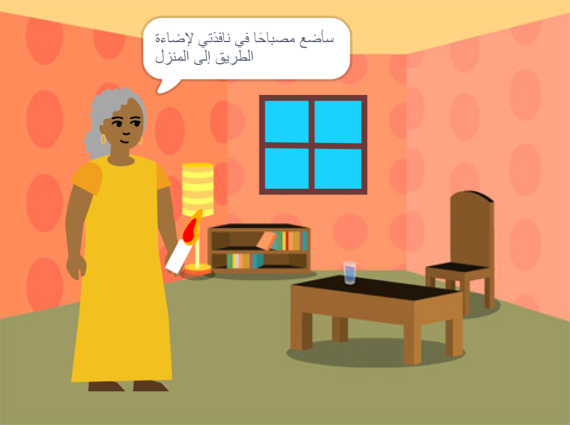

## المقدمة

قم بإنشاء كتاب باستخدام منصة Scratch بناءً على فكرتك الخاصة. سيحتاج كتابك إلى تلبية **ملخص المشروع**.

** موجز المشروع ** يوضح ما يجب ان يفعله المشروع. إنه يشبه إلى حد ما إعطاء مهمة لإكمالها.

سوف:

+ تفكر في أفكار لإنشاء كتاب رقمي لشخص معين
+ تختار المهارات التي ستستخدمها في صنع كتابك
+ تشارك عنوان الموقع الالكتروني لكتابك

--- no-print ---

--- task ---

### جربها

انقر على الزاوية لقلب الصفحة.

كم عدد صفحات الكتاب؟

ابحث عن الكائنات المتحركة التي تظهر وتختفي في صفحات مختلفة.

** أضيء الطريق إلى المنزل **: [اطلع على البرنامج] (https://scratch.mit.edu/projects/499860786/editor) {: target = "_blank"}

  <iframe allowtransparency="true" width="485" height="402" src="https://scratch.mit.edu/projects/embed/499860786/?autostart=false" frameborder="0"></iframe>

--- /task ---

--- /no-print ---

### ملخص المشروع: إنشاء ** كتاب رقمي **

يمكن أن يكون كتابك قصة أو كتابًا تعليميًا أو كتاب حقائق أو كتابًا تفاعليًا أو أي شيء آخر.

يجب أن تختار لمن تكتب الكتاب ، مثل "أختي الصغيرة" أو "عشاق الديناصورات" أو "الأشخاص الذين يتعلمون الغناء".  

يجب أن يكون كتابك:
+ يحتوي على صفحات متعددة ، مع طريقة للانتقال إلى الصفحة التالية
+ يتضمن كائن واحد على الأقل
+ يقول أو يفعل شيئًا مختلفًا في كل صفحة

يمكن لكتابك:
+ الحصول على كلام أو مؤثرات صوتية
+ الخصول على نص أو فن تم إنشاؤه في محرر الرسام
+ التمتع بميزات تفاعلية في كل صفحة

A ** كتاب رقمي ** (أو كتاب إلكتروني) هو كتاب تم إنشاؤه وقراءته على جهاز كمبيوتر أو كمبيوتر لوحي أو هاتف أو أي جهاز إلكتروني آخر. هل قرأت أي كتب على جهاز رقمي؟

--- no-print ---

### احصل على الإلهام

--- task ---

استكشف هذه الأمثلة على المشاريع للحصول على أفكار لكتابك:

**دغدغة وحش**: [انظر من الداخل](https://scratch.mit.edu/projects/500189097/editor){: target = "_ blank"}

  <iframe allowtransparency="true" width="485" height="402" src="https://scratch.mit.edu/projects/embed/500189097/?autostart=false" frameborder="0"></iframe>

**يمزج قطة Scratch في**: [انظر من الداخل](https://scratch.mit.edu/projects/498968472/editor){: target = "_ blank"}

  <iframe allowtransparency="true" width="485" height="402" src="https://scratch.mit.edu/projects/embed/498968472/?autostart=false" frameborder="0"></iframe>

**قصة تصحيح أخطاء**: [شاهد ما بالداخل](https://scratch.mit.edu/projects/498960446/editor){: target = "_ blank"}
انقر فوق الشخصية والكائن لاختيار العناصر التي تريدها في القصة ، ثم انقر فوق "المرحلة" لقلب الصفحة.

  <iframe allowtransparency="true" width="485" height="402" src="https://scratch.mit.edu/projects/embed/498960446/?autostart=false" frameborder="0"></iframe>

--- /task ---

--- /no-print ---

--- print-only ---

### احصل على الإلهام

للحصول على أفكار لكتابك، **انظر في الداخل** مثال على مشاريع في 'صممت لك كتاباً' استوديو سكراتش: https://scratch.mit.edu/studios/29082370

--- /print-only ---

