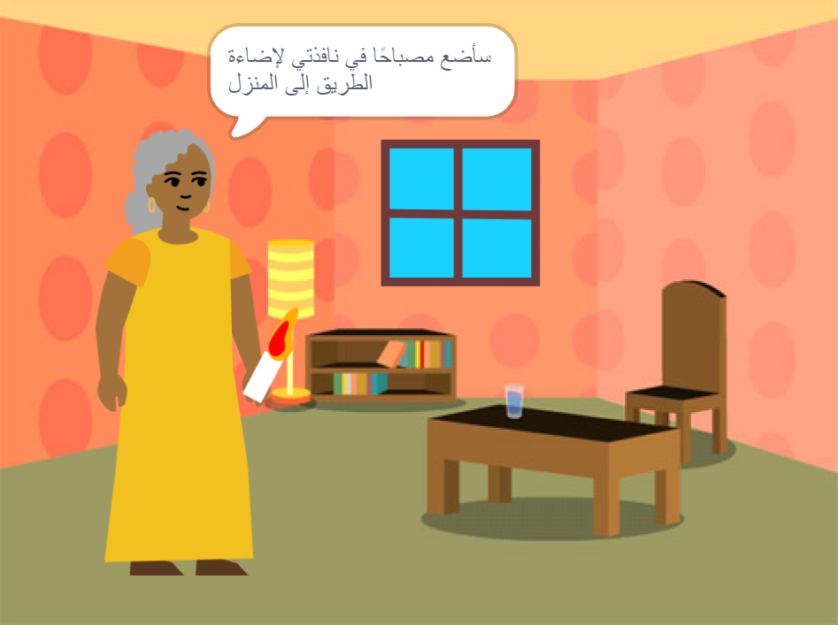

## المقدمة

قم بإنشاء كتاب باستخدام منصة Scratch بناءً على فكرتك الخاصة.

سوف:

+ تفكر في أفكار لإنشاء كتاب رقمي لشخص معين
+ تختار المهارات التي ستستخدمها في صنع كتابك
+ تشارك عنوان الموقع الالكتروني لكتابك

--- no-print ---

--- task ---

### جربها

انقر على الزاوية لقلب الصفحة.

ابحث عن الكائنات المتحركة التي تظهر وتختفي في صفحات مختلفة.
  
ماذا يحدث عند النقر فوق كل كائن؟

  
**Tickle monster**: [See inside](https://scratch.mit.edu/projects/500189097/editor){:target="_blank"}

  <iframe allowtransparency="true" width="485" height="402" src="https://scratch.mit.edu/projects/embed/500189097/?autostart=false" frameborder="0"></iframe>

--- /task ---

--- /no-print ---

سيحتاج كتابك إلى تلبية **ملخص المشروع**.

**موجز المشروع** يوضح ما يجب ان يفعله المشروع. إنه يشبه إلى حد ما إعطاء مهمة لإكمالها.

### ملخص المشروع: إنشاء **كتاب رقمي**

يمكن أن يكون كتابك قصة أو كتابًا تعليميًا أو كتاب حقائق أو كتابًا تفاعليًا أو أي شيء آخر. يجب أن تختار لمن تكتب الكتاب ، مثل "أختي الصغيرة" أو "عشاق الديناصورات" أو "الأشخاص الذين يتعلمون الغناء". 

يجب أن يكون كتابك:
+ يحتوي على صفحات متعددة ، مع طريقة للانتقال إلى الصفحة التالية
+ يتضمن كائن واحد على الأقل
+ يقول أو يفعل شيئًا مختلفًا في كل صفحة

يمكن لكتابك:
+ الحصول على كلام أو مؤثرات صوتية
+ الخصول على نص أو فن تم إنشاؤه في محرر الرسام
+ التمتع بميزات تفاعلية في كل صفحة

--- no-print ---

### احصل على الإلهام

--- task ---

استكشف هذه الأمثلة على المشاريع للحصول على أفكار لكتابك:

⭐ شارك بمشروعك النهائي "لقد صنعت لك كتابًا" لتحصل على فرصة عرضه هنا.

**يمزج قطة Scratch في**: [انظر من الداخل](https://scratch.mit.edu/projects/627753829/editor){:target="_blank"}

  <iframe allowtransparency="true" width="485" height="402" src="https://scratch.mit.edu/projects/embed/724148783/?autostart=false" frameborder="0"></iframe>

**دغدغة وحش**: [انظر من الداخل](https://scratch.mit.edu/projects/627753229/editor){:target="_blank"}

  <iframe allowtransparency="true" width="485" height="402" src="https://scratch.mit.edu/projects/embed/799448516/?autostart=false" frameborder="0"></iframe>

**قصة تصحيح أخطاء**: [شاهد ما بالداخل](https://scratch.mit.edu/projects/627754356/editor){:target="_blank"}
انقر فوق الشخصية والكائن لاختيار العناصر التي تريدها في القصة ، ثم انقر فوق "المرحلة" لقلب الصفحة.

  <iframe allowtransparency="true" width="485" height="402" src="https://scratch.mit.edu/projects/embed/793833913/?autostart=false" frameborder="0"></iframe>

**أضيء الطريق إلى المنزل**: \[اطلع على البرنامج\](https://scratch.mit.edu/projects/627752762/editor){:target="_blank"}

  <iframe allowtransparency="true" width="485" height="402" src="https://scratch.mit.edu/projects/embed/707648744/?autostart=false" frameborder="0"></iframe>

--- /مهمة ---

--- /بدون طباعة ---

- للطباعة فقط -

### احصل على الإلهام

للحصول على أفكار لكتابك، **انظر في الداخل** مثال على مشاريع في 'صممت لك كتاباً' استوديو سكراتش: https://scratch.mit.edu/studios/29082370

- / للطباعة فقط -

