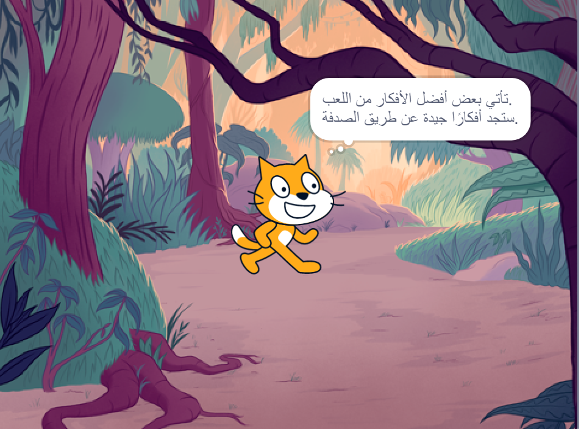

## Your idea

Use this step to plan your book. You can plan by just thinking, adding backdrops and sprites in Scratch, or drawing or writing — or however you like!

### Why are you making the book?

--- task ---

Think about the purpose of your book.

It could be:
- To entertain a younger child
- To share an important message, such as encouraging recycling
- To teach someone how to do something, such as how to make your favourite food
- To tell or retell a story
- To share something about yourself
- To express yourself and be creative

--- /task ---

### Who is it for?

--- task ---

Think about who you will make your book for (your **audience**).

It could be for a friend, for a family member, for a school class, for people who share a hobby, for fans of a musician, or just for yourself.

--- /task ---

### Get started

Now, it's time to start to think about the pages (backdrops) and the characters and objects (sprites) in your book.

--- task ---

Open a [new Scratch project](https://rpf.io/scratch-new){:target="_blank"}. Scratch will open in another browser tab.

--- collapse ---
---
title: Working offline
---

For information about how to set up Scratch for offline use, visit [our 'Getting started with Scratch' guide](https://projects.raspberrypi.org/en/projects/getting-started-scratch){:target="_blank"}.

--- /collapse ---

Use your new Scratch project, a pen and paper, or both to plan ideas for your book.

--- /task ---

--- task ---

Think about the backdrops and sprites:
- Which backdrops or background colours will you use in your book?
- How will users interact with your book to turn to the next page?
- Which characters and objects will you have in your book?
- How will the sprites be animated and interact on each page?

--- /task ---

--- save ---
