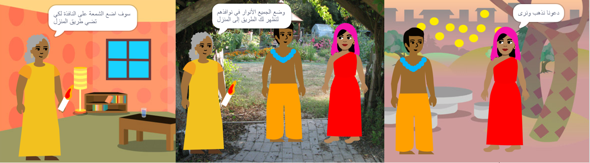

## بناء واختبار

حان الوقت الآن لإعداد كتابك. ابدأ بمشروع صغير ، وأضف المزيد إلى مشروعك إذا كان لديك الوقت.

**نصيحة:** تذكر أن تختبر مشروعك في كل مرة تضيف شيئًا. من الأسهل بكثير العثور على الأخطاء وإصلاحها قبل إجراء المزيد من التغييرات.

--- task ---

سوف تحتاج إلى أن تقرر في أي ترتيب لبناء كتابك. للبدء ، يمكنك:
- إنشاء جميع الصفحات كخلفيات ، أو
- الحصول على صفحة واحدة تعمل أولاً

--- /task ---

قد لا يكون لديك الوقت لإضافة كل ما تريد إلى كتابك في البداية. لا بأس بذلك - يمكنك دائمًا العودة إلى مشروعك لاحقًا. 

--- task ---

لقد اكتسبت بعض المهارات المفيدة حقًا في Scratch. إليك تذكير لمساعدتك في صنع كتابك:

التعليمات البرمجية:

[[[scratch3-changing-backdrops-pages-levels]]]

[[[scratch3-change-costumes-to-show-mood]]]

[[[scratch3-animate-movement-costumes]]]

[[[scratch3-graphic-effects]]]

[[[scratch3-show-hide-sprites-backdrops]]]

[[[scratch3-positioning-with-layers]]]

[[[scratch3-jiggle-a-sprite]]]

محرر الرسام - الخلفيات والأزياء:

[[[scratch3-paint-a-new-backdrop-extended]]]

[[[scratch3-backdrops-and-sprites-using-shapes]]]

[[[scratch3-use-text-tool]]]

[[[scratch3-copy-parts-between-sprite-costumes]]]

[[[scratch3-add-costumes-to-a-sprite]]]

الصوت:

[[[scratch3-add-sound]]]

[[[scratch3-record-sound]]]

[[[scratch3-text-to-speech]]]

محرر Scratch:

[[[scratch3-copy-code]]]

[[[scratch3-full-screen]]]

[[[scratch3-duplicate-sprite]]]

--- /task ---

--- task ---

**اختبار:** اعرض مشروعك على شخص آخر واطلب منه إبداء الرأي. هل تريد إجراء أي تغييرات على كتابك؟

--- /task ---

--- task ---

**تصحيح:** قد تجد بعض الأخطاء في مشروعك والتي تحتاج إلى إصلاحها. فيما يلي بعض الأخطاء الشائعة:

--- collapse ---
---
title: كائن يظهر أو يختبئ في الصفحات الخطأ
---

تأكد من أن الكائن يحتوي على `عندما تتبدل الخلفية إلى`{:class="block3events"} مع `عرض`{:class="block3looks"} أو `إخفاء`{:class="block3looks"} حسب الحاجة. تأكد من أنك اخترت اسم الخلفية الصحيح في `عندما تتبدل الخلفية إلى`{:class="block3events"}. من المفيد إعطاء أسماء الخلفيات التي يمكنك فهمها بسهولة ، للمساعدة في اكتشاف مثل هذه المشاكل.

--- /collapse ---

--- collapse ---
---
title: كائن ينقلب رأسًا على عقب
---

إضافة لبنة`نمط الدوران يمين-يسار`{:فئة="block3motion"} أو `نمط الدوران لا دوران`{:فئة="block3motion"}.

--- /collapse ---

--- collapse ---
---
title: "'يقفز"' الكائن عندما يغير زيه أو يرتد
---

تأكد من أن الزي يتم توسيطه في محرر الرسام (قم بمحاذاة الصليب الأزرق في الزي مع علامة التقاطع في وسط محرر الرسام).

--- /collapse ---

--- collapse ---
---
title: الصوت لا يعمل
---

هل أضفت لبنة إلى `تشغيل الصوت`{:class="block3sound"} عند الحاجة؟ إذا نسخت رمزًا من كائن آخر ، فستحتاج إلى إضافة الصوت إلى هذا الكائن في علامة التبويب **الأصوات** تتحقق من مستوى الصوت على جهاز الكمبيوتر أو الجهاز اللوحي، وتأكد من أنك لم تخفض مستوى الصوت باستخدام التعليمة البرمجية- محاولة `اجعل القيمة إلى`{:class="block3sound"} `100`.

--- /collapse ---

--- collapse ---
---
title: الكائنات الأخرى تستمر في التقدم أمام كائن ما
---

أضف `انتقل إلى`{:class="block3looks"}.

--- /collapse ---

--- collapse ---
---
title: يتحرك الكائن أو يتغير مرة واحدة فقط
---

ضع التعليمة البرمجية داخل `كرر باستمرار`{:class="block3control"} بحيث تستمر في العمل.

--- /collapse ---

--- collapse ---
---
title: ترتيب الصفحات خاطئ
---

تحقق من ترتيب الخلفيات الخاصة بك: انقر فوق جزء المنصة ثم على **الخلفيات** لعرض الخلفيات الخاصة بمشروعك.

--- /collapse ---

قد تجد خطأ غير مدرج هنا. هل يمكنك معرفة كيفية إصلاحه؟

نحن نحب أن نسمع عن أخطائك وكيفية إصلاحها. استخدم **إرسال ملاحظات** في أسفل هذه الصفحة وأخبرنا إذا وجدت خطأً مختلفًا في مشروعك.

--- /task ---

--- save ---
