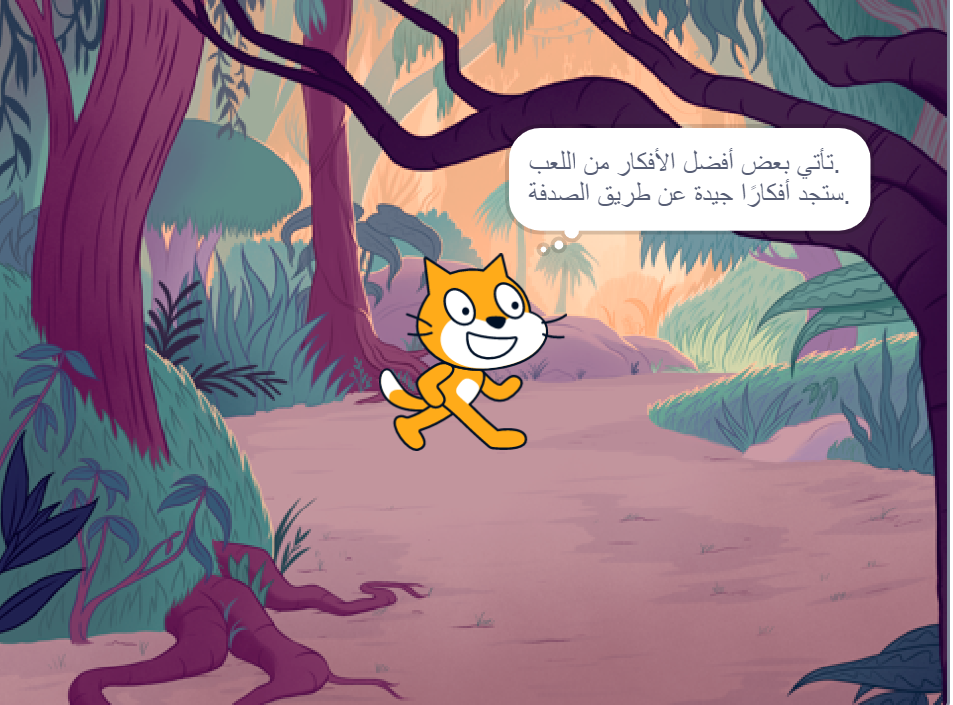

## خطط لكتابك 📔

استخدم هذه الخطوة لوضع خطة لتصميم كتابك. يمكنك التخطيط بمجرد التفكير ، وإضافة الخلفيات والكائنات في Scratch ، أو الرسم أو الكتابة - أو كيفما تريد!

حان الوقت الآن للبدء في التفكير في الصفحات (الخلفيات) و (الشخصيات) في كتابك.

--- task ---

افتح [ مشروع بداية لقد صنعت لك كتاب ](https://scratch.mit.edu/projects/582223042/editor){: target = "_ blank"}. سيتم فتح Scratch في تبويب متصفح أخرى.

⏱️ ليس الكثير من الوقت؟ يمكنك البدء من أحد الأمثلة {: target = "_ blank"}.

--- collapse ---
---
title: Working offline
---

للحصول على معلومات حول كيفية إعداد Scratch للاستخدام دون اتصال بالانترنت، قم بزيارة دليل [" العمل مع Scratch "](https://projects.raspberrypi.org/en/projects/getting-started-scratch).

--- /collapse ---

--- /task ---

--- task ---

استخدم مشروع سكراتش جديد للتخطيط لكتابك. لست مضطرًا إلى تخطيط جميع الصفحات يمكنك إضافتها لاحقًا.

يمكنك أيضًا استخدام ✏️ قلم رصاص و [ورقة التخطيط هذه](resources/i-made-a-book-worksheet.pdf){: target = "_ blank"} أو قطعة من الورق لرسم أفكارك.

فكر في الخلفيات والشخصيات (الكائنات):
- 🖼️ ما الخلفيات أو ألوان الخلفية التي ستستخدمها في كتابك؟
- 🗒️ كيف سيتفاعل المستخدمون مع كتابك للانتقال إلى الصفحة التالية؟
- 🦁 ما هي الشخصيات والأشياء التي ستكون لديك في كتابك؟
- 🏃‍♀️ كيف ستتحرك الكائنات المتحركة وتتفاعل في كل صفحة؟

{:width="300px"}

--- /task ---
