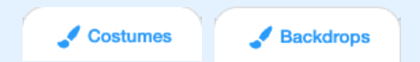

## أبني 🧱 واختبار 🔄

حان الوقت الآن لإعداد كتابك. ابدأ بمشروع صغير ، وأضف المزيد إلى مشروعك إذا كان لديك الوقت.


**نصيحة:** تذكر أن تفحص مشروعك في كل مرة تضيف شيئًا. من الأسهل بكثير العثور على الأخطاء وإصلاحها قبل إجراء المزيد من التغييرات.

### لكل صفحة 📃

--- task ---

أضف الخلفية والكائنات الجديدة التي تحتاجها لهذه الصفحة.


ستحتاج إلى إضافة تعليمات برمجية لأعداد المواضع ورؤية الكائنات على العنوان الأول الصفحة  وكل صفحة بعد ذلك.

```blocks3
when flag clicked

when backdrop switches to [page v]
```

[[[scratch3-show-hide-sprites-backdrops]]]

[[[scratch3-positioning-with-layers]]]

--- /task ---

### لكل كائن 🐈 🐢 🎈

--- task ---

ستحتاج إلى إضافة تعليمات برمجية لكل شخصية و كائن في كتابك. ضع في اعتبارك ما إذا كانوا سيفعلون أي شيء عند بدء المشروع ، أو عندما تتحول الخلفية إلى صفحة معينة أو عند النقر فوق الكائن.

```blocks3
when flag clicked

when this sprite clicked

when backdrop switches to [page v]
```

[[[scratch3-change-costumes-to-show-mood]]]

[[[scratch3-animate-movement-costumes]]]

[[[scratch3-graphic-effects]]]

[[[scratch3-jiggle-a-sprite]]]

--- /task ---

### تقليب الصفحة 📖

--- task ---

ستحتاج إلى طريقة للقارئ للانتقال إلى الصفحة التالية في كتابك.

```blocks3
when this sprite clicked
```

[[[scratch3-changing-backdrops-pages-levels]]]

--- /task ---

### تحرير (تعديل) الازياء 🦁 والخلفيات 🖼️

--- task ---

قد ترغب في تعديل أو إضافة أزياء أو خلفيات في محرر الرسام.

{:width="250px"}


[[[scratch3-paint-a-new-backdrop-extended]]]

[[[scratch3-backdrops-and-sprites-using-shapes]]]

[[[scratch3-use-text-tool]]]

[[[scratch3-copy-parts-between-sprite-costumes]]]

[[[scratch3-add-costumes-to-a-sprite]]]

--- /task ---

### إضافة صوت 🎵

--- task ---


```blocks3
when flag clicked

when this sprite clicked

when backdrop switches to [page v]
```


[[[scratch3-add-sound]]]


[[[scratch3-record-sound]]]


[[[scratch3-text-to-speech]]]

--- /task ---

### تذكيرات محرر Scratch

[[[scratch3-copy-code]]]

[[[scratch3-full-screen]]]

[[[scratch3-duplicate-sprite]]]

--- task ---

هل قابلت **ملخص المشروع**؟ فكر في مشروعك وانتقل إلى قائمة المراجعة أدناه وتحقق من الميزات التي يحتوي عليها مشروعك. هل تريد إجراء أي تغييرات على كتابك؟

⏱️ إذا كان لديك الوقت ، يمكنك تطوير مشروعك.

💡 يمكنك:
- إضافة المزيد من التعليمات البرمجية إلى الكائنات الخاصة بك
- إضافة كائن آخر
- أضف صفحة أخرى
- سجل صوتًا
- قم بإنشاء أزياء جديدة في محرر الرسام

--- /task ---

--- task ---

**التصحيح:** 🐞 قد تجد بعض الأخطاء في مشروعك والتي تحتاج إلى إصلاحها. فيما يلي بعض الأخطاء الشائعة:

--- collapse ---
---
title: A sprite is showing or hiding on the wrong pages
---

تأكد من أن الكائن يحتوي على `عند تبديل الخلفية إلى ` نص برمجي {: class = "block3events"} مع الكتل البرمجية `عرض `{: class = "block3looks"} أو `
إخفاء `{: class = "block3looks"} حسب الحاجة. تأكد من أنك اخترت اسم الخلفية الصحيح في كتلة `عندما تتحول الخلفية إلى `{: class = "block3events"}. من المفيد إعطاء أسماء الخلفيات التي يمكنك فهمها بسهولة ، للمساعدة في اكتشاف مثل هذه المشاكل.

--- /collapse ---

--- collapse ---
---
title: A sprite is going upside down
---

أضف كتلة `أضبط نمط تدوير يسار-يمين`{: class = "block3motion"} أو `أضبط نمط التدوير لا دوران `{: class = "block3motion"}.

--- /collapse ---

--- collapse ---
---
title: A sprite 'jumps' when it changes costume or bounces
---

تأكد من أن الزي يتم توسيطه في محرر الرسام (قم بمحاذاة الصليب الأزرق في الزي مع علامة التقاطع في وسط محرر الرسام).

--- /collapse ---

--- collapse ---
---
title: A sound does not play
---

هل أضفت كتلة `تشغيل الصوت`{: class = "block3sound"} عند الحاجة أليها؟ إذا نسخت تعليمة برمجية من كائن آخر ، فستحتاج إلى إضافة الصوت إلى هذا الكائن من علامة التبويب **الأصوات**. تحقق من مستوى الصوت على جهاز الكمبيوتر أو الجهاز اللوحي، وتأكد من أنك لم تخفض مستوى الصوت في التعليمة البرمجية خاصتك - جرب `اجعل شدة الصوت `{: "class = "block3sound} `100`.

--- /collapse ---

--- collapse ---
---
title: Other sprites keep going in front of a sprite
---

أضف كتلة `انتقل إلى الطبقة الأمامية`{: class = "block3looks"}.

--- /collapse ---

--- collapse ---
---
title: A sprite only moves or changes once
---

ضع التعليمة البرمجية داخل كتلة `كرر باستمرار`{: class = "block3control"} بحيث تستمر في العمل.

--- /collapse ---

--- collapse ---
---
title: The pages are in the wrong order
---

تحقق من ترتيب الخلفيات الخاصة بك: انقر فوق جزء المنصة ثم على علامة التبويب **الخلفيات** لعرض الخلفيات الخاصة بمشروعك.

--- /collapse ---

قد تجد خطأ غير مدرج هنا. هل يمكنك معرفة كيفية إصلاحه؟

🗣️ نحن نحب أن نسمع عن أخطائك البرمجية وكيفية إصلاحها. استخدم الزر **إرسال ملاحظات** في أسفل هذه الصفحة وأخبرنا إذا وجدت خطأً مختلفًا في مشروعك.

--- /task ---

