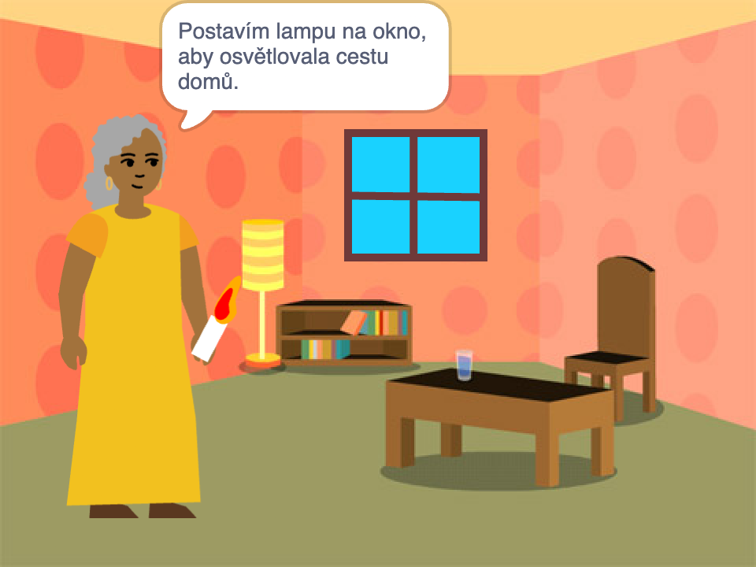

## Co budeš dělat

Vytvořte si 📚 knihu ve Scratchi na základě vlastního nápadu 💡.

Budeš:

+ Vytvořte digitální knihu pro někoho konkrétního
+ Vyberte si, jaké dovednosti použijete k vytvoření své knihy
+ Sdílejte webovou adresu své knihy

--- no-print ---

--- task ---

### Hrát ▶️ 

Kliknutím na roh otočíte stránku.

Hledejte postavičky, které se zobrazují a skrývají na různých stránkách.
  
Co se stane, když kliknete na kařdou postavičku?

  
**Tickle monster**: [See inside](https://scratch.mit.edu/projects/500189097/editor){:target="_blank"}

  <iframe allowtransparency="true" width="485" height="402" src="https://scratch.mit.edu/projects/embed/500189097/?autostart=false" frameborder="0"></iframe>

--- /task ---

--- /no-print ---

Vaše kniha bude muset splňovat zadání **projektu**.

**stručný popis projektu** popisuje, co musí projekt dělat. Je to trochu jako dostat úkol, který je třeba splnit.

### 🎯 STRUČNÝ POPIS PROJEKTU: Vytvořte **digitální knihu**

Budete se muset rozhodnout, jaký typ knihy byste chtěli vytvořit a pro koho je určena. 

Vaše kniha by měla:
+ 📃 Obsahovat více stránek s možností přejít na další stránku
+ 🐢 Obsahovat alespoň jednu postavičku
+ 💬 Na každé stránce říci nebo udělat něco jiného

Vaše kniha by mohla:
+ 🔉 Obsahovat řeč nebo zvukové efekty 
+ 🎨 Obsahovat text nebo grafiku, která byla vytvořena v editoru Malování
+ 🖱️ Mít interaktivní funkce na každé stránce

--- no-print ---

### Inspiruj se 💭

--- task ---

Pohraj si s těmito ukázkovými projekty, a inspiruj se pro svou knihu:

⭐ Podělte se o svůj hotový projekt „Udělal jsem vám knihu“, abys měl šanci, že že zde bude uveden.

**My band** 🎸 : [See inside](https://scratch.mit.edu/projects/724148783/editor){:target="_blank"}

  <iframe allowtransparency="true" width="485" height="402" src="https://scratch.mit.edu/projects/embed/724148783/?autostart=false" frameborder="0"></iframe>

**⭐ Cinderella and the spider** 🕷️ : [See inside](https://scratch.mit.edu/projects/799448516/editor){:target="_blank"}

  <iframe allowtransparency="true" width="485" height="402" src="https://scratch.mit.edu/projects/embed/799448516/?autostart=false" frameborder="0"></iframe>

**⭐ Accidental Teleportation** 🚀 : [See inside](https://scratch.mit.edu/projects/793833913/editor){:target="_blank"} (featured community project)

  <iframe allowtransparency="true" width="485" height="402" src="https://scratch.mit.edu/projects/embed/793833913/?autostart=false" frameborder="0"></iframe>

**⭐ How winter came** ☃️ : [See inside](https://scratch.mit.edu/projects/707648744/editor){:target="_blank"} (featured community project)

  <iframe allowtransparency="true" width="485" height="402" src="https://scratch.mit.edu/projects/embed/707648744/?autostart=false" frameborder="0"></iframe>

--- /task ---

--- /no-print ---

--- print-only ---

### Inspiruj se 💭

Chcete-li získat nápady pro svou 📚 knihu, **Podívejte se na** příklad projektů ve studiu Scratch „Udělal jsem ti knihu — Příklady“: https://scratch.mit.edu/studios/29082370

--- /print-only ---

