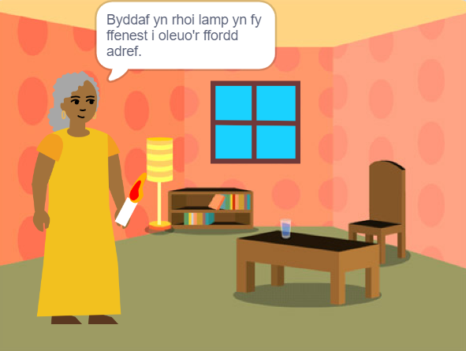

## Cyflwyniad

Crea lyfr yn Scratch yn seiliedig ar dy syniad dy hun. Bydd angen i dy lyfr fodloni **briff y prosiect**.

Mae briff prosiect yn disgrifio'r hyn y mae'n rhaid i brosiect ei wneud. Mae fel cael tasg arbennig i'w chwblhau.

Byddi di'n:

+ Meddwl am syniadau i greu llyfr digidol ar gyfer rhywun penodol
+ Dewis pa sgiliau i'w defnyddio i wneud dy lyfr
+ Rhannu cyfeiriad gwe ar gyfer dy lyfr

--- no-print ---

--- task ---

### Rho gynnig arni

Clicia ar y gornel i droi'r dudalen.

Sawl tudalen sydd gan y llyfr?

Chwilia am gorluniau sy'n ymddangos ac yn cuddio ar wahanol dudalennau.

**Goleuo'r ffordd adref**: [Gweld tu mewn](https://scratch.mit.edu/projects/627804682/editor){:target="_blank"}

  <iframe allowtransparency="true" width="485" height="402" src="https://scratch.mit.edu/projects/embed/627804682/?autostart=false" frameborder="0"></iframe>

--- /task ---

--- /no-print ---

### BRIFF PROSIECT: Creu **llyfr digidol**

Gallai dy lyfr fod yn llyfr stori, llyfr tiwtorial, llyfr ffeithiau, llyfr rhyngweithiol, neu rywbeth arall.

Rhaid i ti ddewis ar gyfer pwy rwyt ti am ysgrifennu'r llyfr, er enghraifft "fy chwaer fach", "ffans deinosoriaid", neu "bobl sy'n dysgu canu".  

Dylai dy lyfr:
+ Fod â sawl tudalen, gyda ffordd o droi i'r dudalen nesaf
+ Gael o leiaf un corlun
+ Ddweud neu wneud rhywbeth gwahanol ar bob tudalen

Gallai eich llyfr:
+ Gael effeithiau lleferydd neu sain
+ Gael testun neu gelf sydd wedi'i greu yn y golygydd Paent
+ Fod â nodweddion rhyngweithiol ar bob tudalen

Mae **llyfr digidol** (neu e-lyfr) yn llyfr sy'n cael ei greu a'i ddarllen ar gyfrifiadur, llechen, ffôn, neu ddyfais electronig arall. Wyt ti wedi darllen unrhyw lyfrau ar ddyfais ddigidol?

--- no-print ---

### Cael ysbrydoliaeth

--- task ---

Cymer olwg ar y prosiectau enghreifftiol hyn i gael syniadau ar gyfer dy lyfr:

**Anghenfil goglais**: [Gweld tu mewn](https://scratch.mit.edu/projects/627814880/editor){:target="_blank"}

  <iframe allowtransparency="true" width="485" height="402" src="https://scratch.mit.edu/projects/embed/627814880/?autostart=false" frameborder="0"></iframe>

**Y Gath Scratch yn cuddio**: [Gweld tu mewn](https://scratch.mit.edu/projects/627816660/editor){:target="_blank"}

  <iframe allowtransparency="true" width="485" height="402" src="https://scratch.mit.edu/projects/embed/627816660/?autostart=false" frameborder="0"></iframe>

**Stori ddifa chwilod**: [Gweld tu mewn](https://scratch.mit.edu/projects/627817880/editor){:target="_blank"}
Clicia ar y cymeriad a'r gwrthrych i ddewis y rhai rwyt ti eu heisiau yn y stori, wedyn clicia ar y Llwyfan i droi'r dudalen.

  <iframe allowtransparency="true" width="485" height="402" src="https://scratch.mit.edu/projects/embed/627817880/?autostart=false" frameborder="0"></iframe>

--- /task ---

--- /no-print ---

--- print-only ---

### Cael ysbrydoliaeth

I gael syniadau ar gyfer dy lyfr, **Cymer olwg ar** brosiectau enghreifftiol yn stiwdio Scratch 'Fe wnes i lyfr i chi - Enghreifftiau': https://scratch.mit.edu/studios/29082370

--- /print-only ---

