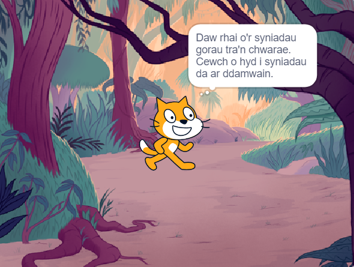

## Dy syniad

Defnyddia'r cam yma i gynllunio dy lyfr. Galli di gynllunio drwy feddwl, ychwanegu cefndiroedd a chorluniau yn Scratch, neu drwy dynnu llun neu ysgrifennu - sut bynnag sydd well gen ti!

### Pam wyt ti'n gwneud y llyfr?

--- task ---

Meddylia am bwrpas dy lyfr.

Gallai fod:
- I ddifyrru plentyn iau
- I rannu neges bwysig, fel annog ailgylchu
- I ddysgu rhywun sut i wneud rhywbeth, fel sut i goginio dy hoff fwyd
- I ddweud neu ailadrodd stori
- I rannu rhywbeth amdanat ti dy hun
- I fynegi dy hun a bod yn greadigol

--- /task ---

### Ar gyfer pwy mae'r llyfr?

--- task ---

Ystyria i bwy wyt ti eisiau gwneud y llyfr (dy **gynulleidfa**).

Gallai fod i ffrind, i aelod o'r teulu, i ddosbarth ysgol, i bobl sy'n rhannu hobi, i ffans cerddor, neu dim ond i ti dy hun.

--- /task ---

### Sut i ddechrau

Nawr, mae'n amser dechrau meddwl am y tudalennau (cefnlenni) a'r cymeriadau a'r gwrthrychau (corluniau) yn dy lyfr.

--- task ---

Agora'r [prosiect cychwynnol Dw i wedi creu llyfr i ti](https://scratch.mit.edu/projects/582223042/editor){:target="_blank"}. Bydd Scratch yn agor mewn tab arall ar y porwr.

--- collapse ---
---
title: Gweithio all-lein
---

I gael gwybodaeth am sut i osod Scratch i'w ddefnyddio all-lein, ymwelwch â [ein canllaw 'Dechrau arni gyda Scratch'](https://projects.raspberrypi.org/en/projects/getting-started-scratch){: target = "_ blank"}.

--- /collapse ---

Defnyddia dy brosiect Scratch newydd, beiro a phapur, neu'r ddau i gynllunio syniadau ar gyfer dy lyfr.

--- /task ---

--- task ---

Meddylia am y cefnlenni a'r corluniau:
- Pa gefnlenni neu liwiau cefndir fyddi di'n eu defnyddio yn dy lyfr?
- Sut bydd defnyddwyr yn rhyngweithio â dy lyfr i droi i'r dudalen nesaf?
- Pa gymeriadau a gwrthrychau fydd gen ti yn dy lyfr?
- Sut fydd y corluniau yn cael eu hanimeiddio ac yn rhyngweithio ar bob tudalen?

--- /task ---

--- save ---
