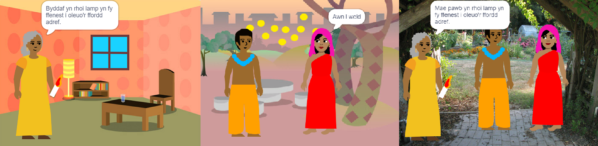

## Adeiladu a phrofi

Nawr, mae'n bryd creu dy lyfr. Dechreua yn fach, ac ychwanegu mwy at dy brosiect os oes gen ti amser.

**Awgrym:** Cofia brofi dy brosiect bob tro y byddi di'n ychwanegu rhywbeth. Mae'n llawer haws dod o hyd i chwilod a'u trwsio cyn i ti wneud mwy o newidiadau.

--- task ---

Bydd angen i ti benderfynu ym mha drefn rwyt ti am adeiladu dy lyfr. I ddechrau, fe allet ti:
- Greu’r holl dudalennau fel cefnlenni, neu
- Sicrhau fod un dudalen yn gweithio gyntaf

--- /task ---

Efallai na fydd gen ti amser i ychwanegu popeth rwyt ti ei eisiau i dy lyfr ar y dechrau. Mae hynny'n iawn - galli di bob amser ddod yn ôl i dy brosiect yn nes ymlaen. 

--- task ---

Rwyt ti wedi meithrin sgiliau defnyddiol iawn yn Scratch. Dyma nodyn atgoffa i dy helpu di i greu dy lyfr:

Cod:

[[[scratch3-changing-backdrops-pages-levels]]]

[[[scratch3-change-costumes-to-show-mood]]]

[[[scratch3-animate-movement-costumes]]]

[[[scratch3-graphic-effects]]]

[[[scratch3-show-hide-sprites-backdrops]]]

[[[scratch3-positioning-with-layers]]]

[[[scratch3-jiggle-a-sprite]]]

Y Golygydd Paent - cefnlenni a gwisgoedd:

[[[scratch3-paint-a-new-backdrop-extended]]]

[[[scratch3-backdrops-and-sprites-using-shapes]]]

[[[scratch3-use-text-tool]]]

[[[scratch3-copy-parts-between-sprite-costumes]]]

[[[scratch3-add-costumes-to-a-sprite]]]

Sain:

[[[scratch3-add-sound]]]

[[[scratch3-record-sound]]]

[[[scratch3-text-to-speech]]]

Golygydd Scratch:

[[[scratch3-copy-code]]]

[[[scratch3-full-screen]]]

[[[scratch3-duplicate-sprite]]]

--- /task ---

--- task ---

**Prawf:** Dangosa dy brosiect i rywun arall a gofyn am eu hadborth. Wyt ti am wneud unrhyw newidiadau i dy lyfr?

--- /task ---

--- task ---

**Difa chwilod:** Efallai bydd angen i ti drwsio chwilod yn dy brosiect. Dyma rai chwilod cyffredin:

--- collapse ---
---
title: Mae corlun yn ymddangos neu'n cuddio ar y tudalennau anghywir
---

Gwna'n siŵr bod gan y corlun sgriptiau `pan fydd cefnlen yn newid i`{:class="block3events"} gyda blociau `dangos`{:class="block3looks"} neu `cuddio`{:class="block3looks"} yn ôl yr angen. Gwna'n siŵr dy fod wedi dewis yr enw cefnlen cywir yn y bloc `pan fydd cefnlen yn newid i`{:class="block3events"}. Mae'n helpu i roi enwau cefnlenni y galli di eu deall yn hawdd, i helpu i adnabod problemau fel hyn.

--- /collapse ---

--- collapse ---
---
title: Mae corlun yn mynd ben i waered
---

Ychwanega floc `gosod steil cylchdroi chwith-dde`{:class="block3motion"} neu `gosod steil cylchdroi peidio troi`{:class="block3motion"}.

--- /collapse ---

--- collapse ---
---
title: Mae corlun yn 'neidio' pan fydd yn newid gwisg neu mae'n bownsio
---

Gwna'n siŵr bod y wisg wedi'i chanoli yn y golygydd Paent (alinia'r groes las yn y wisg gyda'r groeslin yng nghanol y golygydd Paent).

--- /collapse ---

--- collapse ---
---
title: Dydy sain ddim yn chwarae
---

Wyt ti wedi ychwanegu bloc i `chwarae sain`{:class="block3sound"} pan fo angen? Os wyt ti wedi copïo cod o gorlun arall, bydd angen i ti ychwanegu'r sain at y corlun hwn yn y tab **Seiniau**. Cymer olwg ar lefel y sain ar dy gyfrifiadur neu dabled, a gwna'n siŵr nad wyt ti wedi gostwng lefel y sain yn y cod — rho gynnig ar `gosod lefel sain i`{:class="block3sound"} `100`.

--- /collapse ---

--- collapse ---
---
title: Mae corluniau eraill yn mynd o flaen corlun
---

Ychwanega floc `mynd i haen blaen`{:class="block3looks"}.

--- /collapse ---

--- collapse ---
---
title: Dim ond unwaith mae corlun yn symud neu'n newid
---

Rho dy god y tu mewn i floc `am byth`{:class="block3control"} fel ei fod yn parhau i redeg.

--- /collapse ---

--- collapse ---
---
title: Mae'r tudalennau yn y drefn anghywir
---

Gwiria ym mha drefn y mae dy gefnlenni: clicia ar gwarel y Llwyfan ac yna ar y **Cefnlenni** i weld cefnlenni dy brosiect.

--- /collapse ---

Efallai byddi di'n dod o hyd i chwilen sydd ddim wedi'i rhestru yma. Alli di weithio allan sut i'w drwsio?

Rydyn ni wrth ein bodd yn clywed am eich chwilod chi a sut gwnaethoch chi eu trwsio. Defnyddia'r botwm **Anfon adborth** ar waelod y dudalen hon a dyweda wrthym os wnes di ddod ar draws chwilen wahanol yn dy brosiect.

--- /task ---

--- save ---
