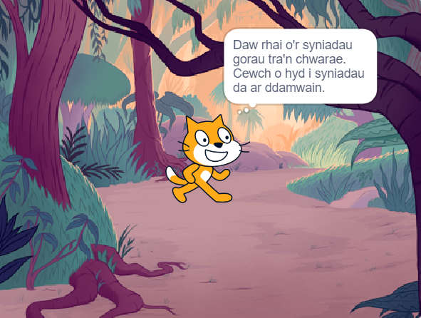

## Adeiladu a phrofi

Use this step to plan your book. You can plan by just thinking, adding backdrops and sprites in Scratch, or drawing or writing — or however you like!

**Awgrym:** Cofia brofi dy brosiect bob tro y byddi di'n ychwanegu rhywbeth. Mae'n llawer haws dod o hyd i chwilod a'u trwsio cyn i ti wneud mwy o newidiadau.

--- task ---

Open the [I made you a book starter project](https://scratch.mit.edu/projects/582223042/editor){:target="_blank"}. Scratch will open in another browser tab.

⏱️ Not much time? You can start from one of the [examples](https://scratch.mit.edu/studios/29082370){:target="_blank"}.

--- collapse ---
---
title: Working offline
---

For information about how to set up Scratch for offline use, visit [our 'Getting started with Scratch' guide](https://projects.raspberrypi.org/en/projects/getting-started-scratch){:target="_blank"}.

--- /collapse ---

--- /task ---

--- task ---

Use your new Scratch project to plan your book. You don't have to plan all the pages you can add more later.

[[[scratch3-animate-movement-costumes]]]

[[[scratch3-graphic-effects]]]
- Greu’r holl dudalennau fel cefnlenni, neu
- Sicrhau fod un dudalen yn gweithio gyntaf
- 🦁 Which characters and objects will you have in your book?
- 🏃‍♀️ How will the sprites be animated and interact on each page?

[[[scratch3-show-hide-sprites-backdrops]]]

--- /task ---
