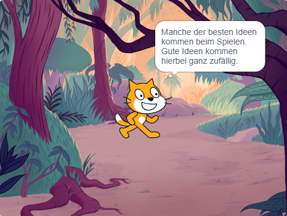

## Dein Buch planen 📔

Nutze diesen Schritt, um dein Buch zu planen. You can plan by just thinking, adding backdrops and sprites in Scratch, or drawing or writing — or however you like!

Now, it's time to start to think about the pages (backdrops) and the characters and objects (sprites) in your book.

--- task ---

Open the [I made you a book starter project](https://scratch.mit.edu/projects/582223042/editor){:target="_blank"}. Scratch wird in einem anderen Tab im Browser geöffnet.

⏱️ Wenig Zeit? Du kannst mit einem der [Beispiele](https://scratch.mit.edu/studios/29082370){:target="_blank"} beginnen.

--- collapse ---
---
title: Offline arbeiten
---

Besuche [unsere Anleitung 'Erste Schritte mit Scratch' ](https://projects.raspberrypi.org/en/projects/getting-started-scratch){:target="_blank"} für mehr Information zum Einrichten von Scratch für die offline Benutzung.

--- /collapse ---

--- /task ---

--- task ---

Use your new Scratch project to plan your book. Du musst nicht alle Seiten planen, du kannst später mehr hinzufügen.

You can also use ✏️ a pencil and [this planning sheet](resources/i-made-a-book-worksheet.pdf){:target="_blank"} or a piece of paper to sketch your ideas.

Think about the backdrops and sprites:
- 🖼️ Which backdrops or background colours will you use in your book?
- 🗒️ How will users interact with your book to turn to the next page?
- 🦁 Which characters and objects will you have in your book?
- 🏃‍♀️ How will the sprites be animated and interact on each page?

{:width="300px"}

--- /task ---
