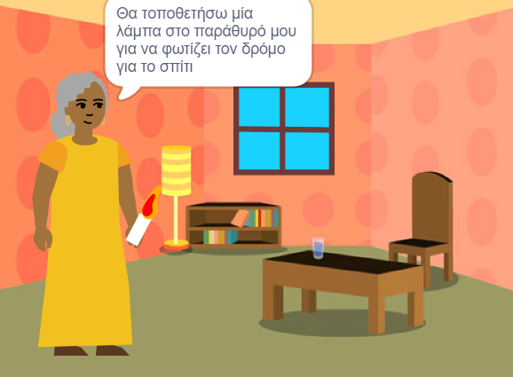

## Εισαγωγή

Δημιούργησε ένα βιβλίο στο Scratch με βάση μια δική σου ιδέα. Το βιβλίο σου θα πρέπει να πληροί τη **σύνοψη έργου**.

Μια **σύνοψη έργου ** περιγράφει το τι πρέπει να κάνει ένα έργο. Είναι σαν να σου έχει δοθεί μια αποστολή να ολοκληρώσεις.

Θα χρειαστεί να:

+ Σκεφτείς ιδέες για να δημιουργήσεις ένα ψηφιακό βιβλίο για κάποιο συγκεκριμένο άτομο
+ Επιλέξεις ποιες δεξιότητες θα χρησιμοποιήσεις για να φτιάξεις το βιβλίο σου
+ Κοινοποιήσεις μια διεύθυνση ιστοσελίδας για το βιβλίο σου

--- no-print ---

--- task ---

### Δοκίμασε το

Κάνε κλικ στη γωνία για να γυρίσεις σελίδα.

Πόσες σελίδες έχει το βιβλίο;

Αναζήτησε αντικείμενα που εμφανίζονται και εξαφανίζονται σε διάφορες σελίδες.

** Φώτισε τον δρόμο για το σπίτι **: [Δείτε μέσα] (https://scratch.mit.edu/projects/499860786/editor) {: target = "_blank"}

  <iframe allowtransparency="true" width="485" height="402" src="https://scratch.mit.edu/projects/embed/499860786/?autostart=false" frameborder="0"></iframe>

--- /task ---

--- /no-print ---

### ΣΥΝΟΨΗ ΕΡΓΟΥ: Δημιούργησε ένα ** ψηφιακό βιβλίο **

Το βιβλίο σου θα μπορούσε να είναι ένα βιβλίο ιστοριών, ένα εγχειρίδιο, ένα βιβλίο γεγονότων, ένα διαδραστικό βιβλίο ή κάτι άλλο.

Πρέπει να επιλέξεις για ποιον θα γράψεις το βιβλίο, όπως για "τη μικρή μου αδερφή", για "θαυμαστές δεινοσαύρων" ή για "άτομα που μαθαίνουν να τραγουδούν".  

Το βιβλίο σου θα πρέπει να:
+ Έχει πολλές σελίδες, με έναν τρόπο να γυρνάει από τη μία σελίδα στην επόμενη
+ Έχει τουλάχιστον ένα αντικείμενο
+ Λέει ή κάνει κάτι διαφορετικό σε κάθε σελίδα

Το βιβλίο σου θα μπορούσε να:
+ Έχει ομιλία ή ηχητικά εφέ
+ Έχει κάποιο κείμενο ή κάποια ζωγραφιά που έχει δημιουργηθεί στον επεξεργαστή ζωγραφικής
+ Έχει διαδραστικές λειτουργίες σε κάθε σελίδα

Ένα ** ψηφιακό βιβλίο** (ή ηλεκτρονικό βιβλίο) είναι ένα βιβλίο που δημιουργείται και διαβάζεται σε υπολογιστή, tablet, τηλέφωνο ή άλλη ηλεκτρονική συσκευή. Έχεις διαβάσει ποτέ βιβλία σε ψηφιακή συσκευή;

--- no-print ---

### Βρες έμπνευση

--- task ---

Μελέτησε τα παρακάτω παραδείγματα έργων για να πάρεις ιδέες για το βιβλίο σου:

**Το τέρας που γαργαλάει**: [Δες μέσα](https://scratch.mit.edu/projects/500189097/editor){:target="_ blank"}

  <iframe allowtransparency="true" width="485" height="402" src="https://scratch.mit.edu/projects/embed/500189097/?autostart=false" frameborder="0"></iframe>

**Οι μεταμορφώσεις της Γάτας του Scratch**: [Δες εδώ](https://scratch.mit.edu/projects/498968472/editor){:target="_blank"}

  <iframe allowtransparency="true" width="485" height="402" src="https://scratch.mit.edu/projects/embed/498968472/?autostart=false" frameborder="0"></iframe>

**Μια ιστορία εντοπισμού σφαλμάτων**: [Δες μέσα](https://scratch.mit.edu/projects/498960446/editor){:target="_ blank"}
Κάνε κλικ στον χαρακτήρα και το αντικείμενο για να επιλέξεις αυτούς που θέλεις στην ιστορία και, στη συνέχεια, κάνε κλικ στο υπόβαθρο για να γυρίσεις σελίδα.

  <iframe allowtransparency="true" width="485" height="402" src="https://scratch.mit.edu/projects/embed/498960446/?autostart=false" frameborder="0"></iframe>

--- /task ---

--- /no-print ---

--- print-only ---

### Βρες έμπνευση

Για να πάρεις ιδέες για το βιβλίο σου, **δες μέσα** στα παραδείγματα έργων στο Scratch studio 'I made you a book — Examples': https://scratch.mit.edu/studios/29082370

--- /print-only ---

