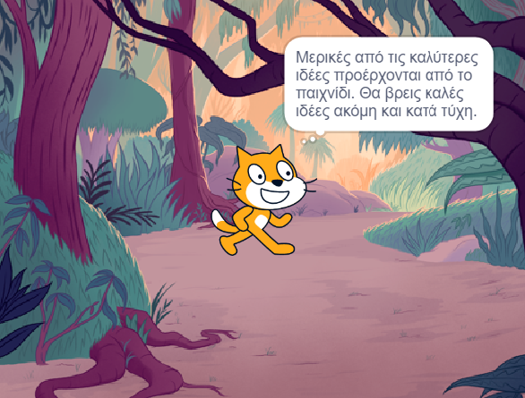

## Σχεδίασε το βιβλίο σου 📔

Χρησιμοποίησε αυτό το βήμα για να σχεδιάσεις το βιβλίο σου. Μπορείς να το σχεδιάσεις απλώς με τη σκέψη σου, προσθέτοντας υπόβαθρα και αντικείμενα στο Scratch, ή ζωγραφίζοντας, ή γράφοντας - ή οτιδήποτε σου αρέσει!

Τώρα, ήρθε η ώρα να αρχίσεις να σκέφτεσαι τις σελίδες (υπόβαθρα) και τους χαρακτήρες και τα αντικείμενα (αντικείμενα στο Scratch) στο βιβλίο σου.

--- task ---

Άνοιξε το [αρχικό έργο "Σου έφτιαξα ένα βιβλίο"](https://scratch.mit.edu/projects/582223042/editor){:target="_blank"}. Το Scratch θα ανοίξει σε νέα καρτέλα στον φυλλομετρητή.

⏱️ Δεν έχεις πολύ χρόνο; Μπορείς να ξεκινήσεις από ένα από τα [παραδείγματα](https://scratch.mit.edu/studios/29082370){:target="_blank"}.

--- collapse ---
---
title: Εργασία εκτός σύνδεσης
---

Για πληροφορίες σχετικά με τον τρόπο ρύθμισης του Scratch για χρήση εκτός σύνδεσης, επισκέψου τον [οδηγό «Ξεκινώντας με το Scratch»](https://projects.raspberrypi.org/en/projects/getting-started-scratch): target = "_ blank"}.

--- /collapse ---

--- /task ---

--- task ---

Χρησιμοποίησε το νέο σου έργο Scratch για να σχεδιάσεις το βιβλίο σου. Δεν χρειάζεται να σχεδιάσεις όλες τις σελίδες, μπορείς να προσθέσεις περισσότερες αργότερα.

Μπορείς επίσης να χρησιμοποιήσεις ✏️ ένα μολύβι και [αυτό το φύλλο σχεδίασης](resources/i-made-a-book-worksheet.pdf){:target="_blank"} ή ένα κομμάτι χαρτί για να σχεδιάσεις τις ιδέες σου.

Σκέψου τα υπόβαθρα και τα αντικείμενα:
- 🖼️ Ποια υπόβαθρα ή χρώματα φόντου θα χρησιμοποιήσεις στο βιβλίο σου;
- 🗒️ Πώς θα αλληλεπιδράσουν οι χρήστες με το βιβλίο σου για να μεταβούν στην επόμενη σελίδα;
- 🦁 Ποιους χαρακτήρες και αντικείμενα θα έχεις στο βιβλίο σου;
- 🏃‍♀️ Πώς θα κινούνται τα αντικείμενα και θα αλληλεπιδρούν σε κάθε σελίδα;

{:width="300px"}

--- /task ---
