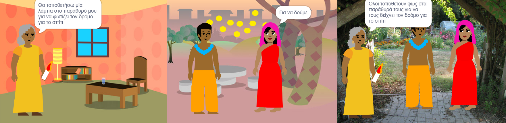

## Δημιουργία κι έλεγχος

Τώρα, ήρθε η ώρα να φτιάξεις το βιβλίο σου. Ξεκίνησε απλά και πρόσθεσε περισσότερα στο έργο σου αν έχεις χρόνο.

**Συμβουλή:** Μην ξεχνάς να δοκιμάζεις το έργο σου κάθε φορά που προσθέτεις κάτι. Είναι πολύ πιο εύκολο να βρεις και να διορθώσεις σφάλματα προτού κάνεις περισσότερες αλλαγές.

--- task ---

Θα πρέπει να αποφασίσεις με ποια σειρά θα φτιάξεις το βιβλίο σου. Για να ξεκινήσεις, μπορείς να:
- Δημιουργήσεις όλες τις σελίδες ως υπόβαθρα, ή
- Δημιουργήσεις μία πλήρως λειτουργική σελίδα στην αρχή

--- /task ---

Μπορεί να μην έχεις χρόνο να προσθέσεις όλα όσα θα ήθελες στο βιβλίο σου στην αρχή. Δεν πειράζει - μπορείς πάντα να επιστρέψεις στο έργο σου αργότερα. 

--- task ---

Έχεις ήδη αναπτύξει μερικές πραγματικά χρήσιμες δεξιότητες στο Scratch. Ακολουθεί μια υπενθύμιση που θα σε βοηθήσει να φτιάξεις το βιβλίο σου:

Κώδικας:

[[[scratch3-changing-backdrops-pages-levels]]]

[[[scratch3-change-costumes-to-show-mood]]]

[[[scratch3-animate-movement-costumes]]]

[[[scratch3-graphic-effects]]]

[[[scratch3-show-hide-sprites-backdrops]]]

[[[scratch3-positioning-with-layers]]]

[[[scratch3-jiggle-a-sprite]]]

Επεξεργαστής Ζωγραφικής - υπόβαθρα και ενδυμασίες:

[[[scratch3-paint-a-new-backdrop-extended]]]

[[[scratch3-backdrops-and-sprites-using-shapes]]]

[[[scratch3-use-text-tool]]]

[[[scratch3-copy-parts-between-sprite-costumes]]]

[[[scratch3-add-costumes-to-a-sprite]]]

Ήχος:

[[[scratch3-add-sound]]]

[[[scratch3-record-sound]]]

[[[scratch3-text-to-speech]]]

Επεξεργαστής Scratch:

[[[scratch3-copy-code]]]

[[[scratch3-full-screen]]]

[[[scratch3-duplicate-sprite]]]

--- /task ---

--- task ---

**Δοκιμή:** Δείξε σε κάποιον άλλο το έργο σου και ζήτησε τα σχόλιά του. Θέλεις να κάνεις αλλαγές στο βιβλίο σου;

--- /task ---

--- task ---

**Εντοπισμός σφαλμάτων:** Ενδέχεται να βρεις κάποια σφάλματα στο έργο σου που πρέπει να διορθώσεις. Εδώ είναι μερικά κοινά σφάλματα:

--- collapse ---
---
title: Ένα αντικείμενο εμφανίζεται ή κρύβεται σε λάθος σελίδες
---

Βεβαιώσου ότι το αντικείμενο έχει τα script `όταν το υπόβαθρο αλλάξει σε`{:class="block3events"} με μπλοκ `εμφανίσου`{:class="block3looks"} ή `εξαφανίσου`{:class="block3looks"} όπως απαιτείται. Βεβαιώσου ότι έχεις επιλέξει το σωστό όνομα υπόβαθρου στο μπλοκ `όταν το υπόβαθρο αλλάξει σε`{:class="block3events"}. Είναι καλή ιδέα να δίνεις ονόματα υποβάθρων που μπορείς να καταλαβαίνεις εύκολα, για να εντοπίζεις προβλήματα όπως αυτό.

--- /collapse ---

--- collapse ---
---
title: Ένα αντικείμενο πηγαίνει ανάποδα
---

Πρόσθεσε ένα μπλοκ `όρισε τρόπο περιστροφής αριστερά-δεξιά`{:class="block3motion"} ή `όρισε τρόπο περιστροφής μην περιστρέψεις`{:class="block3motion"}.

--- /collapse ---

--- collapse ---
---
title: Ένα sprite «πηδάει» όταν αλλάζει ενδυμασία ή αναπηδά
---

Βεβαιώσου ότι η ενδυμασία είναι κεντραρισμένη στον επεξεργαστή ζωγραφικής (ευθυγράμμισε τον μπλε σταυρό στην ενδυμασία με το σταυρόνημα στο κέντρο του επεξεργαστή ζωγραφικής).

--- /collapse ---

--- collapse ---
---
title: Ένας ήχος δεν παίζει
---

Έχεις προσθέσει ένα μπλοκ `παίξε ήχο`{:class="block3sound"} όπου χρειάζεται; Εάν έχεις αντιγράψει κώδικα από άλλο αντικείμενο, θα πρέπει να προσθέσεις τον ήχο σε αυτό το αντικείμενο στην καρτέλα **Ήχοι**. Έλεγξε την ένταση του υπολογιστή ή του tablet σου και βεβαιώσου ότι δεν έχεις μειώσει την ένταση με τον κώδικα - δοκίμασε `όρισε ένταση σε`{:class="block3sound"} `100`.

--- /collapse ---

--- collapse ---
---
title: Άλλα αντικείμενα περνάνε μπροστά από ένα αντικείμενο
---

Πρόσθεσε ένα μπλοκ `πήγαινε σε επίπεδο προσκήνιο`{:class="block3looks"}.

--- /collapse ---

--- collapse ---
---
title: Ένα αντικείμενο μετακινείται ή αλλάζει μόνο μία φορά
---

Βάλε τον κώδικά σου σε ένα μπλοκ `για πάντα`{:class="block3control"}, έτσι ώστε να συνεχίσει να λειτουργεί.

--- /collapse ---

--- collapse ---
---
title: Οι σελίδες έχουν λάθος σειρά
---

Έλεγξε σε ποια σειρά βρίσκονται τα υπόβαθρά σου: κάνε κλικ στο παράθυρο Σκηνή και στη συνέχεια στα **Υπόβαθρα** για να δεις τα υπόβαθρα για το έργο σου.

--- /collapse ---

Πιθανόν να βρεις ένα σφάλμα που δεν αναφέρεται εδώ. Μπορείς να σκεφτείς πώς θα το λύσεις;

Μας αρέσει να μαθαίνουμε για τα σφάλματα που εντοπίζετε και πώς τα διορθώνετε. Χρησιμοποίησε την **Αποστολή σχολίων** στο κάτω μέρος αυτής της σελίδας και πες μας αν εντόπισες κάποιο διαφορετικό σφάλμα στο έργο σου.

--- /task ---

--- save ---
