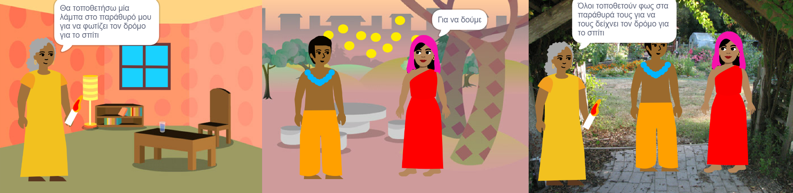
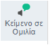

## Κατασκεύασε 🧱 και δοκίμασε 🔄

Τώρα, ήρθε η ώρα να φτιάξεις το βιβλίο σου. Ξεκίνησε με ένα μικρό βιβλίο και πρόσθεσε περισσότερα στο έργο σου όταν έχεις χρόνο.



**Συμβουλή:** Μην ξεχνάς να δοκιμάζεις το έργο σου κάθε φορά που προσθέτεις κάτι. Είναι πολύ πιο εύκολο να βρεις και να διορθώσεις σφάλματα προτού κάνεις περισσότερες αλλαγές.

### Για κάθε σελίδα 📃

--- task ---

Πρόσθεσε το υπόβαθρο και τα νέα αντικείμενα που χρειάζεσαι γι' αυτήν τη σελίδα.


Θα χρειαστεί να προσθέσεις κώδικα για να ορίσεις τις θέσεις και την ορατότητα των αντικειμένων στην πρώτη σελίδα τίτλου και σε κάθε σελίδα μετά από αυτήν.

```blocks3
when flag clicked

when backdrop switches to [page v]
```

[[[scratch3-show-hide-sprites-backdrops]]]

[[[scratch3-positioning-with-layers]]]

--- /task ---

### Για κάθε αντικείμενο 🐈 🐢 🎈

--- task ---

Θα χρειαστεί να προσθέσεις κώδικα σε κάθε χαρακτήρα και αντικείμενο στο βιβλίο σου. Σκέψου αν θα γίνεται κάτι όταν ξεκινήσει το έργο, όταν το υπόβαθρο αλλάξει σε μια συγκεκριμένη σελίδα ή όταν γίνει κλικ στο αντικείμενο.

```blocks3
when flag clicked

when this sprite clicked

when backdrop switches to [page v]
```

[[[scratch3-change-costumes-to-show-mood]]]

[[[scratch3-animate-movement-costumes]]]

[[[scratch3-graphic-effects]]]

[[[scratch3-jiggle-a-sprite]]]

--- /task ---

### Γυρίζοντας σελίδα 📖

--- task ---

Θα χρειαστείς έναν τρόπο για να πηγαίνει ο αναγνώστης σου στην επόμενη σελίδα του βιβλίου σου.

```blocks3
when this sprite clicked
```

[[[scratch3-changing-backdrops-pages-levels]]]

--- /task ---

### Επεξεργάσου ενδυμασίες🦁 και υπόβαθρα🖼️

--- task ---

Μπορεί να θέλεις να επεξεργαστείς ή να προσθέσεις ενδυαμασίες ή υπόβαθρα στο πρόγραμμα επεξεργασίας Ζωγραφική.

{:width="250px"}


[[[scratch3-paint-a-new-backdrop-extended]]]

[[[scratch3-backdrops-and-sprites-using-shapes]]]

[[[scratch3-use-text-tool]]]

[[[scratch3-copy-parts-between-sprite-costumes]]]

[[[scratch3-add-costumes-to-a-sprite]]]

--- /task ---

### Προσθήκη ήχου 🎵

--- task ---


```blocks3
when flag clicked

when this sprite clicked

when backdrop switches to [page v]
```


[[[scratch3-add-sound]]]


[[[scratch3-record-sound]]]



[[[scratch3-text-to-speech]]]

--- /task ---

### Ας ξαναθυμηθούμε την επεξεργασία στο Scratch

[[[scratch3-copy-code]]]

[[[scratch3-full-screen]]]

[[[scratch3-duplicate-sprite]]]

--- task ---

**Δοκιμή:** 🔄 Δείξε σε κάποιον/α άλλο/η το έργο σου και ζήτησε 🗣️ τα σχόλιά του. Θέλεις να κάνεις αλλαγές στο βιβλίο σου;

⏱️ Εάν έχεις χρόνο, μπορείς να αναβαθμίσεις το έργο σου.

💡 Θα μπορούσες να:
- Προσθέσεις περισσότερο κώδικα στα αντικείμενά σου
- Προσθέσεις ακόμη ένα αντικείμενο
- Προσθέσεις σελίδα
- Ηχογραφήσεις έναν ήχο
- Δημιουργήσεις μία νέα ενδυμασία στον επεξεργαστή Ζωγραφική

--- /task ---

--- task ---

**Εντοπισμός σφαλμάτων:** Ενδέχεται να βρεις κάποια σφάλματα στο έργο σου που πρέπει να διορθώσεις. Εδώ είναι μερικά συνηθισμένα σφάλματα:

--- collapse ---
---
title: Ένα αντικείμενο εμφανίζεται ή κρύβεται σε λάθος σελίδες
---

Βεβαιώσου ότι το αντικείμενο έχει τα script `όταν το υπόβαθρο αλλάξει σε`{:class="block3events"} με μπλοκ `εμφανίσου`{:class="block3looks"} ή `εξαφανίσου`{:class="block3looks"} όπως απαιτείται. Βεβαιώσου ότι έχεις επιλέξει το σωστό όνομα υπόβαθρου στο μπλοκ `όταν το υπόβαθρο αλλάξει σε`{:class="block3events"}. Είναι καλή ιδέα να δίνεις ονόματα υποβάθρων που μπορείς να τα καταλαβαίνεις εύκολα, για να εντοπίζεις προβλήματα όπως αυτό.

--- /collapse ---

--- collapse ---
---
title: Ένα αντικείμενο πηγαίνει ανάποδα
---

Πρόσθεσε ένα μπλοκ `όρισε τρόπο περιστροφής αριστερά-δεξιά`{:class="block3motion"} ή `όρισε τρόπο περιστροφής μην περιστρέψεις`{:class="block3motion"}.

--- /collapse ---

--- collapse ---
---
title: Ένα αντικείμενο «πηδάει» όταν αλλάζει ενδυμασία ή αναπηδά
---

Βεβαιώσου ότι η ενδυμασία είναι κεντραρισμένη στον επεξεργαστή Ζωγραφικής (ευθυγράμμισε τον μπλε σταυρό στην ενδυμασία με το σταυρόνημα στο κέντρο του επεξεργαστή Ζωγραφικής).

--- /collapse ---

--- collapse ---
---
title: Ένας ήχος δεν παίζει
---

Έχεις προσθέσει ένα μπλοκ `παίξε ήχο`{:class="block3sound"} όπου χρειάζεται; Εάν έχεις αντιγράψει κώδικα από άλλο αντικείμενο, θα πρέπει να προσθέσεις τον ήχο σε αυτό το αντικείμενο στην καρτέλα **Ήχοι**. Έλεγξε την ένταση του υπολογιστή ή του tablet σου και βεβαιώσου ότι δεν έχεις μειώσει την ένταση με τον κώδικα — δοκίμασε `όρισε ένταση σε`{:class="block3sound"} `100`.

--- /collapse ---

--- collapse ---
---
title: Άλλα αντικείμενα περνάνε μπροστά από ένα αντικείμενο
---

Πρόσθεσε ένα μπλοκ `πήγαινε σε επίπεδο προσκήνιο`{:class="block3looks"}.

--- /collapse ---

--- collapse ---
---
title: Ένα αντικείμενο μετακινείται ή αλλάζει μόνο μία φορά
---

Βάλε τον κώδικά σου σε ένα μπλοκ `για πάντα`{:class="block3control"}, έτσι ώστε να συνεχίσει να εκτελείται.

--- /collapse ---

--- collapse ---
---
title: Οι σελίδες έχουν λάθος σειρά
---

Έλεγξε σε ποια σειρά βρίσκονται τα υπόβαθρά σου: κάνε κλικ στο παράθυρο Σκηνή και στη συνέχεια στην καρτέλα **Υπόβαθρα** για να δεις τα υπόβαθρα για το έργο σου.

--- /collapse ---

Πιθανόν να βρεις ένα σφάλμα που δεν αναφέρεται εδώ. Μπορείς να σκεφτείς πώς θα το λύσεις;

🗣️ Μας αρέσει να μαθαίνουμε για τα σφάλματα που εντοπίζεις και πώς τα διορθώνεις. Χρησιμοποίησε την **Αποστολή σχολίων** στο κάτω μέρος αυτής της σελίδας και πες μας αν εντόπισες κάποιο διαφορετικό σφάλμα στο έργο σου.

--- /task ---

