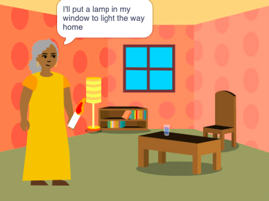

## Introduction

You are going to create a book in Scratch based on your own original idea. Your book will need to meet the **project brief**.

You will:
+ Think of original design ideas to create a digital book for someone specific,
+ Choose which skills to use to make your idea,
+ Learn how to use the project online via a web address.

### PROJECT BRIEF: I made you a book

You need to create a **digital book** that is educational, interesting, funny or all of those. 

You must choose who to write the book for such as "My little sister", "Dinosaur fans" or "People who are learning to sing".  

Your book should:
+ Have multiple pages with a way to turn to the next page,
+ Have at least one sprite,
+ Say or do something different on every page.

Your book could:
+ Have speech or sound effects,
+ Have artwork created in the paint editor,
+ Have interactive features on each page.

 

A project brief describes what a project must do. It's a bit like being given a mission to complete.

A digital book (or ebook) is a book created and read on a computer, table, phone or other electronic device. Have you read any books on a digital device?

--- task ---

### Try it

Click on the character and object to choose the ones you want in the story, then click on the Stage to turn the page.

**A debugging story**: [See inside](https://scratch.mit.edu/projects/498960446/editor){:target="_blank"}

  <iframe allowtransparency="true" width="485" height="402" src="https://scratch.mit.edu/projects/embed/498960446/?autostart=false" frameborder="0"></iframe>

--- /task ---

--- no-print ---

--- task ---

You are going create a digital book based on your own original idea. It could be a short story, a tutorial or fact book, a silly or funny book, an interactive book for young children or something we haven't thought of.

Think about what the topic of your book could be as you investigate these example projects to get more ideas:

**Changing backdrop tutorial**: [See inside](https://scratch.mit.edu/projects/498966268/editor){:target="_blank"}

  <iframe allowtransparency="true" width="485" height="402" src="https://scratch.mit.edu/projects/embed/498966268/?autostart=false" frameborder="0"></iframe>

**Scratch blends in**: [See inside](https://scratch.mit.edu/projects/498968472/editor){:target="_blank"}

  <iframe allowtransparency="true" width="485" height="402" src="https://scratch.mit.edu/projects/embed/498968472/?autostart=false" frameborder="0"></iframe>

**Tickle monster**: [See inside](https://scratch.mit.edu/projects/495865093/editor){:target="_blank"}

  <iframe allowtransparency="true" width="485" height="402" src="https://scratch.mit.edu/projects/embed/495865093/?autostart=false" frameborder="0"></iframe>

--- /task ---

--- /no-print ---

--- print-only ---

--- /print-only ---

