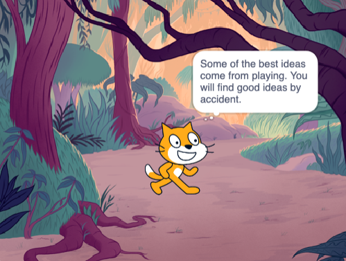

## Plan your book

Use this step to plan your book. You can plan by just thinking, adding backdrops and sprites in Scratch, or drawing or writing — or however you like! 

### Get started

Now, it's time to start to think about the pages (backdrops) and the characters and objects (sprites) in your book.

--- task ---

Open the [I made you a book starter project](https://scratch.mit.edu/projects/582223042/editor){:target="_blank"}. Scratch will open in another browser tab.

--- collapse ---
---
title: Working offline
---

For information about how to set up Scratch for offline use, visit [our 'Getting started with Scratch' guide](https://projects.raspberrypi.org/en/projects/getting-started-scratch){:target="_blank"}.

--- /collapse ---

Use your new Scratch project, ✏️ a pencil and [our planning sheet](){:target="_blank"} or a piece of paper, to plan ideas for your book.

--- /task ---

--- task ---

Think about the backdrops and sprites:
- 🖼️ Which backdrops or background colours will you use in your book? 
- 🗒️ How will users interact with your book to turn to the next page?
- 🦧 Which characters and objects will you have in your book? 
- 🏃‍♀️ How will the sprites be animated and interact on each page?

--- /task ---

--- task ---

You will need to decide in what order to build your book. To get started, you could:
- Create all the pages as backdrops, or
- Get one page working first

--- /task ---

You may not have time to add everything that you want to your book at first. That's OK — you can always come back to your project later. 

