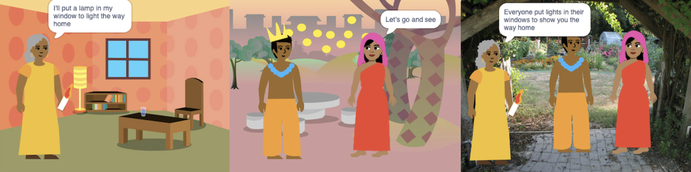

## Build and test

Now, it's time to build your book. Start small, and add more to your project if you have time.



**Tip:** Remember to test your project each time you add something. It is much easier to find and fix bugs before you make more changes.

### For each page 📃

--- task ---

Add the backdrop and new sprites you need for this page. 


You will need to add code to set the positions and visibility of sprites on the first title page and each page after that. 

```blocks3
when flag clicked

when backdrop switches to [page v]
```

[[[scratch3-show-hide-sprites-backdrops]]]

[[[scratch3-positioning-with-layers]]]

--- /task ---

### For each sprite 🎈

--- task ---

You will need to add code to each character and object sprite in your book. Consider whether they will do anything when the project starts, when the backdrop switches to a particular page or when the sprite is clicked. 

```blocks3
when flag clicked

when this sprite clicked

when backdrop switches to [page v]
```

[[[scratch3-change-costumes-to-show-mood]]]

[[[scratch3-animate-movement-costumes]]]

[[[scratch3-graphic-effects]]]

[[[scratch3-jiggle-a-sprite]]]

--- /task ---

### Turning the page 📖

--- task ---

You will need a way for your reader to move to the next page in your book.

```blocks3
when this sprite clicked
```

[[[scratch3-changing-backdrops-pages-levels]]]

--- /task ---

### Edit costumes 🦧 and backdrops 🖼️

--- task ---

You may want to edit or add costumes or backdrops in the Paint editor. 

{:width="200px"}


[[[scratch3-paint-a-new-backdrop-extended]]]

[[[scratch3-backdrops-and-sprites-using-shapes]]]

[[[scratch3-use-text-tool]]]

[[[scratch3-copy-parts-between-sprite-costumes]]]

[[[scratch3-add-costumes-to-a-sprite]]]

--- /task ---

### Add sound 🎵

--- task ---


```blocks3
when flag clicked

when this sprite clicked

when backdrop switches to [page v]
```


[[[scratch3-add-sound]]]


[[[scratch3-record-sound]]]


[[[scratch3-text-to-speech]]]

--- /task ---

### Useful tips:

[[[scratch3-copy-code]]]

[[[scratch3-full-screen]]]

[[[scratch3-duplicate-sprite]]]

--- task ---

**Test:** 🔄 Show someone else your project and ask for 🗣️ their feedback. Do you want to make any changes to your book? 

⏱️ If you have time, you can upgrade your project. 

💡 You could:
- Add more code to your sprites
- Add another sprite
- Record a sound 
- Create a new costume in the Paint editor

--- /task ---

--- task ---

**Debug:** 🐞 You might find some bugs in your project that you need to fix. Here are some common bugs:

--- collapse ---
---
title: A sprite is showing or hiding on the wrong pages
---

Check that the sprite has `when backdrop switches to`{:class="block3events"} scripts with `show`{:class="block3looks"} or `hide`{:class="block3looks"} blocks as needed. Check that you have chosen the correct backdrop name in the `when backdrop switches to`{:class="block3events"} block. It helps to give backdrops names that you can understand easily, to help spot problems like this.

--- /collapse ---

--- collapse ---
---
title: A sprite is going upside down
---

Add a `set rotation style left-right`{:class="block3motion"} or `set rotation style don't rotate`{:class="block3motion"} block.

--- /collapse ---

--- collapse ---
---
title: A sprite 'jumps' when it changes costume or bounces
---

Make sure that the costume is centred in the Paint editor (line up the blue cross in the costume with the crosshair in the centre of the Paint editor).

--- /collapse ---

--- collapse ---
---
title: A sound does not play
---

Have you added a block to `play sound`{:class="block3sound"} when needed? If you have copied code from another sprite, you will need to add the sound to this sprite in the **Sounds** tab. Check the volume on your computer or tablet, and make sure that you have not lowered the volume with code — try `set volume to`{:class="block3sound"} `100`.

--- /collapse ---

--- collapse ---
---
title: Other sprites keep going in front of a sprite
---

Add a `go to front layer`{:class="block3looks"} block.

--- /collapse ---

--- collapse ---
---
title: A sprite only moves or changes once
---

Put your code inside a `forever`{:class="block3control"} block so that it keeps running.

--- /collapse ---

--- collapse ---
---
title: The pages are in the wrong order
---

Check what order your backdrops are in: click on the Stage pane and then on the **Backdrops** tab to view the backdrops for your project.

--- /collapse ---

You might find a bug that is not listed here. Can you work out how to fix it?

🗣️ We love hearing about your bugs and how you fixed them. Use the **Send feedback** button at the bottom of this page and tell us if you found a different bug in your project.

--- /task ---


--- save ---
