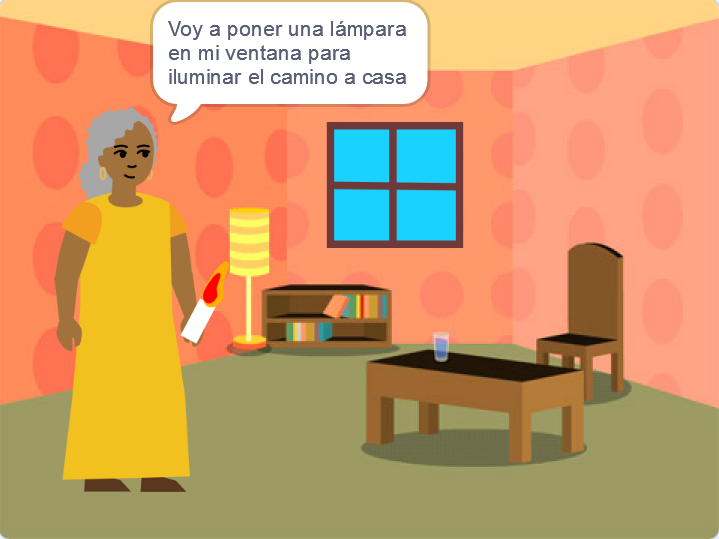

## Lo que harás

Crea un 📚 libro en Scratch basado en tu propia idea 💡.

You will:

+ Create a digital book for someone specific
+ Escoger qué habilidades usar para hacer tu libro
+ Compartir una dirección web para tu libro

--- no-print ---

--- task ---

### Reproducir▶️ 

Haz clic en la esquina para pasar la página.

Look for sprites that show and hide on different pages.
  
What happens when you click on each sprite?

  
**Monstruo de las cosquillas**: [Ver dentro](https://scratch.mit.edu/projects/500189097/editor){:target="_blank"}

  <iframe allowtransparency="true" width="485" height="402" src="https://scratch.mit.edu/projects/embed/500189097/?autostart=false" frameborder="0"></iframe>

--- /task ---

--- /no-print ---

Tu libro deberá seguir el **resumen del proyecto**.

Un **resumen del proyecto** describe lo que éste debe hacer. It is a bit like being given a mission to complete.

### 🎯 RESUMEN DEL PROYECTO: Crea un **libro digital**

Decide el tipo de libro que te gustaría hacer y para quienes está destinado. 

Your book should:
+ 📃 Have multiple pages, with a way to turn to the next page
+ 🐢 Have at least one sprite
+ 💬 Say or do something different on every page

Your book could:
+ 🔉 Have speech or sound effects 
+ 🎨 Have text or art that has been created in the Paint editor
+ 🖱️ Have interactive features on every page

--- no-print ---

### Obtén ideas 💭

--- task ---

Explora estos proyectos de ejemplo para obtener ideas para tu libro:

⭐ Share your finished 'I made you a book' project for a chance of it being featured here.

**Mi banda** 🎸 : [Ver dentro](https://scratch.mit.edu/projects/724148783/editor){:target="_blank"}

  <iframe allowtransparency="true" width="485" height="402" src="https://scratch.mit.edu/projects/embed/724148783/?autostart=false" frameborder="0"></iframe>

**⭐ Cenicienta y la araña** 🕷️ : [Ver dentro](https://scratch.mit.edu/projects/799448516/editor){:target="_blank"}

  <iframe allowtransparency="true" width="485" height="402" src="https://scratch.mit.edu/projects/embed/799448516/?autostart=false" frameborder="0"></iframe>

**⭐ Teletransportación accidental** 🚀 : [Ver dentro](https://scratch.mit.edu/projects/793833913/editor){:target="_blank"} (proyecto destacado de la comunidad)

  <iframe allowtransparency="true" width="485" height="402" src="https://scratch.mit.edu/projects/embed/793833913/?autostart=false" frameborder="0"></iframe>

**⭐ Cómo llegó el invierno** ☃️ : [Ver dentro](https://scratch.mit.edu/projects/707648744/editor){:target="_blank"} (proyecto destacado de la comunidad)

  <iframe allowtransparency="true" width="485" height="402" src="https://scratch.mit.edu/projects/embed/707648744/?autostart=false" frameborder="0"></iframe>

--- /task ---

--- /no-print ---

--- print-only ---

### Obtén ideas 💭

Para obtener ideas para tu 📚 libro, usa **Ver dentro** los proyectos de ejemplo en 'Te hice un libro - Ejemplos' del Estudio Scratch: https://scratch.mit.edu/studios/29082370

--- /print-only ---

