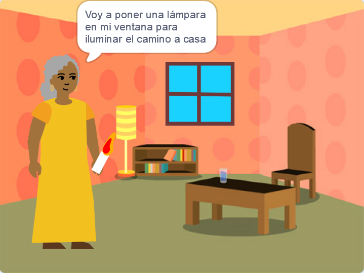

## Lo que harás

Crea un 📚 libro en Scratch basado en tu propia idea 💡.

Vas a:

+ Crear un libro digital para alguien en particular
+ Escoger qué habilidades usar para hacer tu libro
+ Compartir una dirección web para tu libro

--- no-print ---

--- task ---

### Reproducir▶️ 

Haz clic en la esquina para pasar la página.

Busca los objetos que se muestran y se ocultan en diferentes páginas.
  
¿Qué ocurre al hacer clic en cada objeto?

  
**Tickle monster**: [See inside](https://scratch.mit.edu/projects/500189097/editor){:target="_blank"}

  <iframe allowtransparency="true" width="485" height="402" src="https://scratch.mit.edu/projects/embed/500189097/?autostart=false" frameborder="0"></iframe>

--- /task ---

--- /no-print ---

Tu libro deberá seguir el **resumen del proyecto**.

Un **resumen del proyecto** describe lo que éste debe hacer. Es algo así como recibir una misión para completar.

### 🎯 RESUMEN DEL PROYECTO: Crea un **libro digital**

Decide el tipo de libro que te gustaría hacer y para quienes está destinado. 

Tu libro debe:
+ 📃Tener varias páginas, con una forma de poder pasar a la página siguiente
+ 🐢Tener por lo menos un objeto
+ 💬 Decir o hacer algo diferente en cada página

Tu libro podría:
+ 🔉Tener efectos de voz o de sonido
+ 🎨 Tener texto o arte creado en el editor de dibujo
+ 🖱️ Tener funciones interactivas en cada página

--- no-print ---

### Obtén ideas 💭

--- task ---

Explora estos proyectos de ejemplo para obtener ideas para tu libro:

⭐ Comparte tu proyecto de 'Te hice un libro' y ten la oportunidad de que se muestre aquí.

**My band** 🎸 : [See inside](https://scratch.mit.edu/projects/724148783/editor){:target="_blank"}

  <iframe allowtransparency="true" width="485" height="402" src="https://scratch.mit.edu/projects/embed/724148783/?autostart=false" frameborder="0"></iframe>

**⭐ Cinderella and the spider** 🕷️ : [See inside](https://scratch.mit.edu/projects/799448516/editor){:target="_blank"}

  <iframe allowtransparency="true" width="485" height="402" src="https://scratch.mit.edu/projects/embed/799448516/?autostart=false" frameborder="0"></iframe>

**⭐ Accidental Teleportation** 🚀 : [See inside](https://scratch.mit.edu/projects/793833913/editor){:target="_blank"} (featured community project)

  <iframe allowtransparency="true" width="485" height="402" src="https://scratch.mit.edu/projects/embed/793833913/?autostart=false" frameborder="0"></iframe>

**⭐ How winter came** ☃️ : [See inside](https://scratch.mit.edu/projects/707648744/editor){:target="_blank"} (featured community project)

  <iframe allowtransparency="true" width="485" height="402" src="https://scratch.mit.edu/projects/embed/707648744/?autostart=false" frameborder="0"></iframe>

--- /tarea ---

--- no imprimir ---

--- solo imprimir ---

### Obtén ideas 💭

Para obtener ideas para tu 📚 libro, usa **Ver dentro** los proyectos de ejemplo en 'Te hice un libro - Ejemplos' del Estudio Scratch: https://scratch.mit.edu/studios/29082370

--- /solo imprimir ---

