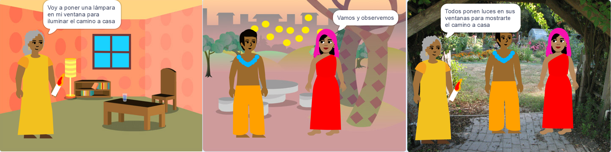

## Construye y prueba

Ahora es el momento de hacer tu libro. Empieza poco a poco y agrega más a tu proyecto si tienes tiempo.

**Consejo:** Recuerda probar tu proyecto cada vez que agregues algo. Es mucho más fácil encontrar y corregir errores antes de hacer más cambios.

--- task ---

Deberás decidir en qué orden crear tu libro. Para comenzar, puedes:
- Crear todas las páginas como fondos, o
- Hacer que una página funcione primero

--- /task ---

Es posible que al principio no tengas tiempo para agregar todo lo que quieras a tu libro. Está bien — siempre puedes volver a tu proyecto más tarde. 

--- task ---

Has desarrollado algunas habilidades realmente útiles en Scratch. Aquí hay un recordatorio para ayudarte a crear tu libro:

Código:

[[[scratch3-changing-backdrops-pages-levels]]]

[[[scratch3-change-costumes-to-show-mood]]]

[[[scratch3-animate-movement-costumes]]]

[[[scratch3-graphic-effects]]]

[[[scratch3-show-hide-sprites-backdrops]]]

[[[scratch3-positioning-with-layers]]]

[[[scratch3-jiggle-a-sprite]]]

El Editor de dibujo — fondos y disfraces:

[[[scratch3-paint-a-new-backdrop-extended]]]

[[[scratch3-backdrops-and-sprites-using-shapes]]]

[[[scratch3-use-text-tool]]]

[[[scratch3-copy-parts-between-sprite-costumes]]]

[[[scratch3-add-costumes-to-a-sprite]]]

Sonido:

[[[scratch3-add-sound]]]

[[[scratch3-record-sound]]]

[[[scratch3-text-to-speech]]]

El editor de Scratch:

[[[scratch3-copy-code]]]

[[[scratch3-full-screen]]]

[[[scratch3-duplicate-sprite]]]

--- /task ---

--- task ---

**Prueba:** Muéstrale tu proyecto a otra persona y pídele su opinión. ¿Quieres hacer cambios a tu libro?

--- /task ---

--- task ---

**Depurar:** Es posible que encuentres algunos errores en tu proyecto que necesites corregir. A continuación, se muestran algunos errores comunes:

--- collapse ---
---
title: Un objeto se muestra u oculta en las páginas incorrectas
---

Comprueba que el objeto tenga scripts `cuando el fondo cambie a`{:class="block3events"} con bloques `mostrar`{:class="block3looks"} o `esconder`{:class="block3looks"} según sea necesario. Comprueba que hayas elegido el nombre de fondo correcto en el bloque`cuando el fondo cambie a`{:class="block3events"}. Es útil dar nombres de fondo que pueda entender fácilmente, para ayudar a detectar problemas como este.

--- /collapse ---

--- collapse ---
---
title: Un objeto se pone boca abajo
---

Agrega un bloque `fijar estilo de rotación a izquierda-derecha`{:class="block3motion"} o `fijar estilo de rotación a no rotar`{:class="block3motion"}.

--- /collapse ---

--- collapse ---
---
title: Un objeto 'salta' cuando cambia de vestuario o rebota
---

Asegúrate de que el disfraz esté centrado en el editor de Paint (alinea la cruz azul del disfraz con la cruz en el centro del editor de Paint).

--- /collapse ---

--- collapse ---
---
title: No se reproduce un sonido
---

¿Ha agregado un bloque para `iniciar sonido`{:class="block3sound"} cuando sea necesario? Si has copiado el código de otro objeto, deberás agregar el sonido a este objeto en la pestaña **Sonidos**. Verifica el volumen en tu computadora o tableta, y asegúrate de no haber bajado el volumen con el código; prueba `fijar volumen a`{:class="block3sound"} `100`.

--- /collapse ---

--- collapse ---
---
title: Otros objetos continúan frente a un objeto
---

Agrega un bloque `ir a la capa de adelante`{:class="block3looks"}.

--- /collapse ---

--- collapse ---
---
title: Un objeto solo se mueve o cambia una vez
---

Pon tu código dentro de un bloque `por siempre`{:class="block3control"} para que siga funcionando.

--- /collapse ---

--- collapse ---
---
title: Las páginas están en el orden incorrecto
---

Verifica en qué orden están tus fondos: haz clic en el panel Escenario y luego en **Fondos** para ver los fondos de tu proyecto.

--- /collapse ---

Es posible que encuentres un error que no se incluye aquí. ¿Puedes averiguar cómo solucionarlo?

Nos encanta conocer tus errores y cómo los solucionaste. Usa el botón **Enviar comentarios** en la parte inferior de esta página y cuéntanos si encontraste un error distinto en tu proyecto.

--- /task ---

--- save ---
