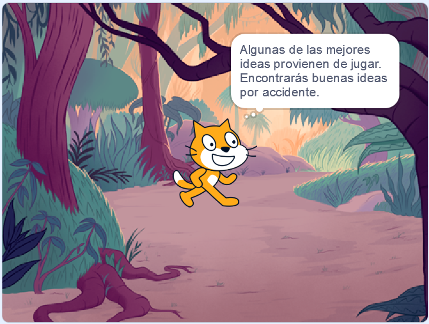

## Planifica tu libro 📔

Aprovecha este paso para planearlo. Puedes planearlo simplemente pensando, agregando fondos y objetos en Scratch, o dibujando o escribiendo, ¡o como quieras!

Ahora es el momento de empezar a pensar en las páginas (fondos) y los personajes y objetos (sprites) de tu libro.

--- task ---

Abre el [proyecto de iniciación te hice un libro](https://scratch.mit.edu/projects/582223042/editor){:target="_blank"}. Scratch se abrirá en otra pestaña del navegador.

⏱️ ¿Poco tiempo? Puedes comenzar con uno de los [ejemplos](https://scratch.mit.edu/studios/29082370){:target="_blank"}.

--- collapse ---
---
title: Trabajar sin conexión
---

Para obtener información sobre cómo configurar Scratch para usar sin conexión, visita [nuestra guía de "Introducción a Scratch"](https://projects.raspberrypi.org/en/projects/getting-started-scratch){:target="_blank"}.

--- /collapse ---

--- /task ---

--- task ---

Usa tu nuevo proyecto de Scratch para planear tu libro. No tienes que planificar todas las páginas, puedes agregarlas más tarde.

También puedes usar ✏️ un lápiz y [esta hoja de planificación](resources/i-made-a-book-worksheet.pdf){:target="_blank"} o una hoja de papel para esbozar tus ideas.

Piensa en los fondos y los objetos:
- 🖼️ ¿Qué fondos o colores de fondo usarás en tu libro?
- 🗒️ ¿Cómo interactuarán los usuarios con tu libro para pasar a la página siguiente?
- 🦁 ¿Qué personajes y objetos habrá en tu libro?
- 🏃‍♀️ ¿Cómo se animarán e interactuarán los objetos en cada página?

{:width="300px"}

--- /task ---
