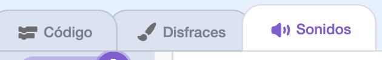

## Construye 🧱 y prueba 🔄

Ahora es el momento de hacer tu libro. Empieza poco a poco y agrega más a tu proyecto si tienes tiempo.


**Consejo:** Recuerda probar tu proyecto cada vez que agregues algo. Es mucho más fácil encontrar y corregir errores antes de hacer más cambios.

### Por cada página 📃

--- task ---

Agrega el fondo y los nuevos objetos que necesitas para esta página.


Deberás agregar un código para establecer las posiciones y la visibilidad de los objetos en la primera página de título y cada página posterior.

```blocks3
when flag clicked

when backdrop switches to [page v]
```

[[[scratch3-show-hide-sprites-backdrops]]]

[[[scratch3-positioning-with-layers]]]

--- /task ---

### Para cada objeto 🐈 🐢 🎈

--- task ---

Deberás agregar un código a cada personaje y objeto en tu libro. Ten en cuenta si harán algo cuando comience el proyecto, cuando el fondo cambie a una página en particular o al hacer clic en el objeto.

```blocks3
when flag clicked

when this sprite clicked

when backdrop switches to [page v]
```

[[[scratch3-change-costumes-to-show-mood]]]

[[[scratch3-animate-movement-costumes]]]

[[[scratch3-graphic-effects]]]

[[[scratch3-jiggle-a-sprite]]]

--- /task ---

### Pasando la página 📖

--- task ---

Necesitarás una forma para que tu lector pase a la página siguiente del libro.

```blocks3
when this sprite clicked
```

[[[scratch3-changing-backdrops-pages-levels]]]

--- /task ---

### Edita los disfraces 🦁 y fondos 🖼️

--- task ---

Quizás quieras editar o agregar disfraces o fondos en el editor de pintura.

{:width="250px"}


[[[scratch3-paint-a-new-backdrop-extended]]]

[[[scratch3-backdrops-and-sprites-using-shapes]]]

[[[scratch3-use-text-tool]]]

[[[scratch3-copy-parts-between-sprite-costumes]]]

[[[scratch3-add-costumes-to-a-sprite]]]

--- /task ---

### Añade sonido 🎵

--- task ---



```blocks3
when flag clicked

when this sprite clicked

when backdrop switches to [page v]
```


[[[scratch3-add-sound]]]


[[[scratch3-record-sound]]]


[[[scratch3-text-to-speech]]]

--- /task ---

### Recordatorios del editor de scratch

[[[scratch3-copy-code]]]

[[[scratch3-full-screen]]]

[[[scratch3-duplicate-sprite]]]

--- task ---

**Prueba:** 🔄 Muéstrale tu proyecto a otra persona y pídele 🗣️ su opinión. ¿Quieres hacerle cambios a tu libro?

⏱️ Si tienes tiempo, puedes mejorar tu proyecto.

💡 Podrías:
- Agregar más código a tus objetos
- Agregar otro objeto
- Agregar otra página
- Grabar un sonido
- Crear un nuevo disfraz en el editor de dibujo

--- /task ---

--- task ---

**Debug:** 🐞 Es posible que en el proyecto encuentres algunos errores que necesites corregir. A continuación, se muestran algunos errores comunes:

--- collapse ---
---
title: Un objeto se muestra u oculta en las páginas incorrectas
---

Comprueba que el objeto tenga `cuando el fondo cambie a`{:class="block3events"} con bloques `mostrar`{:class="block3looks"} o `esconder`{:class="block3looks"} según sea necesario. Comprueba que hayas elegido el nombre de fondo correcto en el bloque`cuando el fondo cambie a`{:class="block3events"}. Es útil darle a los fondos nombres que puedas entender fácilmente, para ayudar a detectar problemas como este.

--- /collapse ---

--- collapse ---
---
title: Un objeto se pone boca abajo
---

Agrega un bloque `fijar estilo de rotación a izquierda-derecha`{:class="block3motion"} o `fijar estilo de rotación a no rotar`{:class="block3motion"}.

--- /collapse ---

--- collapse ---
---
title: Un objeto 'salta' cuando cambia de vestuario o rebota
---

Asegúrate de que el disfraz esté centrado en el editor de dibujo (alinea la cruz azul del disfraz con la cruz en el centro del editor).

--- /collapse ---

--- collapse ---
---
title: No se reproduce un sonido
---

¿Has agregado un bloque a `reproducir sonido`{:class="block3sound"} cuando sea necesario? Si has copiado el código de otro objeto, le deberás agregar el sonido a este en la pestaña **Sonidos**. Verifica el volumen en tu computadora o tableta y asegúrate de no haber bajado el volumen con el código; prueba `fijar volumen a`{:class="block3sound"} `100`.

--- /collapse ---

--- collapse ---
---
title: Otros objetos continúan frente a un objeto
---

Agrega un bloque `ir a la capa de adelante`{:class="block3looks"}.

--- /collapse ---

--- collapse ---
---
title: Un objeto solo se mueve o cambia una vez
---

Pon tu código dentro de un bloque `por siempre`{:class="block3control"} para que siga funcionando.

--- /collapse ---

--- collapse ---
---
title: Las páginas están en el orden incorrecto
---

Verifica en qué orden están tus fondos: haz clic en el panel escenario y luego en **Fondos** para ver los fondos de tu proyecto.

--- /collapse ---

Es posible que encuentres un error que no se incluye aquí. ¿Puedes averiguar cómo solucionarlo?

🗣️ Nos encanta conocer tus errores y cómo los solucionaste. Usa el botón **Enviar comentarios** en la parte inferior de esta página y cuéntanos si encontraste un error distinto en tu proyecto.

--- /task ---

