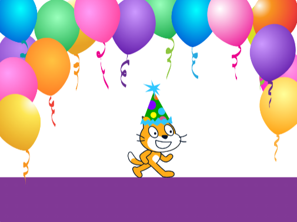

## Lista de control

¿Cumpliste con el **resumen del proyecto**? Piensa en tu proyecto y revisa la lista de control, marca las características que tiene tu proyecto.

### Tu libro debe tener:

--- task ---

Varias páginas, con una forma de pasar a la página siguiente

--- /task ---

--- task ---

Al menos un objeto

--- /task ---

--- task ---

Diferentes acciones en cada página

--- /task ---

### También podría tener:

--- task ---

Efectos de voz o sonido

--- /task ---

--- task ---

Texto o arte creado en el editor de dibujo

--- /task ---

--- task ---

Funciones interactivas en cada página

--- /task ---

### Reflexión

Puedes reflexionar sobre cómo hiciste tu libro, para ayudarte en tus proyectos futuros:

--- task ---

¿Cómo obtuviste tus ideas?

--- /task ---

--- task ---

¿Qué cosas nuevas y geniales aprendiste?

--- /task ---

### ¡Ahora eres el autor de un libro digital!

🎉 Tómate un momento para celebrar lo que has hecho.

--- task ---

¿Dónde usarás tus nuevos poderes? ¿Qué harás a continuación?

--- /task ---

