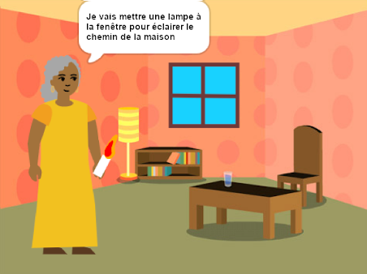

## Introduction

Crée ton propre livre avec Scratch. Ton livre devra respecter la **fiche de projet**.

La **fiche de projet** décrit ce qu'un projet doit faire. C'est un peu comme une mission à accomplir.

Tu vas devoir :

+ Penser à des idées afin de créer un livre numérique pour quelqu'un en particulier
+ Choisir les compétences à utiliser pour créer ton livre
+ Partager l'adresse Web de ton livre

--- no-print ---

--- task ---

### Essaie le livre

Clique sur le coin pour tourner la page.

Combien de pages le livre a-t-il ?

Recherche les sprites qui s'affichent et se cachent sur différentes pages.

**Éclaire le chemin du retour** : [Voir à l'intérieur](https://scratch.mit.edu/projects/499860786/editor){:target="_blank"}

  <iframe allowtransparency="true" width="485" height="402" src="https://scratch.mit.edu/projects/embed/499860786/?autostart=false" frameborder="0"></iframe>

--- /task ---

--- /no-print ---

### FICHE DE PROJET : Crée un **livre numérique**

Ton livre peut être un livre d'histoires, un manuel d'instructions, un livre relatant des faits, un livre interactif ou autre.

Tu dois choisir pour qui écrire le livre, comme « ma petite sœur », « les fans de dinosaures » ou « les gens qui apprennent à chanter ».  

Ton livre doit :
+ Avoir plusieurs pages, avec un moyen de passer à la page suivante
+ Avoir au moins un sprite
+ Dire ou faire quelque chose de différent sur chaque page

Ton livre pourrait :
+ Avoir des paroles ou des effets sonores
+ Avoir du texte ou de l'art qui a été créé dans l'éditeur d'images
+ Avoir des fonctionnalités interactives sur chaque page

Un **livre numérique** (ou e-book) est un livre créé et lu sur un ordinateur, une tablette, un téléphone ou tout autre appareil électronique. As-tu déjà lu des livres sur un appareil numérique ?

--- no-print ---

### Trouve l'inspiration

--- task ---

Explore ces exemples de projets pour trouver des idées pour ton livre :

**Monstre chatouilleur** : [Voir à l'intérieur](https://scratch.mit.edu/projects/500189097/editor){:target="_blank"}

  <iframe allowtransparency="true" width="485" height="402" src="https://scratch.mit.edu/projects/embed/500189097/?autostart=false" frameborder="0"></iframe>

**Scratch le chat se transforme** : [Voir à l'intérieur](https://scratch.mit.edu/projects/498968472/editor){:target="_blank"}

  <iframe allowtransparency="true" width="485" height="402" src="https://scratch.mit.edu/projects/embed/498968472/?autostart=false" frameborder="0"></iframe>

**Une histoire de débogage** : [Voir à l'intérieur](https://scratch.mit.edu/projects/498960446/editor){:target="_blank"}
Clique sur le personnage et l'objet pour choisir ceux que tu veux utiliser dans l'histoire, puis clique sur la scène pour tourner la page.

  <iframe allowtransparency="true" width="485" height="402" src="https://scratch.mit.edu/projects/embed/498960446/?autostart=false" frameborder="0"></iframe>

--- /task ---

--- /no-print ---

--- print-only ---

### Trouve l'inspiration

Pour trouver des idées pour ton livre, **regarde** ces exemples de projets dans le studio Scratch « Je t'ai fait un livre — Exemples » : https://scratch.mit.edu/studios/29082370

--- /print-only ---

