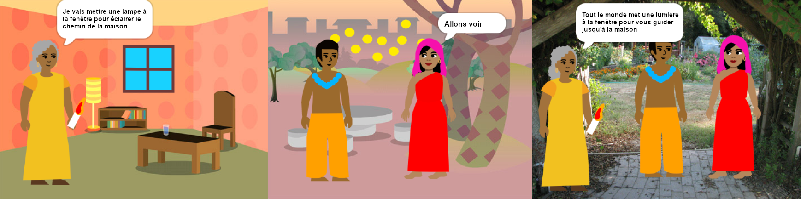

## Construire et tester

Maintenant, il est temps de créer ton livre. Commence doucement et développe ton projet si tu as le temps.

**Astuce :** N'oublie pas de tester ton projet à chaque fois que tu ajoutes quelque chose. Il est beaucoup plus facile de trouver et de corriger les bogues avant d'apporter d'autres modifications.

--- task ---

Tu devras décider dans quel ordre construire ton livre. Pour commencer, tu pourrais :
- Créer toutes les pages comme arrière-plans, ou
- Faire fonctionner une seule page en premier

--- /task ---

Tu n'auras peut-être pas le temps d'ajouter tout ce que tu veux à ton livre au début. Ce n'est pas grave, tu peux toujours revenir sur ton projet plus tard. 

--- task ---

Tu as déjà acquis des compétences très utiles dans Scratch. Voici un rappel pour t'aider à réaliser ton livre :

Code :

[[[scratch3-changing-backdrops-pages-levels]]]

[[[scratch3-change-costumes-to-show-mood]]]

[[[scratch3-animate-movement-costumes]]]

[[[scratch3-graphic-effects]]]

[[[scratch3-show-hide-sprites-backdrops]]]

[[[scratch3-positioning-with-layers]]]

[[[scratch3-jiggle-a-sprite]]]

L'éditeur d'images — arrière-plans et costumes :

[[[scratch3-paint-a-new-backdrop-extended]]]

[[[scratch3-backdrops-and-sprites-using-shapes]]]

[[[scratch3-use-text-tool]]]

[[[scratch3-copy-parts-between-sprite-costumes]]]

[[[scratch3-add-costumes-to-a-sprite]]]

Effets sonores :

[[[scratch3-add-sound]]]

[[[scratch3-record-sound]]]

[[[scratch3-text-to-speech]]]

L'éditeur Scratch :

[[[scratch3-copy-code]]]

[[[scratch3-full-screen]]]

[[[scratch3-duplicate-sprite]]]

--- /task ---

--- task ---

**Test :** Montre ton projet à quelqu'un d'autre et demande-lui son avis. Tu souhaites apporter des modifications à ton livre ?

--- /task ---

--- task ---

**Débogage :** Il est possible que tu trouves des bogues dans ton projet que tu dois corriger. Voici quelques bogues assez courants :

--- collapse ---
---
title: Un sprite s'affiche ou se cache sur la mauvaise page
---

Vérifie que le sprite a des scripts `quand l'arrière-plan bascule sur`{:class="block3events"} avec le bloc `montrer`{:class="block3looks"} ou `cacher`{:class="block3looks"} selon les besoins. Vérifie que tu as choisi le bon nom d'arrière plan dans le `quand l'arrière-plan bascule sur`{:class="block3events"}. Il est utile de donner aux arrière-plans des noms que tu peux comprendre facilement, pour aider à repérer des problèmes comme celui-ci.

--- /collapse ---

--- collapse ---
---
title: Un sprite part à l'envers
---

Ajoute un bloc `fixer le sens de rotation gauche-droite`{:class="block3motion"} ou un `fixer le sens de rotation ne tourne pas`{:class="block3motion"}.

--- /collapse ---

--- collapse ---
---
title: Un sprite « saute » lorsqu'il change de costume ou rebondit
---

Assure-toi que le costume est centré dans l'éditeur d'image (aligne la croix bleue dans le costume avec le réticule au centre de l'éditeur de peinture).

--- /collapse ---

--- collapse ---
---
title: Un son ne joue pas
---

As-tu ajouté un bloc `jouer le son`{:class="block3sound"} en cas de besoin ? Si tu as copié le code d'un autre sprite, tu dois ajouter le son à ce sprite dans l'onglet **Sons**. Vérifie le volume sur ton ordinateur ou ta tablette et assure-toi que tu n'as pas baissé le volume avec le code — essayer `mettre le volume à`{:class="block3sound"} `100`.

--- /collapse ---

--- collapse ---
---
title: D'autres sprites restent devant un sprite
---

Ajoute un `aller à l'avant plan`{:class="block3looks"}.

--- /collapse ---

--- collapse ---
---
title: Un sprite ne bouge ou ne change qu'une seule fois
---

Mets ton code dans un `répéter indéfiniment`{:class="block3control"} afin qu'il continue de s'exécuter.

--- /collapse ---

--- collapse ---
---
title: Les pages sont dans le mauvais ordre
---

Vérifie l'ordre dans lequel se trouvent tes arrière-plans : clique sur le panneau Scène, puis sur l' onglet **Arrière-plans** pour afficher les arrière-plans de ton projet.

--- /collapse ---

Tu pourrais trouver un bogue qui n'est pas répertorié ici. Peux-tu trouver comment le réparer?

Nous aimons avoir des nouvelles de tes bogues et de la façon dont tu les as corrigés. Utilise le bouton **Envoyer des commentaires** en bas de cette page et dis-nous si tu as trouvé un bogue différent dans ton projet.

--- /task ---

--- save ---
