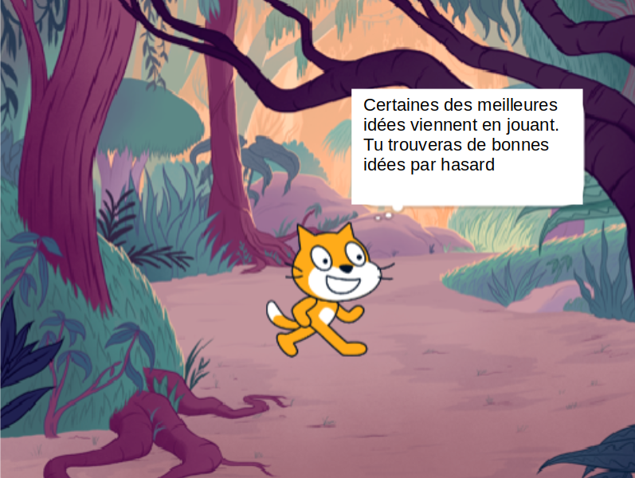

## Planifier ton livre 📔

Utilise cette étape pour planifier ton livre. Tu peux planifier en réfléchissant, en ajoutant des arrière-plans et des sprites dans Scratch, ou en dessinant ou écrivant - ou comme tu le souhaites !

Maintenant, il est temps de commencer à penser aux pages (arrière-plans) et aux personnages et objets (sprites) de ton livre.

--- task ---

Ouvre le [ projet de démarrage « Je t'ai fait un livre »](https://scratch.mit.edu/projects/582223042/editor){:target="_blank"}. Scratch s'ouvrira dans un autre onglet du navigateur.

⏱️ Tu n'as pas beaucoup de temps ? Tu peux commencer à partir de l'un des [exemples](https://scratch.mit.edu/studios/29082370){:target="_blank"}.

--- collapse ---
---
title: Travailler hors ligne
---

Pour plus d'informations sur la configuration de Scratch pour une utilisation hors connexion, consulte [notre guide « Premiers pas avec Scratch »](https://projects.raspberrypi.org/fr-FR/projects/getting-started-scratch){:target="_blank"}.

--- /collapse ---

--- /task ---

--- task ---

Utilise ton nouveau projet Scratch pour planifier ton livre. Tu n'as pas à planifier toutes les pages que tu peux ajouter plus tard.

Tu peux également utiliser ✏️ un crayon et [cette feuille de planification](resources/i-made-a-book-worksheet.pdf){:target="_blank"} ou une feuille de papier pour esquisser tes idées.

Pense aux arrière-plans et aux sprites :
- 🖼️ Quels décors ou couleurs d'arrière-plan utiliseras-tu dans ton livre ?
- 🗒️ Comment les utilisateurs interagiront-ils avec ton livre pour passer à la page suivante ?
- 🦁 Quels personnages et objets auras-tu dans ton livre ?
- 🏃‍♀️ Comment les sprites seront-ils animés et interagiront-ils sur chaque page ?

{:width="300px"}

--- /task ---
