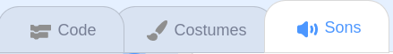
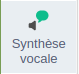

## Construire 🧱 et tester 🔄

Maintenant, il est temps de construire ton livre. Commence petit et ajoute plus à ton projet si tu as le temps.


**Astuce :** N'oublie pas de tester ton projet à chaque fois que tu ajoutes quelque chose. Il est beaucoup plus facile de trouver et de corriger les bogues avant d'apporter d'autres modifications.

### Pour chaque page 📃

--- task ---

Ajoute l'arrière-plan et les nouveaux sprites dont tu as besoin pour cette page.


Tu devras ajouter du code pour définir les positions et la visibilité des sprites sur la première page de titre et sur chaque page suivante.

```blocks3
when flag clicked

when backdrop switches to [page v]
```

[[[scratch3-show-hide-sprites-backdrops]]]

[[[scratch3-positioning-with-layers]]]

--- /task ---

### Pour chaque sprite 🐈 🐢 🎈

--- task ---

Tu devras ajouter du code à chaque personnage et sprite d'objet de ton livre. Détermine s'ils feront quelque chose au démarrage du projet, lorsque l'arrière-plan bascule vers une page particulière ou lorsque le sprite est cliqué.

```blocks3
when flag clicked

when this sprite clicked

when backdrop switches to [page v]
```

[[[scratch3-change-costumes-to-show-mood]]]

[[[scratch3-animate-movement-costumes]]]

[[[scratch3-graphic-effects]]]

[[[scratch3-jiggle-a-sprite]]]

--- /task ---

### Tourner la page 📖

--- task ---

Tu auras besoin d'un moyen pour ton lecteur de passer à la page suivante de ton livre.

```blocks3
when this sprite clicked
```

[[[scratch3-changing-backdrops-pages-levels]]]

--- /task ---

### Modifier les costumes 🦁 et les arrières-plans 🖼️

--- task ---

Tu voudras peut-être modifier ou ajouter des costumes ou des arrière-plans dans l'éditeur de peinture.

{:width="250px"}


[[[scratch3-paint-a-new-backdrop-extended]]]

[[[scratch3-backdrops-and-sprites-using-shapes]]]

[[[scratch3-use-text-tool]]]

[[[scratch3-copy-parts-between-sprite-costumes]]]

[[[scratch3-add-costumes-to-a-sprite]]]

--- /task ---

### Ajouter du son 🎵

--- task ---



```blocks3
when flag clicked

when this sprite clicked

when backdrop switches to [page v]
```


[[[scratch3-add-sound]]]


[[[scratch3-record-sound]]]



[[[scratch3-text-to-speech]]]

--- /task ---

### Rappels de l'éditeur Scratch

[[[scratch3-copy-code]]]

[[[scratch3-full-screen]]]

[[[scratch3-duplicate-sprite]]]

--- task ---

**Test :** 🔄 Montre ton projet à quelqu'un d'autre et demande 🗣️ son avis. Tu souhaites apporter des modifications à ton livre ?

⏱️ Si tu as le temps, tu peux perfectionner ton projet.

💡 Tu pourrais :
- Ajouter plus de code à tes sprites
- Ajouter un autre sprite
- Ajouter une autre page
- Enregistrer un son
- Créer un nouveau costume dans l'éditeur de peinture

--- /task ---

--- task ---

**Débogage :** 🐞 Tu pourrais trouver des bugs dans ton projet que tu dois corriger. Voici quelques bugs assez courants :

--- collapse ---
---
title: un sprite s'affiche ou se cache sur les mauvaises pages
---

Vérifie que le sprite a des scripts `quand l'arrière-plan bascule sur`{:class="block3events"} avec le bloc `montrer`{:class="block3looks"} ou `cacher`{:class="block3looks"} selon les besoins. Vérifie que tu as choisi le bon nom d'arrière-plan dans le bloc `quand l'arrière-plan bascule sur`{:class="block3events"}. Il est utile de donner aux arrière-plans des noms que tu peux comprendre facilement, pour aider à repérer des problèmes comme celui-ci.

--- /collapse ---

--- collapse ---
---
title: Un sprite part à l'envers
---

Ajoute un bloc `fixer le sens de rotation gauche-droite`{:class="block3motion"} ou un `fixer le sens de rotation ne tourne pas`{:class="block3motion"}.

--- /collapse ---

--- collapse ---
---
title: Un sprite « saute » lorsqu'il change de costume ou rebondit
---

Assure-toi que le costume est centré dans l'éditeur de peinture (aligne la croix bleue dans le costume avec le réticule au centre de l'éditeur de peinture).

--- /collapse ---

--- collapse ---
---
title: Un son ne joue pas
---

As-tu ajouté un bloc `jouer le son`{:class="block3sound"} lorsque cela est nécessaire ? Si tu as copié le code d'un autre sprite, tu devras ajouter le son à ce sprite dans l'onglet **Sons**. Vérifie le volume sur ton ordinateur ou ta tablette et assure-toi que tu n'as pas baissé le volume avec le code — essaye `mettre le volume à`{:class="block3sound"} `100`.

--- /collapse ---

--- collapse ---
---
title: D'autres sprites restent devant un sprite
---

Ajoute un bloc `aller à l'avant plan`{:class="block3looks"}.

--- /collapse ---

--- collapse ---
---
title: Un sprite ne bouge ou ne change qu'une seule fois
---

Mets ton code dans un bloc `répéter indéfiniment`{:class="block3control"} afin qu'il continue de s'exécuter.

--- /collapse ---

--- collapse ---
---
title: Les pages sont dans le mauvais ordre
---

Vérifie l'ordre dans lequel se trouvent tes arrière-plans : clique sur le panneau Scène, puis sur l'onglet **Arrière-plans** pour afficher les arrière-plans de ton projet.

--- /collapse ---

Tu pourrais trouver un bug qui n'est pas répertorié ici. Peux-tu trouver comment le résoudre ?

🗣️ Nous aimons avoir des nouvelles de tes bugs et de la façon dont tu les as corrigés. Utilise le bouton **Envoyer des commentaires** en bas de cette page et dis-nous si tu as trouvé un bug différent dans ton projet.

--- /task ---

