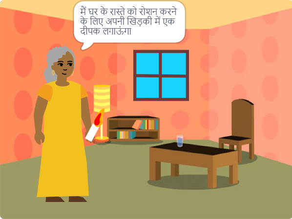

## आपको बनाना है

अपने विचार 💡 के आधार पर स्क्रैच में एक 📚 पुस्तक बनाएं।

आप करेंगे:

+ किसी विशिष्ट व्यक्ति के लिए एक डिजिटल पुस्तक बनाएं
+ अपनी पुस्तक बनाने के लिए कुशलताओं का चयन करेंगे
+ अपनी पुस्तक के लिए एक वेब एड्रेस साझा करेंगे

--- no-print ---

--- task ---

### इसे आज़माएं

पेज पलटने के लिए कोने पर क्लिक करें।

स्प्राइट्स की तलाश करें जो अलग-अलग पेजों पर दिखते और छिपते हैं।
  
जब आप प्रत्येक स्प्राइट पर क्लिक करते हैं तो क्या होता है?

  
**Tickle monster**: [See inside](https://scratch.mit.edu/projects/500189097/editor){:target="_blank"}

  <iframe allowtransparency="true" width="485" height="402" src="https://scratch.mit.edu/projects/embed/500189097/?autostart=false" frameborder="0"></iframe>

--- /task ---

--- /no-print ---

आपकी पुस्तक को **परियोजना संक्षेप** को पूरा करने की आवश्यकता होगी।

एक **परियोजना संक्षेप** बताता है कि किसी प्रोजेक्ट को क्या करना चाहिए। यह कुछ हद तक एक मिशन पूरा करने जैसा है

### 🎯 प्रोजेक्ट संक्षिप्त: एक **डिजिटल पुस्तक** बनाएं

आपको यह तय करना होगा कि आप किस प्रकार की पुस्तक बनाना चाहते हैं और यह किसके लिए है। 

आपकी पुस्तक में:
+ कई पेज हों, अगले पेज पर जाने के तरीका भी हो
+ कम से कम एक स्प्राइट हो
+ प्रत्येक पेज पर कुछ अलग कहें या करें

आपकी पुस्तक में यह सब हो सकता है:
+ भाषण या ध्वनि प्रभाव
+ पेंट एडिटर में बनायी हुई कला या शब्द
+ प्रत्येक पेज पर इंटरैक्टिव सुविधाएं

--- no-print ---

### विचार प्राप्त करें 💭

--- task ---

अपनी किताब के लिए विचार प्राप्त करने के लिए इन उदाहरण प्रोजेक्ट्स का अन्वेषण करें:

⭐ अपने तैयार 'मैंने तुम्हारे लिए एक किताब बनाई है' प्रोजेक्ट को यहां प्रदर्शित होने के अवसर के लिए साझा करें।

**My band** 🎸 : [See inside](https://scratch.mit.edu/projects/724148783/editor){:target="_blank"}

  <iframe allowtransparency="true" width="485" height="402" src="https://scratch.mit.edu/projects/embed/724148783/?autostart=false" frameborder="0"></iframe>

**⭐ Cinderella and the spider** 🕷️ : [See inside](https://scratch.mit.edu/projects/799448516/editor){:target="_blank"}

  <iframe allowtransparency="true" width="485" height="402" src="https://scratch.mit.edu/projects/embed/799448516/?autostart=false" frameborder="0"></iframe>

**⭐ Accidental Teleportation** 🚀 : [See inside](https://scratch.mit.edu/projects/793833913/editor){:target="_blank"} (featured community project)

  <iframe allowtransparency="true" width="485" height="402" src="https://scratch.mit.edu/projects/embed/793833913/?autostart=false" frameborder="0"></iframe>

**⭐ How winter came** ☃️ : [See inside](https://scratch.mit.edu/projects/707648744/editor){:target="_blank"} (featured community project)

  <iframe allowtransparency="true" width="485" height="402" src="https://scratch.mit.edu/projects/embed/707648744/?autostart=false" frameborder="0"></iframe>

--- /काम ---

--- /नो-प्रिंट ---

--- केवल प्रिंट ---

### विचार प्राप्त करें 💭

अपनी किताब के लिए विचार प्राप्त करने के लिए, 'I मैंने तुम्हारे लिए एक किताब बनाई है — उदाहरणों' स्क्रैच स्टूडियो: https://scratch.mit.edu/studios/29082370 में **अंदर देखें** उदाहरण प्रोजेक्ट्स

--- /print-only ---

