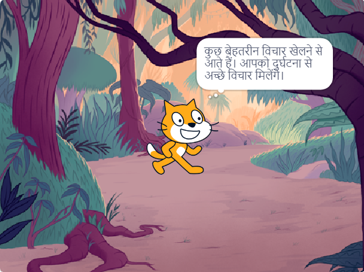

## अपनी पुस्तक की योजना बनाएं 📔

अपनी पुस्तक की योजना बनाने के लिए इस चरण का उपयोग करें। आप केवल सोचकर, स्क्रैच में पृष्ठभूमि और स्प्राइट्स जोड़कर, या ड्राइंग या लिखकर योजना बना सकते हैं - या फिर भी आप चाहें!

अब, अपनी पुस्तक में पृष्ठों (पृष्ठभूमि) और पात्रों और वस्तुओं (स्प्राइट्स) के बारे में सोचना शुरू करने का समय आ गया है।

--- task ---

[मैंने आपको एक बुक स्टार्टर प्रोजेक्ट बनाया है](https://scratch.mit.edu/projects/582223042/editor){:target="_blank"} खोलें। स्क्रैच दूसरे ब्राउजर टैब में खुलेगा।

⏱️ ज्यादा समय नहीं है? आप [उदाहरण](https://scratch.mit.edu/studios/29082370){:target="_blank"} में से किसी एक से शुरू कर सकते हैं।

--- collapse ---
---
title: Working offline
---

Scratch को ऑफ़लाइन उपयोग के लिए कैसे सेट करें, इस बारे में जानकारी के लिए, [ 'Getting started with Scratch' guide](https://projects.raspberrypi.org/en/projects/getting-started-scratch){:target="_blank"} पर जाएं।

--- /collapse ---

--- /task ---

--- task ---

अपनी किताब की योजना बनाने के लिए अपने नए स्क्रैच प्रोजेक्ट का उपयोग करें। आपको उन सभी पृष्ठों की योजना बनाने की आवश्यकता नहीं है आप बाद में और बना सकते हैं।

आप अपने विचारों को स्केच करने के लिए ✏️ एक पेंसिल और [इस प्लानिंग शीट](resources/i-made-a-book-worksheet.pdf){:target="_blank"} या कागज के एक टुकड़े का भी उपयोग कर सकते हैं।

बैकड्रॉप और चित्रों के बारे में सोचें:
- 🖼️ आप अपनी पुस्तक में किन पृष्ठभूमि या पृष्ठभूमि के रंगों का उपयोग करेंगे?
- 🗒️ अगले पृष्ठ पर जाने के लिए उपयोगकर्ता आपकी पुस्तक के साथ कैसे इंटरैक्ट करेंगे?
- 🦁 आपकी पुस्तक में कौन से पात्र और वस्तुएं होंगी?
- 🏃‍♀️ प्रत्येक पृष्ठ पर स्प्राइट्स कैसे एनिमेटेड और इंटरैक्ट करेंगे?

{:width="300px"}

--- /task ---
