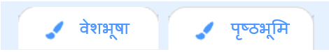
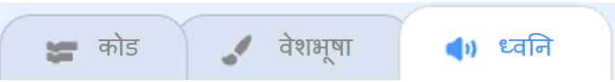
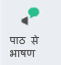

## निर्माण और परीक्षण करें

अब, आपकी किताब बनाने का समय आ गया है। छोटे से शुरू करें, और यदि आपके पास समय हो तो अपनी परियोजना में और जोड़ें।


**युक्ति:** प्रत्येक बार जब आप कुछ जोड़ते हैं तो अपनी परियोजना का परीक्षण करना याद रखें। अधिक बदलाव करने से पहले गलती को खोजना और ठीक करना बहुत आसान है।

### प्रत्येक पृष्ठ के लिए 📃

--- task ---

इस पृष्ठ के लिए आवश्यक बैकड्रॉप और नए चित्र जोड़ें।


पहले शीर्षक पृष्ठ और उसके बाद प्रत्येक पृष्ठ पर चित्र की स्थिति और दृश्यता सेट करने के लिए आपको कोड लिखने की आवश्यकता होगी।

```blocks3
when flag clicked

when backdrop switches to [page v]
```

[[[scratch3-show-hide-sprites-backdrops]]]

[[[scratch3-positioning-with-layers]]]

--- /task ---

### प्रत्येक चित्र के लिए 🐈 🐢 🎈

--- task ---

आपको अपनी पुस्तक में प्रत्येक वर्ण और वस्तु चित्र में कोड जोड़ने की आवश्यकता होगी। इस बात पर विचार करें कि जब परियोजना शुरू होती है, जब पृष्ठभूमि किसी विशेष पृष्ठ पर जाती है या जब स्प्राइट पर क्लिक किया जाता है तो क्या वे कुछ करेंगे।

```blocks3
when flag clicked

when this sprite clicked

when backdrop switches to [page v]
```

[[[scratch3-change-costumes-to-show-mood]]]

[[[scratch3-animate-movement-costumes]]]

[[[scratch3-graphic-effects]]]

[[[scratch3-jiggle-a-sprite]]]

--- /task ---

### पन्ना 📖 पलटना

--- task ---

आपको अपने पाठक को अपनी पुस्तक के अगले पृष्ठ पर भेजने के लिए एक मार्ग की आवश्यकता होगी।

```blocks3
when this sprite clicked
```

[[[scratch3-changing-backdrops-pages-levels]]]

--- /task ---

### वेशभूषा 🦁 और पृष्ठभूमि 🖼️ को बदले

--- task ---

आप पेंट संपादक में वेशभूषा या पृष्ठभूमि को संपादित करना या जोड़ना चाह सकते हैं।

{:width="250px"}


[[[scratch3-paint-a-new-backdrop-extended]]]

[[[scratch3-backdrops-and-sprites-using-shapes]]]

[[[scratch3-use-text-tool]]]

[[[scratch3-copy-parts-between-sprite-costumes]]]

[[[scratch3-add-costumes-to-a-sprite]]]

--- /task ---

### ध्वनि डालें 🎵

--- task ---



```blocks3
when flag clicked

when this sprite clicked

when backdrop switches to [page v]
```


[[[scratch3-add-sound]]]


[[[scratch3-record-sound]]]



[[[scratch3-text-to-speech]]]

--- /task ---

### स्क्रैच संपादक अनुस्मारक

[[[scratch3-copy-code]]]

[[[scratch3-full-screen]]]

[[[scratch3-duplicate-sprite]]]

--- task ---

**परीक्षण:** अपने प्रोजेक्ट को किसी और को दिखाएँ और अपनी प्रतिक्रिया प्राप्त करें। क्या आप अपनी किताब में कोई बदलाव करना चाहते हैं?

यदि आपके पास समय है, तो आप अपने प्रोजेक्ट को अपग्रेड कर सकते हैं।

आप ऐसा कर सकते हैं:
- अपने स्प्राइट्स में और कोड डालें
- एक और स्प्राइट डालें
- एक और पन्ना डालें
- ध्वनि रिकॉर्ड करें
- पेंट संपादक में एक नई पोशाक बनाएं

--- /task ---

--- task ---

**गतियां सही करें:** आपको अपने प्रोजेक्ट में कुछ गलतियां मिल सकती हैं जिन्हें आपको ठीक करने की आवश्यकता है। यहाँ कुछ सामान्य गलतियां हैं:

--- collapse ---
---
title: A sprite is showing or hiding on the wrong pages
---

जांचें कि स्प्राइट के पास `when background,`{:class="block3events"} स्क्रिप्ट `show`{:class="block3looks"} या `hide`{:class="block3looks"} ब्लॉक हैं, जैसा आवश्यक है। जांचें कि आपने `when background`{:class="block3events"} ब्लॉक में सही पृष्ठभूमि नाम चुना है। यह ऐसे बैकड्रॉप नाम देने में मदद करता है जिन्हें आप आसानी से समझ सकते हैं, ताकि इस तरह की समस्याओं को दूर करने में मदद मिल सके।

--- /collapse ---

--- collapse ---
---
title: A sprite is going upside down
---

`set rotation style left-right`{:class="block3motion"} या `set rotation style`{:class="block3motion"} ब्लॉक को जोड़ें।

--- /collapse ---

--- collapse ---
---
title: A sprite 'jumps' when it changes costume or bounces
---

सुनिश्चित करें कि पोशाक पेंट संपादक में केंद्रित है (पेंट संपादक के केंद्र में क्रॉसहेयर के साथ पोशाक में नीले क्रॉस को पंक्तिबद्ध करें)।

--- /collapse ---

--- collapse ---
---
title: A sound does not play
---

क्या आपने जरूरत पड़ने पर `प्ले साउंड`{:class="block3sound"} में ब्लॉक जोड़ा है? यदि आपने किसी अन्य स्प्राइट से कोड कॉपी किया है, तो आपको **ध्वनि** टैब में इस स्प्राइट में ध्वनि जोड़ने की आवश्यकता होगी। अपने कंप्यूटर या टैबलेट पर वॉल्यूम जांचें, और सुनिश्चित करें कि आपने कोड के साथ वॉल्यूम कम नहीं किया है - वॉल्यूम `सेट करें`{:class="block3sound"} `100`।

--- /collapse ---

--- collapse ---
---
title: Other sprites keep going in front of a sprite
---

एक `go to front layer`{:class="block3looks"} ब्लॉक जोड़ें।

--- /collapse ---

--- collapse ---
---
title: A sprite only moves or changes once
---

अपना कोड `हमेशा के लिए`{:class='block3control'} ब्लॉक के अंदर रखें ताकि यह चलता रहे।

--- /collapse ---

--- collapse ---
---
title: The pages are in the wrong order
---

जांचें कि आपकी बैकड्रॉप किस क्रम में हैं: स्टेज फलक पर क्लिक करें और फिर अपने प्रोजेक्ट के लिए बैकड्रॉप देखने के लिए **Backdrops** टैब पर क्लिक करें।

--- /collapse ---

आपको एक बग मिल सकता है जो यहां सूचीबद्ध नहीं है। क्या आप यह पता लगा सकते हैं कि इसे कैसे ठीक किया जाए?

हमें आपके बग्स के बारे में सुनना अच्छा लगता है और ये भी की आपने उन्हें कैसे ठीक किया। **फ़ीडबैक भेजें** बटन का उपयोग करें और हमें बताएं कि क्या आपको अपने प्रोजेक्ट में कोई भिन्न बग मिला है।

--- /task ---

