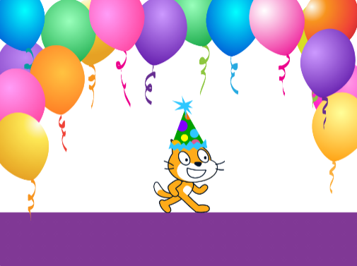

## जांच सूची

क्या आप **परियोजना संक्षिप्त**से मिले? अपने प्रोजेक्ट के बारे में सोचें और नीचे दी गई जांच सूची पर जाएं और अपने प्रोजेक्ट की सुविधाओं की जाँच करें।

### आपकी पुस्तक में यह होना चाहिए:

--- task ---

कई पृष्ठ, अगले पृष्ठ पर जाने के तरीके के साथ

--- /task ---

--- task ---

कम से कम एक स्प्राइट

--- /task ---

--- task ---

प्रत्येक पृष्ठ पर भिन्न क्रियाएँ

--- /task ---

### आपकी किताब में ये भी हो सकते हैं:

--- task ---

बोली या ध्वनि प्रभाव

--- /task ---

--- task ---

पाठ या कला जो पेंट संपादक में बनाई गई है

--- /task ---

--- task ---

प्रत्येक पृष्ठ पर संवादात्मक सुविधाएँ

--- /task ---

### सोचिए

आप अपनी भविष्य की परियोजनाओं में मदद के लिए इस पर विचार कर सकते हैं कि आपने अपनी पुस्तक कैसे बनाई:

--- task ---

आपको अपने विचार कैसे मिले?

--- /task ---

--- task ---

आपने कौन सी नई चीज़ (चीजों) सीखेगी?

--- /task ---

### अब, आप एक डिजिटल पुस्तक के लेखक हैं!

🎉 आपने जो बनाया है उसका जश्न मनाने के लिए कुछ समय निकालें।

--- task ---

आप अपनी नई शक्तियों को कहां ले जाएंगे? आप आगे क्या बनाएँगे?

--- /task ---

