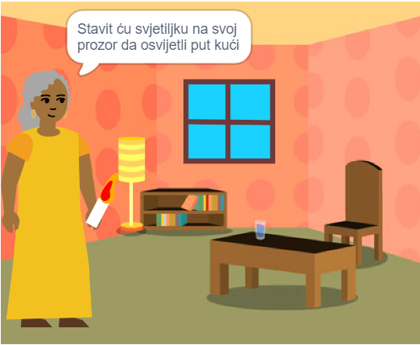

## Vi ćete napraviti

Napravite 📚 knjigu u Scratchu na temelju vlastite ideje 💡.

Vi ćete:

+ Napravite digitalnu knjigu za nekog određenog
+ Odaberite koje ćete vještine koristiti za izradu svoje knjige
+ Podijelite web adresu svoje knjige

--- no-print ---

--- task ---

### Igraj ▶️ 

Kliknite na kut da okrenete stranicu.

Potražite likove koji se prikazuju i skrivaju na različitim stranicama.
  
Što se događa kada kliknete na svaki lik?

  
**Tickle monster**: [See inside](https://scratch.mit.edu/projects/500189097/editor){:target="_blank"}

  <iframe allowtransparency="true" width="485" height="402" src="https://scratch.mit.edu/projects/embed/500189097/?autostart=false" frameborder="0"></iframe>

--- /task ---

--- /no-print ---

Vaša će knjiga morati zadovoljiti **projektni sažetak**.

**sažetak projekta** opisuje što se u projektu mora napraviti. To je pomalo kao da ste dobili misiju koju morate izvršiti.

### 🎯 SAŽETAK PROJEKTA: Stvorite **digitalnu knjigu**

Morat ćete odlučiti koju vrstu knjige želite izraditi i za koga je. 

Vaša bi knjiga trebala:
+ 📃 Imati više stranica, s mogućnošću prelaska na sljedeću stranicu
+ 🐢 Imati barem jedan lik
+ 💬 Recite ili učinite nešto drugačije na svakoj stranici

Vaša bi knjiga mogla:
+ 🔉 Sadržati govor ili zvučni efekti 
+ 🎨 Imajte tekst ili sliku stvorenu u Paint uređivaču
+ 🖱️ Imajte interaktivne značajke na svakoj stranici

--- no-print ---

### Dobijte ideje 💭

--- task ---

Igrajte se s ovim primjerima projekata da biste dobili ideje za svoju knjigu:

⭐ Podijelite svoj završeni projekt 'Napravio sam ti knjigu' kako biste imali priliku da bude predstavljen ovdje.

**My band** 🎸 : [See inside](https://scratch.mit.edu/projects/724148783/editor){:target="_blank"}

  <iframe allowtransparency="true" width="485" height="402" src="https://scratch.mit.edu/projects/embed/724148783/?autostart=false" frameborder="0"></iframe>

**⭐ Cinderella and the spider** 🕷️ : [See inside](https://scratch.mit.edu/projects/799448516/editor){:target="_blank"}

  <iframe allowtransparency="true" width="485" height="402" src="https://scratch.mit.edu/projects/embed/799448516/?autostart=false" frameborder="0"></iframe>

**⭐ Accidental Teleportation** 🚀 : [See inside](https://scratch.mit.edu/projects/793833913/editor){:target="_blank"} (featured community project)

  <iframe allowtransparency="true" width="485" height="402" src="https://scratch.mit.edu/projects/embed/793833913/?autostart=false" frameborder="0"></iframe>

**⭐ How winter came** ☃️ : [See inside](https://scratch.mit.edu/projects/707648744/editor){:target="_blank"} (featured community project)

  <iframe allowtransparency="true" width="485" height="402" src="https://scratch.mit.edu/projects/embed/707648744/?autostart=false" frameborder="0"></iframe>

--- /zadatak ---

--- /bez ispisa ---

--- samo za ispis ---

### Dobijte ideje 💭

Da biste dobili ideje za svoju 📚 knjigu, **Pogledajte unutra** primjer projekata u Scratch studiju 'Napravio sam ti knjigu — Primjeri': https://scratch.mit.edu/studios/29082370

--- /samo za ispis ---

