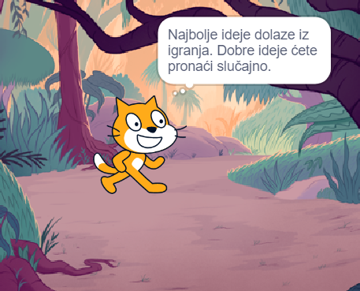

## Planirajte svoju knjigu 📔

Koristite ovaj korak za planiranje svoje knjige. Možete planirati samo razmišljajući, dodajući pozadine i likove u Scratchu, ili crtajući ili pišući — ili kako god želite!

Sada je vrijeme da počnete razmišljati o stranicama (pozadinama) te likovima i objektima (likovima) u vašoj knjizi.

--- task ---

Otvori [Napravio sam ti početni projekt knjige](https://scratch.mit.edu/projects/582223042/editor){:target="_blank"}. Scratch će se otvoriti u drugoj kartici preglednika.

⏱️ Nemate puno vremena? Možete početi od jednog od [primjera](https://scratch.mit.edu/studios/29082370){:target="_blank"}.

--- collapse ---
---
title: Working offline
---

Za informacije o tome kako postaviti Scratch za izvanmrežnu upotrebu, posjeti [naš vodič 'Početak rada sa Scratchom'](https://projects.raspberrypi.org/en/projects/getting-started-scratch){:target="_blank"}.

--- /collapse ---

--- /task ---

--- task ---

Koristite svoj novi Scratch projekt za planiranje svoje knjige. Ne morate planirati sve stranice, možeteih dodati dodati.

Također možete koristiti ✏️ olovku i [ovaj list za planiranje](resources/i-made-a-book-worksheet.pdf){:target="_blank"} ili komad papira da skicirate svoje ideje.

Razmislite o pozadinama i likovima:
- 🖼️ Koje ćete pozadine ili boje pozadine koristiti u svojoj knjizi?
- 🗒️ Kako će korisnici komunicirati s vašom knjigom da pređu na sljedeću stranicu?
- 🦁 Koje ćete likove i predmete imati u svojoj knjizi?
- 🏃‍♀️ Kako će likovi biti animirani i međusobno komunicirati na svakoj stranici?

{:width="300px"}

--- /task ---
