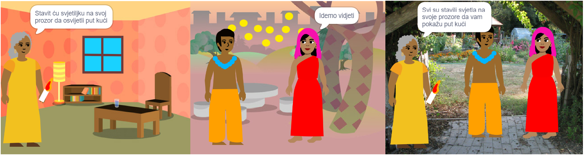
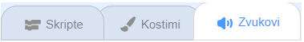

## Napravite 🧱 i testirajte 🔄

Sada je vrijeme da sastavite svoju knjigu. Počnite s malim i dodajte više svom projektu ako imate vremena.



**Savjet:** Ne zaboravite testirati svoj projekt svaki put kada nešto dodate. Puno je lakše pronaći i ispraviti greške prije nego što napravite dodatne promjene.

### Za svaku stranicu 📃

--- task ---

Dodajte pozadinu i nove likove koji su vam potrebni za ovu stranicu.


Morat ćete dodati kod za postavljanje položaja i vidljivosti likova na prvoj naslovnoj stranici i svakoj stranici nakon toga.

```blocks3
when flag clicked

when backdrop switches to [page v]
```

[[[scratch3-show-hide-sprites-backdrops]]]

[[[scratch3-positioning-with-layers]]]

--- /task ---

### Za svaki lik 🐈 🐢 🎈

--- task ---

Morat ćete dodati kod svakom liku i objektu u svojoj knjizi. Razmislite hoće li išta učiniti kada projekt započne, kada se pozadina prebaci na određenu stranicu ili kada se klikne na lik.

```blocks3
when flag clicked

when this sprite clicked

when backdrop switches to [page v]
```

[[[scratch3-change-costumes-to-show-mood]]]

[[[scratch3-animate-movement-costumes]]]

[[[scratch3-graphic-effects]]]

[[[scratch3-jiggle-a-sprite]]]

--- /task ---

### Okretanje stranice 📖

--- task ---

Trebat će vam način da vaš čitatelj prijeđe na sljedeću stranicu u vašoj knjizi.

```blocks3
when this sprite clicked
```

[[[scratch3-changing-backdrops-pages-levels]]]

--- /task ---

### Uredite kostime 🦁 i pozadine 🖼️

--- task ---

Možda ćete htjeti urediti ili dodati kostime ili pozadine u Paint uređivaču.

{:width="250px"}


[[[scratch3-paint-a-new-backdrop-extended]]]

[[[scratch3-backdrops-and-sprites-using-shapes]]]

[[[scratch3-use-text-tool]]]

[[[scratch3-copy-parts-between-sprite-costumes]]]

[[[scratch3-add-costumes-to-a-sprite]]]

--- /task ---

### Dodajte zvuk 🎵

--- task ---



```blocks3
when flag clicked

when this sprite clicked

when backdrop switches to [page v]
```


[[[scratch3-add-sound]]]


[[[scratch3-record-sound]]]


[[[scratch3-text-to-speech]]]

--- /task ---

### Podsjetnici Scratch uređivača

[[[scratch3-copy-code]]]

[[[scratch3-full-screen]]]

[[[scratch3-duplicate-sprite]]]

--- task ---

**Testirajte:** 🔄 Pokažite nekom drugom svoj projekt i zatražite 🗣️ njihove povratne informacije. Želite li nešto promijeniti u svojoj knjizi?

⏱️ Ako imate vremena, možete nadograditi svoj projekt.

💡 Mogli biste:
- Dodajte još koda svojim likovima
- Dodajte još jedan lik
- Dodajte još jednu stranicu
- Snimite zvuk
- Napravite novi kostim u Paint uređivaču

--- /task ---

--- task ---

**Otklanjanje pogrešaka:** 🐞 Možda ćete pronaći neke greške u svom projektu koje trebate popraviti. Evo nekih uobičajenih grešaka:

--- collapse ---
---
title: A sprite is showing or hiding on the wrong pages
---

Provjerite ima li lik `kada se pozadina prebacuje na`{:class="block3events"} skriptu s `prikazivanjem`{:class="block3looks"} ili `sakrivanjem`{:class="block3looks"} blokova prema potrebi. Provjerite jeste li odabrali ispravan naziv pozadine u `kada se pozadina prebacuje na`{:class="block3events"} blok. Pozadinama pomaže dati nazive koje možete lako razumjeti kako biste lakše uočili ovakve probleme.

--- /collapse ---

--- collapse ---
---
title: A sprite is going upside down
---

Dodajte `postavite stil rotacije lijevo-desno`{:class="block3motion"} ili `postavite stil rotacije ne rotiraj`{:class="block3motion"} blok.

--- /collapse ---

--- collapse ---
---
title: A sprite 'jumps' when it changes costume or bounces
---

Provjerite je li kostim u centru Paint uređivača (poravnajte plavi križ u kostimu s križićem u središtu Paint uređivača).

--- /collapse ---

--- collapse ---
---
title: A sound does not play
---

Jeste li dodali blok za `reprodukciju zvuka`{:class="block3sound"} kada je to potrebno? Ako ste kopirali kod s drugog lika, morat ćete dodati zvuk ovom liku na kartici **Zvukovi**. Provjerite glasnoću na računalu ili tabletu i uvjerite se da niste smanjili glasnoću kodom — pokušajte `postaviti glasnoću na`{:class="block3sound"} `100`.

--- /collapse ---

--- collapse ---
---
title: Other sprites keep going in front of a sprite
---

Dodajte blok `idi na prednji sloj`{:class="block3looks"}.

--- /collapse ---

--- collapse ---
---
title: A sprite only moves or changes once
---

Stavite svoj kod unutar bloka `ponavljaj`{:class="block3control"} kako bi nastavio raditi.

--- /collapse ---

--- collapse ---
---
title: The pages are in the wrong order
---

Provjerite kojim redoslijedom su vaše pozadine: kliknite na okno Pozornica, a zatim na karticu **Pozadine** da biste vidjeli pozadine za svoj projekt.

--- /collapse ---

Možda ćete pronaći grešku koja nije ovdje navedena. Možete li smisliti kako to popraviti?

🗣️ Volimo čuti o vašim greškama i kako ste ih popravili. Upotrijebite gumb **Pošalji povratnu informaciju** na dnu ove stranice i recite nam ako ste pronašli drugu pogrešku u svom projektu.

--- /task ---

