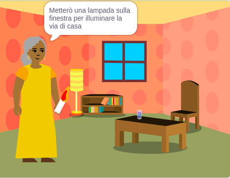

## Quello che farai

Crea un 📚 libro in Scratch basato su una tua idea 💡.

Tu:

+ Crea un libro digitale per una persona specifica
+ Scegli quali abilità utilizzare per creare il tuo libro
+ Condividi un indirizzo web per il tuo libro

--- no-print ---

--- task ---

### Gioca ▶️ 

Fai clic sull'angolo per voltare la pagina.

Cerca gli sprite che si mostrano e si nascondono su pagine diverse.
  
Cosa succede quando clicchi sugli sprite?

**Il mostro con il solletico**: [Guarda dentro](https://scratch.mit.edu/projects/500189097/editor){:target="_blank"}

  <iframe allowtransparency="true" width="485" height="402" src="https://scratch.mit.edu/projects/embed/500189097/?autostart=false" frameborder="0"></iframe>

--- /task ---

--- /no-print ---

Il tuo libro dovrà soddisfare i **requisiti del progetto**.

Un **requisito del progetto** descrive cosa deve fare un progetto. È un po’ come ricevere una missione da completare.

### 🎯 REQUISITO DEL PROGETTO: Crea un **libro digitale**

Dovrai decidere che tipo di libro ti piacerebbe realizzare e a chi è rivolto. 

Il tuo libro dovrebbe:
+ 📃 Avere più pagine, con la possibilità di passare alla pagina successiva
+ 🐢 Avere almeno uno sprite
+ 💬 Dire o fare qualcosa di diverso su ogni pagina

Il tuo libro potrebbe:
+ 🔉 Avere discorsi o effetti sonori
+🎨 Avere testo o grafica creata nell'editor Paint
+🖱️ Avere funzionalità interattive su ogni pagina

--- no-print ---

### Lasciati ispirare 💭

--- task ---

Gioca con questi progetti di esempio per trovare l'ispirazione per il tuo libro:

⭐ Condividi il tuo progetto finito 'Ho creato un libro per te' per riuscire a pubblicarlo qui.

**La mia banda** 🎸 : [Guarda dentro](https://scratch.mit.edu/projects/724148783/editor){:target="_blank"}

  <iframe allowtransparency="true" width="485" height="402" src="https://scratch.mit.edu/projects/embed/724148783/?autostart=false" frameborder="0"></iframe>

**⭐ Cenerentola e il ragno** 🕷️ : [Guarda dentro](https://scratch.mit.edu/projects/799448516/editor){:target="_blank"}

  <iframe allowtransparency="true" width="485" height="402" src="https://scratch.mit.edu/projects/embed/799448516/?autostart=false" frameborder="0"></iframe>

**⭐ Teletrasporto accidentale** 🚀 : [Guarda dentro](https://scratch.mit.edu/projects/793833913/editor){:target="_blank"} (progetto comunitario di qualità)

  <iframe allowtransparency="true" width="485" height="402" src="https://scratch.mit.edu/projects/embed/793833913/?autostart=false" frameborder="0"></iframe>

**⭐ Quando arriva l'inverno** ☃️ : [Guarda dentro](https://scratch.mit.edu/projects/707648744/editor){:target="_blank"} (progetto comunitario di qualità)

  <iframe allowtransparency="true" width="485" height="402" src="https://scratch.mit.edu/projects/embed/707648744/?autostart=false" frameborder="0"></iframe>

--- /task ---

--- /no-print ---

--- print-only ---

### Lasciati ispirare 💭

Per avere idee per il tuo 📚 libro, **Guarda dentro** i progetti di esempio nello studio Scratch 'Ho creato un libro per te - Esempi': https://scratch.mit.edu/studios/29082370

--- /print-only ---

