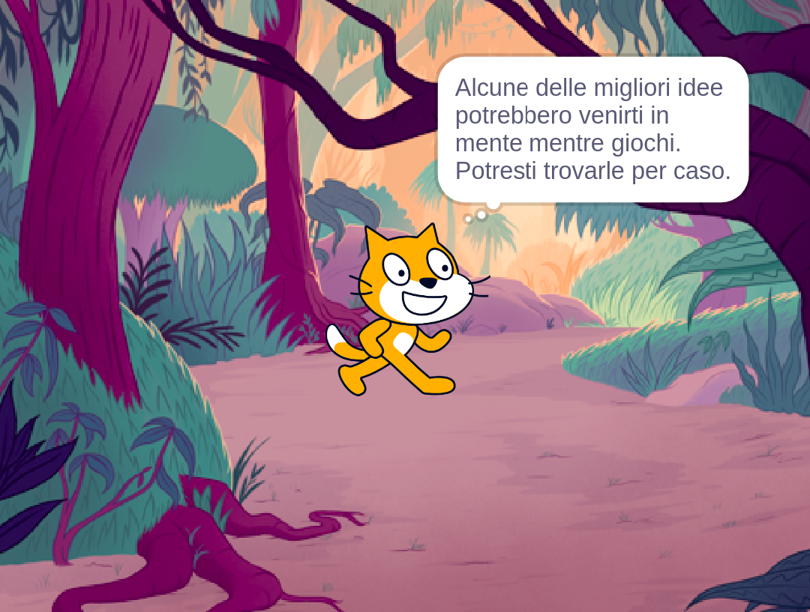
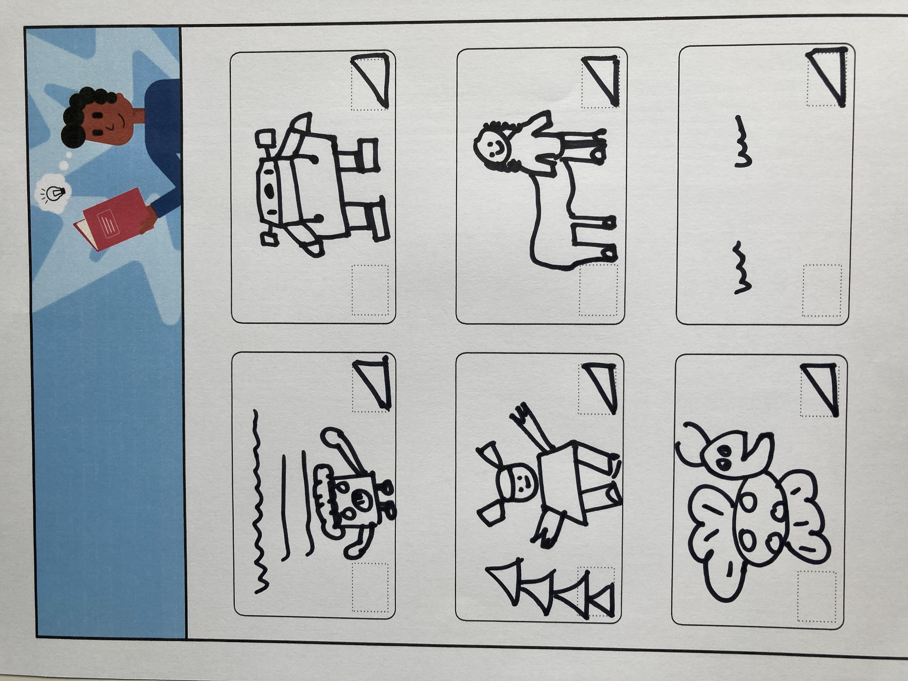

## Pianifica il tuo libro 📔

Utilizza questo passaggio per pianificare il tuo libro. Puoi pianificare semplicemente pensando, aggiungendo sfondi e sprite in Scratch, oppure disegnando o scrivendo, o come preferisci!

Ora è il momento di iniziare a pensare alle pagine (sfondi), ai personaggi e agli oggetti (sprite) del tuo libro.

--- task ---

Apri il [progetto iniziale Ho creato un libro per te](https://scratch.mit.edu/projects/582223042/editor){:target="_blank"}. Scratch si aprirà in una nuova scheda del browser.

⏱️ Hai poco tempo? Puoi iniziare da uno degli [esempi](https://scratch.mit.edu/studios/29082370){:target="_blank"}.

--- collapse ---
---
title: Lavorare offline
---

Per informazioni su come configurare Scratch per l'utilizzo offline, visita [la nostra guida "Iniziare con Scratch"](https://projects.raspberrypi.org/it-IT/projects/getting-started-scratch){:target="_blank"}.

--- /collapse ---

--- /task ---

--- task ---

Usa il tuo nuovo progetto Scratch per pianificare il tuo libro. Non devi pianificare tutte le pagine, potrai aggiungerne altre in seguito.

Puoi anche utilizzare ✏️ una matita e questo [foglio di pianificazione](resources/i-made-a-book-worksheet.pdf){:target="_blank"} o un pezzo di carta per abbozzare le tue idee.

Pensa agli sfondi e agli sprite:
- 🖼️ Quali sfondi o colori di sfondo utilizzerai nel tuo libro?
- 🗒️ Come interagiranno gli utenti con il tuo libro per passare alla pagina successiva?
- 🦁 Quali personaggi e oggetti ci saranno nel tuo libro?
- 🏃‍♀️ Come verranno animati e interagiranno gli sprite su ogni pagina?

{:width="300px"}

--- /task ---
