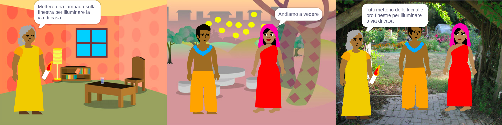
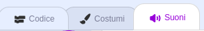

## Costruisci 🧱 e prova 🔄

Ora è il momento di costruire il tuo libro. Inizia con calma e arricchisci il tuo progetto se hai più tempo.



**Suggerimento:** Ricordati di provare il tuo progetto ogni volta che aggiungi qualcosa. È molto più semplice trovare e correggere i bug prima di fare ulteriori modifiche.

### Per ogni pagina 📃

--- task ---

Aggiungi lo sfondo e i nuovi sprite di cui hai bisogno per questa pagina.


Dovrai aggiungere il codice per impostare le posizioni e la visibilità degli sprite sulla prima pagina del titolo e su ogni pagina successiva.

```blocks3
when flag clicked

when backdrop switches to [page v]
```

[[[scratch3-show-hide-sprites-backdrops]]]

[[[scratch3-positioning-with-layers]]]

--- /task ---

### Per ogni sprite 🐈 🐢 🎈

--- task ---

Dovrai aggiungere il codice a ciascuno sprite e oggetto nel tuo libro. Decidi se faranno qualcosa all'avvio del progetto, quando lo sfondo passa a una pagina particolare o quando si fa clic sullo sprite.

```blocks3
when flag clicked

when this sprite clicked

when backdrop switches to [page v]
```

[[[scratch3-change-costumes-to-show-mood]]]

[[[scratch3-animate-movement-costumes]]]

[[[scratch3-graphic-effects]]]

[[[scratch3-jiggle-a-sprite]]]

--- /task ---

### Girare pagina 📖

--- task ---

Avrai bisogno di un modo per consentire al tuo lettore di passare alla pagina successiva del tuo libro.

```blocks3
when this sprite clicked
```

[[[scratch3-changing-backdrops-pages-levels]]]

--- /task ---

### Modifica i costumi 🦁 e gli sfondi 🖼️

--- task ---

Potresti voler modificare o aggiungere costumi o sfondi nell'editor di Paint.

{:width="250px"}


[[[scratch3-paint-a-new-backdrop-extended]]]

[[[scratch3-backdrops-and-sprites-using-shapes]]]

[[[scratch3-use-text-tool]]]

[[[scratch3-copy-parts-between-sprite-costumes]]]

[[[scratch3-add-costumes-to-a-sprite]]]

--- /task ---

### Aggiungi un suono 🎵

--- task ---



```blocks3
when flag clicked

when this sprite clicked

when backdrop switches to [page v]
```


[[[scratch3-add-sound]]]


[[[scratch3-record-sound]]]


[[[scratch3-text-to-speech]]]

--- /task ---

### Appunti sull'editor Scratch

[[[scratch3-copy-code]]]

[[[scratch3-full-screen]]]

[[[scratch3-duplicate-sprite]]]

--- task ---

**Prova:** 🔄 Mostra a qualcun altro il tuo progetto e chiedi 🗣️ la loro opinione. Vuoi fare qualche modifica al tuo libro?

⏱️ Se hai più tempo, puoi migliorare il tuo progetto.

💡 Potresti:
- Aggiungere più codice agli sprite
- Aggiunger un altro sprite
- Aggiungere un'altra pagina
- Registrare un suono
- Creare un nuovo costume nell'editor di Paint

--- /task ---

--- task ---

**Debug:** 🐞 Potresti trovare alcuni bug nel tuo progetto da dover correggere. Ecco alcuni bug comuni:

--- collapse ---
---
title: Uno sprite si mostra o si nasconde nelle pagine sbagliate
---

Controlla che lo sprite abbia lo script `quando lo sfondo passa a`{:class="block3events"} con i blocchi `mostra`{:class="block3looks"} o `nascondi`{:class="block3looks"} nel modo che tu pensi sia corretto. Verifica di aver scelto il nome dello sfondo corretto nel blocco `quando lo sfondo passa a`{:class="block3events"}. È utile assegnare agli sfondi nomi che puoi capire facilmente, per aiutarti a rintracciare problemi come questo.

--- /collapse ---

--- collapse ---
---
title: Uno sprite va a testa in giù
---

Aggiungi un blocco `usa stile rotazione sinistra-destra`{:class="block3motion"} o un blocco`usa stile rotazione non ruotare`{:class="block3motion"}.

--- /collapse ---

--- collapse ---
---
title: Uno sprite 'saltella' quando cambia costume o rimbalza
---

Assicurati che il costume sia centrato nell'editor di Paint (allinea la croce blu nel costume con il mirino al centro dell'editor di Paint).

--- /collapse ---

--- collapse ---
---
title: Un suono non viene riprodotto
---

Hai aggiunto un blocco `avvia riproduzione suono`{:class="block3sound"}? Se hai copiato il codice da un altro sprite, dovrai aggiungere il suono a questo sprite nella scheda **Suoni**. Controlla il volume sul tuo computer o tablet e assicurati di non averlo abbassato con il codice: prova `porta volume a`{:class="block3sound"} `100`.

--- /collapse ---

--- collapse ---
---
title: Alcuni sprite continuano ad andare davanti altri sprite
---

Aggiungi un blocco `porta in primo piano`{:class="block3looks"}.

--- /collapse ---

--- collapse ---
---
title: Uno sprite si muove o cambia costume solamente una volta
---

Inserisci il tuo codice all'interno di un blocco `per sempre`{:class="block3control"} in modo che continui a funzionare.

--- /collapse ---

--- collapse ---
---
title: Le pagine sono nell'ordine sbagliato
---

Controlla in che ordine sono i tuoi sfondi: fai clic sul riquadro degli Stage e poi sulla scheda **Sfondi** per visualizzare gli sfondi del tuo progetto.

--- /collapse ---

Potresti trovare un bug che non è elencato qui. Sai come risolverlo?

🗣️ Adoriamo saperne di più sui tuoi bug e su come li hai risolti. Utilizza il pulsante **Invia feedback** in fondo a questa pagina e comunicaci se hai trovato un bug diverso nel tuo progetto.

--- /task ---

