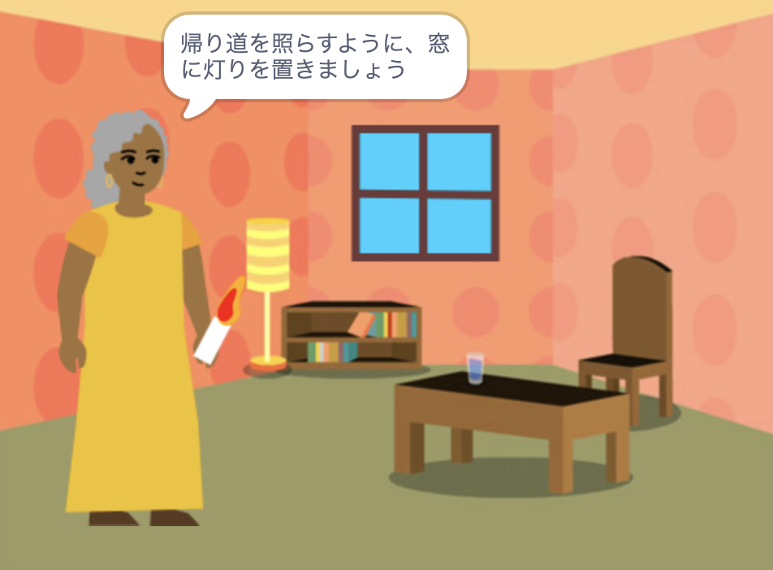

## はじめに

あなた自身のアイデアに基づいてScratchで本を作成してください。 **プロジェクト概要**の内容に沿ったものであることが必要です。

**プロジェクト概要** は、プロジェクトが実行しなければならないことを説明したものです。 達成すべき任務を与えられているようなものです。

あなたは次のことを行います。

+ 特定の誰かに向けたデジタルブックを作成するためのアイデアを考えます
+ あなたの本を作るために使用するスキルを選択します
+ あなたの本のウェブアドレスを共有します

--- no-print ---

--- task ---

### 試してみましょう

コーナーをクリックしてページをめくりましょう。

その本は何ページありますか？

ページによって表示されたり非表示になったりするスプライトを探しましょう。

**帰り道を照らす**: [中を見る](https://scratch.mit.edu/projects/499860786/editor){:target="_blank"}

  <iframe allowtransparency="true" width="485" height="402" src="https://scratch.mit.edu/projects/embed/499860786/?autostart=false" frameborder="0"></iframe>

--- /task ---

--- /no-print ---

###プロジェクト概要: **デジタルブック**を作成する

あなたの本は、物語り、指導書、事実を書いた本、対話型の本、またはその他のいずれでも構いません。

誰のために本を書くかを選択しなければなりません。「自分の妹」、「恐竜のファン」、「歌うことを学んでいる人」などです。  

あなたの本は、以下の通りでなければなりません:
+ 複数のページからなり、次のページに進む方法がある
+ 少なくとも一つのスプライトを使っている
+ すべてのページで何か違うことを言うか行う

あなたの本は以下を含めることができます:
+ 音声や効果音
+ ペイントエディタで作成されたテキストやアート
+ すべてのページ上に双方向性機能

**デジタルブック** (またはイーブック) は、コンピューター、タブレット、電話、またはその他の電子機器で作成され、読まれる本です。 デジタル機器で本を読んだことがありますか？

--- no-print ---

### インスピレーションを得る

--- task ---

これらのサンプルプロジェクトを調べて、本のアイデアをもらいましょう。

**モンスターをくすぐれ**： [中を見る](https://scratch.mit.edu/projects/500189097/editor){:target="_ blank"}

  <iframe allowtransparency="true" width="485" height="402" src="https://scratch.mit.edu/projects/embed/500189097/?autostart=false" frameborder="0"></iframe>

**景色にとけこむScratchキャット**： [中を見る](https://scratch.mit.edu/projects/498968472/editor){:target="_ blank"}

  <iframe allowtransparency="true" width="485" height="402" src="https://scratch.mit.edu/projects/embed/498968472/?autostart=false" frameborder="0"></iframe>

**デバッグ物語**： [中を見る](https://scratch.mit.edu/projects/498960446/editor){:target="_ blank"}
キャラクターとオブジェクトをクリックしてストーリーで使われるものを選び、ステージをクリックしてページをめくります。

  <iframe allowtransparency="true" width="485" height="402" src="https://scratch.mit.edu/projects/embed/498960446/?autostart=false" frameborder="0"></iframe>

--- /task ---

--- /no-print ---

--- print-only ---

### インスピレーションを得る

あなたの本のアイデアを得るには、「I made you a book — Examples' Scratch スタジオ」のサンプルプロジェクトの**中を見**てください：https://scratch.mit.edu/studios/29082370

--- /print-only ---

