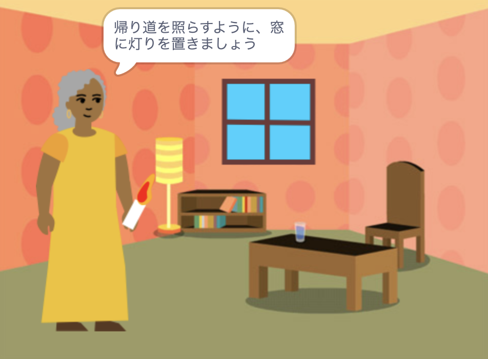

## はじめに

あなた自身のアイデアに基づいてScratchで本を作成してください。

あなたは次のことを行います。

+ 特定の誰かに向けたデジタルブックを作成します
+ 本を作るために使うスキルを選択します
+ 本のウェブアドレスを共有します

--- no-print ---

--- task ---

### 実行してみましょう ▶️ 

画面の隅をクリックしてページをめくります。

表示されたり隠れたりするスプライトをページごとに探してください。
  
各スプライトをクリックすると何が起こりますか？

  
**くすぐりモンスター**: [中を見る](https://scratch.mit.edu/projects/1265019453/editor){:target="_blank"}

  <iframe allowtransparency="true" width="485" height="402" src="https://scratch.mit.edu/projects/embed/500189097/?autostart=false" frameborder="0"></iframe>

--- /task ---

--- /no-print ---

本を**プロジェクト概要**に合わせて作成してください。

**プロジェクト概要**はプロジェクトがしなくてはならないことを説明したものです。 達成すべき任務を与えられているようなものです。

### 🎯プロジェクト概要: **デジタルブック**を作成する

どのような本を作りたいか、その本は誰に向けたものなのかを決める必要があります。 

本は以下であることが必要です。
+ 📃複数のページからなり、次のページに進む方法がある
+ 🐢少なくとも1つのスプライトを持つ
+ 💬ページごとに何か違うことを言ったり行ったりする

本には以下を含めることができます。
+ 🔉音声や効果音
+ 🎨ペイントエディターで作ったテキストやアート
+ 🖱️ページごとの対話機能

--- no-print ---

### インスピレーションを得る

--- task ---

これらのサンプルプロジェクトを調べて、本のアイデアをもらいましょう。

⭐ 完成した「私はあなたに本を作りました」プロジェクトを共有すると、ここで紹介される可能性があります。

**私のバンド** 🎸 : [中を見る](https://scratch.mit.edu/projects/724148783/editor){:target="_blank"}

  <iframe allowtransparency="true" width="485" height="402" src="https://scratch.mit.edu/projects/embed/724148783/?autostart=false" frameborder="0"></iframe>

**⭐ Cinderella and the spider** 🕷️ : [中を見る](https://scratch.mit.edu/projects/799448516/editor){:target="_blank"}

  <iframe allowtransparency="true" width="485" height="402" src="https://scratch.mit.edu/projects/embed/799448516/?autostart=false" frameborder="0"></iframe>

**⭐ Accidental Teleportation** 🚀 : [中を見る](https://scratch.mit.edu/projects/793833913/editor){:target="_blank"} (注目のコミュニティプロジェクト)

  <iframe allowtransparency="true" width="485" height="402" src="https://scratch.mit.edu/projects/embed/793833913/?autostart=false" frameborder="0"></iframe>

**⭐ How winter came** ☃️ : [中を見る](https://scratch.mit.edu/projects/707648744/editor){:target="_blank"} (注目のコミュニティプロジェクト)

  <iframe allowtransparency="true" width="485" height="402" src="https://scratch.mit.edu/projects/embed/707648744/?autostart=false" frameborder="0"></iframe>

--- /task ---

--- /no-print ---

--- print-only ---

### インスピレーションを得る

📚 本のアイデアを得るには、Scratchスタジオ「I made you a book — Examples（私はあなたに本を作りましたの例）」(https://scratch.mit.edu/studios/29082370)にある例題プロジェクトの**中を見てください**。

--- /print-only ---

