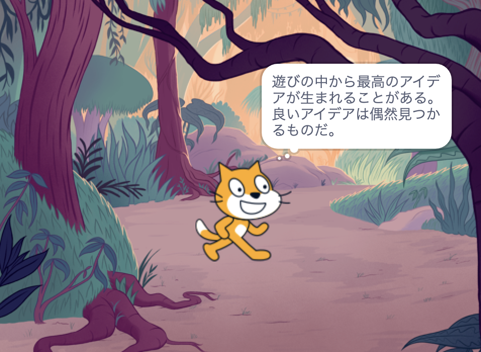

## あなたのアイデア

このステップを使用して、本を計画します。 頭の中だけで考えたり、Scratchに背景やスプライトを追加したり、絵や文章を書いたり、それ以外にあなたの好きな方法で、計画を立てることができます。

### どうして本を作ってるの？

--- task ---

あなたの本の目的について考えてください。

例えば:
- ちいさい子どもを楽しませるために
- リサイクルの奨励など、重要なメッセージを共有するために
- お気に入りの食べ物の作り方など、何かをする方法を誰かに教えるために
- 物語を語ったり、語り直したりするために
- あなた自身について何かを共有するために
- 自分を表現し、創造的になるために

--- /task ---

### 誰に向けてですか？

--- task ---

誰のために本を作るかについて考えてください（ あなたの**観客**）。

友達、家族、学校のクラス、同じ趣味の人たち、ミュージシャンのファン、またはあなた自身のため、などです。

--- /task ---

### 始めよう

それでは、本のページ（背景）と登場する人物や物（スプライト）について考えていきましょう。

--- task ---

[あなたに本を作りましたスタータープロジェクト](https://scratch.mit.edu/projects/582223042/editor){:target="_blank"}を開きます。 Scratchはブラウザの別のタブで開きます。

--- collapse ---
---
title：オフラインでの作業
---

Scratchをオフラインで使用するための設定方法については、 [「Scratch入門」ガイド](https://projects.raspberrypi.org/en/projects/getting-started-scratch){:target="_blank"}を見てください。

--- /collapse ---

新しいScratchプロジェクト、ペンと紙、またはその両方を使用して、本のアイデアを計画します。

--- /task ---

--- task ---

背景とスプライトについて考えてみましょう。
- あなたの本でどの背景や背景色を使いますか？
- 読者はあなたの本をどのように操作して次のページに移動しますか？
- あなたの本にどんな人物と物を登場させますか？
- スプライトは、各ページでどのように動き、反応しますか？

--- /task ---

--- save ---
