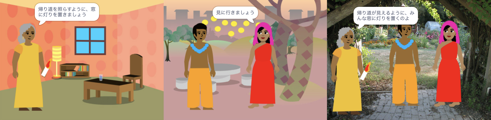

## 作って試す

さあ、あなたの本を作る時が来ました。 小さなことから始めて、時間があればプロジェクトにさらに追加してください。

**ヒント：** 何かを追加するたびに、プロジェクトをテストすることを忘れないでください。 バグを見つけて修正するのは、変更を加える前のほうがはるかに簡単です。

--- task ---

あなたの本をどのような順序で作っていくかを決めなければなりません。 次のやり方で始められます。
- すべてのページを背景として作成する、または
- 最初に1ページを機能させる

--- /task ---

最初は、必要なものすべてを本に追加する時間がない場合があります。 それは問題ありません—後でいつでもプロジェクトに戻ることができます。 

--- task ---

あなたはScratchでいくつかの本当に役立つスキルを作り上げました。 こちらを見て、あなたの本を作るのに役立つスキルを思い出してください：

コード：

[[[scratch3-changing-backdrops-pages-levels]]]

[[[scratch3-change-costumes-to-show-mood]]]

[[[scratch3-animate-movement-costumes]]]

[[[scratch3-graphic-effects]]]

[[[scratch3-show-hide-sprites-backdrops]]]

[[[scratch3-positioning-with-layers]]]

[[[scratch3-jiggle-a-sprite]]]

ペイントエディタ ー 背景とコスチューム：

[[[scratch3-paint-a-new-backdrop-extended]]]

[[[scratch3-backdrops-and-sprites-using-shapes]]]

[[[scratch3-use-text-tool]]]

[[[scratch3-copy-parts-between-sprite-costumes]]]

[[[scratch3-add-costumes-to-a-sprite]]]

音：

[[[scratch3-add-sound]]]

[[[scratch3-record-sound]]]

[[[scratch3-text-to-speech]]]

Scratchエディタ：

[[[scratch3-copy-code]]]

[[[scratch3-full-screen]]]

[[[scratch3-duplicate-sprite]]]

--- /task ---

--- task ---

**テスト：** プロジェクトを他の人に見せて、フィードバックを求めます。 あなたの本に何か変更を加えたいですか？

--- /task ---

--- task ---

**デバッグ：** プロジェクトに修正が必要なバグが見つかる場合があります。 一般的なバグは次のとおりです。

--- collapse ---
---
title: スプライトが違うページで表示または非表示になっている
---

スプライトのコードに、`背景が・・・になったとき`{:class="block3events"}スクリプトに`表示する`{:class="block3looks"}または `隠す`{:class="block3looks"}ブロックが必要に応じて置かれていることを確認してください。 `背景が・・・になったとき`{:class="block3events"}ブロックで正しい背景名を選択したことを確認してください。 わかりやすい背景名を付けると、このような問題を見つけるのに役立ちます。

--- /collapse ---

--- collapse ---
---
title: スプライトが逆さまになってる
---

`回転方法を左右のみにする`{:class="block3motion"}または`回転方法を回転しないにする`{:class="block3motion"}ブロックを追加してください。

--- /collapse ---

--- collapse ---
---
title: コスチュームを変更したりバウンドしたりすると、スプライトが「ジャンプ」する
---

コスチュームがペイントエディタの中央にあることを確認します（コスチュームの青い十字をペイントエディタの中央の十字線に合わせます）。

--- /collapse ---

--- collapse ---
---
title: 音が出ない
---

`・・・の音を鳴らす`{:class="block3sound"}のブロックを必要なところに追加しましたか？ 別のスプライトからコードをコピーした場合は、 **音** タブでこのスプライトに音を追加する必要があります。 パソコンやタブレットのボリュームをチェックして、コードで音量を下げていないことを確認してください。 － `音量を・・・%にする`{:class="block3sound"}ブロックを`100`にしてみてください。

--- /collapse ---

--- collapse ---
---
title: 他のスプライトがスプライトの前を通る
---

`最前面へ移動する`{:class="block3looks"}ブロックを追加します。

--- /collapse ---

--- collapse ---
---
title: スプライトが一度しか移動または変更されない
---

コードを`ずっと`{:class="block3control"}ブロックの中に入れると動き続けます。

--- /collapse ---

--- collapse ---
---
title: ページの順序が間違っています
---

次の方法で背景の順序を確認します。ステージペインをクリックし 、**背景**タブでプロジェクトの背景を表示します。

--- /collapse ---

ここに記載されていないバグが見つかるかもしれません。 あなたはそれを修正する方法を見つけることができますか？

私たちはあなたのバグと、あなたがそれらをどのように修正したかについて教えてほしいです。 このページの下にある**フィードバックを送信**ボタンを使用して、プロジェクトで別のバグを見つけたかどうかをお知らせください。

--- /task ---

--- save ---
