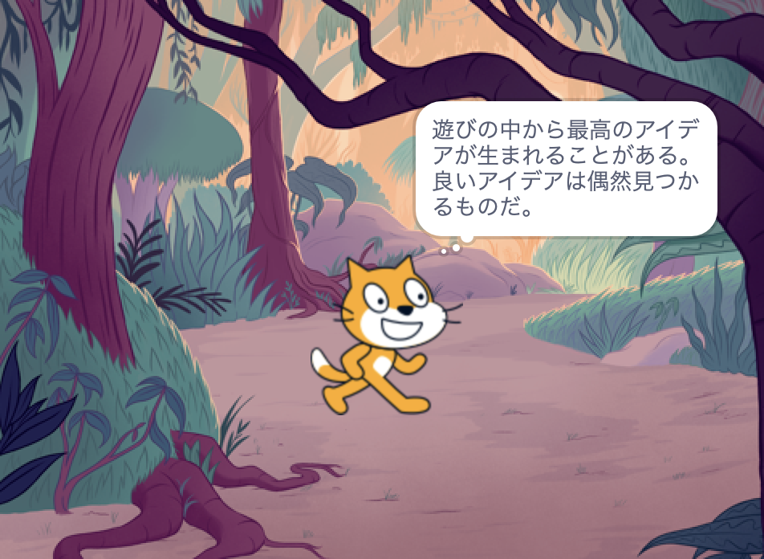
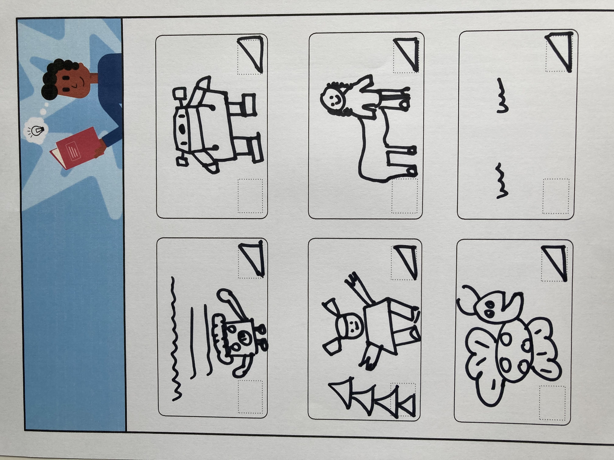

## 本を計画する 📔

この手順を使用して本を計画します。 頭の中だけで考えたり、Scratchに背景やスプライトを追加したり、絵や文章を書いたり、それ以外にあなたの好きな方法で、計画を立てることができます。

それでは、本のページ（背景）と登場する人物や物（スプライト）について考えていきましょう。

--- task ---

[「私はあなたに本を作りました」基本プロジェクト](https://scratch.mit.edu/projects/582223042/editor){:target="_blank"}を開きます。 Scratchはブラウザの別のタブで開きます。

ゆっくりやる時間がないですか？ 忙しい人はプロジェクトの[例](https://scratch.mit.edu/studios/29082370){:target="_blank"}のいずれかから始めることができます。

--- collapse ---
---
title: オフラインでの作業
---

Scratchをオフラインで使用するための設定方法については、 [「Scratch入門」ガイド](https://projects.raspberrypi.org/ja-JP/projects/getting-started-scratch){:target="_blank"}を見てください。

--- /collapse ---

--- /task ---

--- task ---

新しいScratchプロジェクトを使用して本を計画します。 すべてのページを計画する必要はなく、後で追加することもできます。

✏️鉛筆と[この計画シート](resources/i-made-a-book-worksheet.pdf){:target="_blank"}または紙を使ってアイデアをスケッチすることもできます。

背景とスプライトについて考えてみましょう。
- 🖼️あなたの本でどの背景や背景色を使いますか？
- 🗒️読者はあなたの本をどのように操作して次のページに移動しますか？
- 🦁あなたの本にどんな人物と物を登場させますか？
- 🏃‍♀️各ページでスプライトはどのように動き、反応しますか？

{:width="300px"}

--- /task ---
