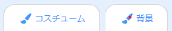
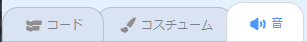

## 作って🧱試す🔄

さあ、あなたの本を作る時が来ました。 小さなことから始めて、時間があればプロジェクトにさらに追加してください。


**ヒント:** 何かを追加するたびに、プロジェクトをテストすることを忘れないでください。 バグを見つけて修正するのは、変更を重ねる前の方がはるかに簡単です。

### ページ📃ごとに

--- task ---

このページに必要な背景と新しいスプライトを追加します。


最初のタイトルページとその後の各ページにコードを追加して、スプライトの位置や表示・非表示を設定する必要があります。

```blocks3
when flag clicked

when backdrop switches to [ページ v]
```

[[[scratch3-show-hide-sprites-backdrops]]]

[[[scratch3-positioning-with-layers]]]

--- /task ---

### スプライト🐈🐢🎈ごとに

--- task ---

あなたの本の各キャラクターやオブジェクトスプライトにコードを追加する必要があります。 プロジェクトが開始した時、背景が特定のページに切り替わった時、あるいはスプライトがクリックされた時に何かを行うようにするか検討します。

```blocks3
when flag clicked

when this sprite clicked

when backdrop switches to [ページ v]
```

[[[scratch3-change-costumes-to-show-mood]]]

[[[scratch3-animate-movement-costumes]]]

[[[scratch3-graphic-effects]]]

[[[scratch3-jiggle-a-sprite]]]

--- /task ---

### ページ📖をめくる

--- task ---

読者が本の次のページに移動できる方法が必要になります。

```blocks3
when this sprite clicked
```

[[[scratch3-changing-backdrops-pages-levels]]]

--- /task ---

### コスチューム🦁と背景🖼️を編集する

--- task ---

ペイントエディターでコスチュームや背景を編集したり追加する必要があるかもしれません。

{:width="250px"}


[[[scratch3-paint-a-new-backdrop-extended]]]

[[[scratch3-backdrops-and-sprites-using-shapes]]]

[[[scratch3-use-text-tool]]]

[[[scratch3-copy-parts-between-sprite-costumes]]]

[[[scratch3-add-costumes-to-a-sprite]]]

--- /task ---

### 音🎵を追加する

--- task ---



```blocks3
when flag clicked

when this sprite clicked

when backdrop switches to [ページ v]
```


[[[scratch3-add-sound]]]


[[[scratch3-record-sound]]]


[[[scratch3-text-to-speech]]]

--- /task ---

### Scratchエディターのリマインダー

[[[scratch3-copy-code]]]

[[[scratch3-full-screen]]]

[[[scratch3-duplicate-sprite]]]

--- task ---

**テスト:** 🔄 プロジェクトを他の人に見せてフィードバック🗣️をもらいます。 本に何か変更を加えますか？

⏱️時間がある人は、プロジェクトをアップグレードしましょう。

💡こんなことができます
- スプライトにコードを追加する
- 別のスプライトを追加する
- 別のページを追加する
- 音を録音する
- ペイントエディターで新しいコスチュームを作成する

--- /task ---

--- task ---

**デバッグ:** 🐞プロジェクトに修正が必要なバグが見つかる場合があります。 よくあるバグをいくつか紹介します。

--- collapse ---
---
title: スプライトが間違ったページで表示または非表示になっている
---

スプライトのコードに、`背景が・・・になったとき`{:class="block3events"}スクリプトに`表示する`{:class="block3looks"}または `隠す`{:class="block3looks"}ブロックが必要に応じて置かれていることを確認してください。 `背景が～になったとき`{:class="block3events"}ブロックで正しい背景名を選択していることを確認します。 わかりやすい背景名を付けると、このような問題を見つけるのに役立ちます。

--- /collapse ---

--- collapse ---
---
title: スプライトが逆さまになってる
---

`回転方法を左右のみにする`{:class="block3motion"}または`回転方法を回転しないにする`{:class="block3motion"}ブロックを追加します。

--- /collapse ---

--- collapse ---
---
title: コスチュームを変更するとスプライトが「ジャンプ」したり跳ね返ったりする
---

コスチュームがペイントエディターの中央にあることを確認します（コスチュームの青い十字をペイントエディターの中央の十字線に合わせます）。

--- /collapse ---

--- collapse ---
---
title: 音が出ない
---

`～の音を鳴らす`{:class="block3sound"}ブロックを必要なところに追加しましたか？ 別のスプライトからコードをコピーした場合、このスプライトの**音**タブでその音を追加する必要があります。 コンピューターやタブレットの音量を確認し、コードで音量を下げていないことを確認します。例えば、 `音量を～%にする`{:class="block3sound"}で`100`に設定してみてください。

--- /collapse ---

--- collapse ---
---
title: 他のスプライトがスプライトの前面に来てしまう
---

`最前面へ移動する`{:class="block3looks"}ブロックを追加します。

--- /collapse ---

--- collapse ---
---
title: スプライトが一度しか移動または変更されない
---

コードを`ずっと`{:class="block3control"}ブロックの中に入れると動き続けます。

--- /collapse ---

--- collapse ---
---
title: ページの順序が間違っている
---

次の方法で背景の順序を確認します。ステージペインをクリックし 、**背景**タブでプロジェクトの背景を表示します。

--- /collapse ---

ここに記載されていないバグが見つかるかもしれません。 修正方法を見つけることができますか？

あなたが見つけたバグやその修正方法についてぜひ聞かせてください。 あなたのプロジェクトで別のバグを見つけたら、このページの一番下にある**フィードバックを送信**ボタンを使ってお知らせください。

--- /task ---

