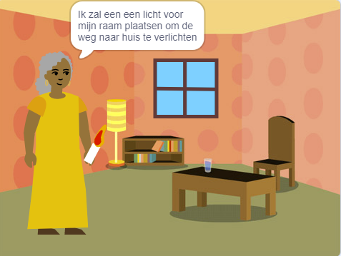

## Inleiding

Maak een boek in Scratch op basis van je eigen idee. Je boek moet voldoen aan de **projectbeschrijving**.

Een **projectbeschrijving** beschrijft wat een project moet doen. Het is een beetje alsof je een missie krijgt om te voltooien.

Je gaat:

+ Ideeën bedenken om voor een speciaal iemand een digitaal boek te maken
+ Kiezen welke vaardigheden je wilt gebruiken om je boek te maken
+ Een webadres voor je boek delen

--- no-print ---

--- task ---

### Probeer het

Klik op de hoek om de pagina om te slaan.

Hoeveel pagina's heeft het boek?

Zoek naar sprites die op verschillende pagina's worden weergegeven en verborgen.

**Verlicht de weg naar huis**: [Bekijk van binnen](https://scratch.mit.edu/projects/599657302/editor){:target="_blank"}

  <iframe allowtransparency="true" width="485" height="402" src="https://scratch.mit.edu/projects/embed/599657302/?autostart=false" frameborder="0"></iframe>

--- /task ---

--- /no-print ---

### PROJECTBESCHRIJVING: Maak een **digitaal boek**

Jouw boek kan een verhalenboek, een instructieboek, een feitenboek, een interactief boek of iets anders zijn.

Je moet kiezen voor wie je het boek wilt schrijven, zoals 'mijn zusje', 'dinosaurusfans' of 'mensen die leren zingen'.  

Je boek moet:
+ meerdere pagina's hebben, met een manier om naar de volgende pagina te gaan
+ minstens één sprite hebben
+ op elke pagina iets anders zeggen of doen

Je boek kan:
+ spraak- of geluidseffecten hebben
+ tekst of illustraties hebben die zijn gemaakt in de Paint-editor
+ interactieve functies op elke pagina hebben

Een **digitaal boek** (of e-book) is een boek dat is gemaakt en wordt gelezen op een computer, tablet, telefoon of ander elektronisch apparaat. Heb je al eens een boek op een digitaal apparaat gelezen?

--- no-print ---

### Doe inspiratie op

--- task ---

Verken deze voorbeeldprojecten om ideeën voor je boek op te doen:

**Kietelmonster**: [Bekijk van binnen](https://scratch.mit.edu/projects/599660054/editor){:target="_blank"}

  <iframe allowtransparency="true" width="485" height="402" src="https://scratch.mit.edu/projects/embed/599660054/?autostart=false" frameborder="0"></iframe>

**Scratch kat past zich aan**: [Bekijk van binnen](https://scratch.mit.edu/projects/599660462/editor){:target="_blank"}

  <iframe allowtransparency="true" width="485" height="402" src="https://scratch.mit.edu/projects/embed/599660462/?autostart=false" frameborder="0"></iframe>

**Een verhaal over fouten opsporen**: [Bekijk van binnen](https://scratch.mit.edu/projects/599661051/editor){:target="_blank"}
Klik op het personage en het object om degene te kiezen die je in het verhaal wilt hebben, en klik vervolgens op het werkgebied om de pagina om te slaan.

  <iframe allowtransparency="true" width="485" height="402" src="https://scratch.mit.edu/projects/embed/599661051/?autostart=false" frameborder="0"></iframe>

--- /task ---

--- /no-print ---

--- print-only ---

### Doe inspiratie op

Om ideeën voor jouw boek op te doen, **Bekijk van binnen** de voorbeeldprojecten in de Scratch-studio 'Ik maak een boek voor je — Voorbeelden': https://scratch.mit.edu/studios/29082370

--- /print-only ---

