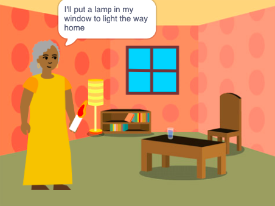

## Je gaat maken

Maak een 📚 boek in Scratch op basis van je eigen idee 💡.

Je gaat:

+ Een digitaal boek maken voor iemand specifiek
+ Kiezen welke vaardigheden je wilt gebruiken om je boek te maken
+ Een webadres voor je boek delen

--- no-print ---

--- task ---

### Spelen ▶️ 

Klik op de hoek om de pagina om te slaan.

Zoek naar sprites die op verschillende pagina's worden weergegeven en verborgen.
  
Wat gebeurt er als je op elke sprite klikt?

  
**Tickle monster**: [See inside](https://scratch.mit.edu/projects/500189097/editor){:target="_blank"}

  <iframe allowtransparency="true" width="485" height="402" src="https://scratch.mit.edu/projects/embed/500189097/?autostart=false" frameborder="0"></iframe>

--- /task ---

--- /no-print ---

Je boek moet voldoen aan de **projectbeschrijving**.

Een **projectbeschrijving** beschrijft wat een project moet doen. Het is een beetje alsof je een missie krijgt om te voltooien.

### 🎯 PROJECTBESCHRIJVING: Maak een **digitaal boek**

Je moet beslissen welk type boek je wilt maken en voor wie het is. 

Je boek moet:
+ 📃 Meerdere pagina's hebben, met een manier om naar de volgende pagina te gaan
+ 🐢 Ten minste één sprite hebben
+ 💬 Op elke pagina iets anders zeggen of doen

Je boek kan:
+ 🔉 Spraak of geluidseffecten bevatten
+ 🎨 Tekst of illustraties bevatten die zijn gemaakt in de Teken-editor
+ 🖱️ Interactieve functies op elke pagina bevatten

--- no-print ---

### Doe inspiratie op 💭

--- task ---

Verken deze voorbeeldprojecten om ideeën voor je boek op te doen:

⭐ Deel je voltooide 'Ik heb een boek voor je gemaakt'-project om kans te maken dat het hier wordt weergegeven.

**My band** 🎸 : [See inside](https://scratch.mit.edu/projects/724148783/editor){:target="_blank"}

  <iframe allowtransparency="true" width="485" height="402" src="https://scratch.mit.edu/projects/embed/724148783/?autostart=false" frameborder="0"></iframe>

**⭐ Cinderella and the spider** 🕷️ : [See inside](https://scratch.mit.edu/projects/799448516/editor){:target="_blank"}

  <iframe allowtransparency="true" width="485" height="402" src="https://scratch.mit.edu/projects/embed/799448516/?autostart=false" frameborder="0"></iframe>

**⭐ Accidental Teleportation** 🚀 : [See inside](https://scratch.mit.edu/projects/793833913/editor){:target="_blank"} (featured community project)

  <iframe allowtransparency="true" width="485" height="402" src="https://scratch.mit.edu/projects/embed/793833913/?autostart=false" frameborder="0"></iframe>

**⭐ How winter came** ☃️ : [See inside](https://scratch.mit.edu/projects/707648744/editor){:target="_blank"} (featured community project)

  <iframe allowtransparency="true" width="485" height="402" src="https://scratch.mit.edu/projects/embed/707648744/?autostart=false" frameborder="0"></iframe>

--- /task ---

--- /no-print ---

--- print-only ---

### Doe inspiratie op 💭

Om ideeën voor jouw 📚 boek op te doen, **Bekijk van binnen** de voorbeeldprojecten in de Scratch-studio 'Ik maak een boek voor je — Voorbeelden': https://scratch.mit.edu/studios/29082370

--- /print-only ---

