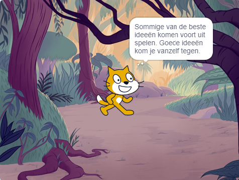

## Jouw idee

Gebruik deze stap om je boek te plannen. Je kunt plannen door gewoon na te denken, achtergronden en sprites toe te voegen in Scratch, of te tekenen of te schrijven - of wat je maar wilt!

### Waarom maak je het boek?

--- task ---

Denk na over het doel van je boek.

Dat kan zijn:
- Om een jonger kind te vermaken
- Om een belangrijke boodschap te delen, zoals recycling (hergebruik) aanmoedigen
- Iemand leren hoe hij iets moet doen, zoals hoe je je favoriete eten maakt
- Een verhaal vertellen of navertellen
- Om iets over jezelf te delen
- Om jezelf te uiten en creatief te zijn

--- /task ---

### Voor wie is het?

--- task ---

Bedenk voor wie je je boek gaat maken (je **doelgroep**).

Het kan voor een vriend zijn, voor een familielid, voor een schoolklas, voor mensen die een hobby delen, voor fans van een muzikant, of gewoon voor jezelf.

--- /task ---

### Aan de slag

Nu is het tijd om na te denken over de pagina's (achtergronden) en de personages en voorwerpen (sprites) in je boek.

--- task ---

Open het [Ik heb een boek voor je gemaakt startproject](https://scratch.mit.edu/projects/582223042/editor){:target="_blank"}. Scratch wordt in een nieuwe browsertabblad geopend.

--- collapse ---
---
title: Offline werken
---

Voor informatie over hoe je Scratch instelt voor offline gebruik, ga je naar [onze handleiding 'Aan de slag met Scratch'](https://projects.raspberrypi.org/nl-NL/projects/getting-started-scratch){:target="_blank"}.

--- /collapse ---

Gebruik je nieuwe Scratch-project, pen en papier of beide om ideeën voor je boek te plannen.

--- /task ---

--- task ---

Denk na over de achtergronden en sprites:
- Welke achtergronden of achtergrondkleuren gebruik je in je boek?
- Hoe gaan gebruikers je boek gebruiken om naar de volgende pagina te gaan?
- Welke personages en voorwerpen ga je gebruiken in je boek?
- Hoe zullen de sprites op elke pagina worden geanimeerd en met elkaar omgaan?

--- /task ---

--- save ---
