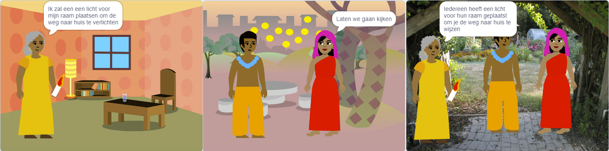

## Bouwen en testen

Nu is het tijd om je boek te maken. Begin klein en voeg meer toe aan je project als je tijd hebt.

**Tip:** Denk eraan om je project elke keer dat je iets toevoegt, te testen. Het is veel gemakkelijker om fouten te vinden en op te lossen voordat je meer wijzigingen aanbrengt.

--- task ---

Je moet beslissen in welke volgorde je jouw boek wilt bouwen. Om te beginnen, kun je:
- elke pagina's maken als achtergrond, of
- eerst één pagina werkend maken

--- /task ---

Misschien heb je in het begin geen tijd om alles wat je wilt aan je boek toe te voegen. Dat is OK - je kunt altijd later terugkomen naar jouw project. 

--- task ---

Je hebt een aantal echt nuttige vaardigheden in Scratch opgebouwd. Hier is een geheugensteuntje om je te helpen bij het maken van jouw boek:

Code:

[[[scratch3-changing-backdrops-pages-levels]]]

[[[scratch3-change-costumes-to-show-mood]]]

[[[scratch3-animate-movement-costumes]]]

[[[scratch3-graphic-effects]]]

[[[scratch3-show-hide-sprites-backdrops]]]

[[[scratch3-positioning-with-layers]]]

[[[scratch3-jiggle-a-sprite]]]

De Paint-editor — achtergronden en uiterlijken:

[[[scratch3-paint-a-new-backdrop-extended]]]

[[[scratch3-backdrops-and-sprites-using-shapes]]]

[[[scratch3-use-text-tool]]]

[[[scratch3-copy-parts-between-sprite-costumes]]]

[[[scratch3-add-costumes-to-a-sprite]]]

Geluid:

[[[scratch3-add-sound]]]

[[[scratch3-record-sound]]]

[[[scratch3-text-to-speech]]]

De Scratch-editor:

[[[scratch3-copy-code]]]

[[[scratch3-full-screen]]]

[[[scratch3-duplicate-sprite]]]

-- /task ---

--- task ---

**Test:** Laat iemand anders je project zien en vraag om terugkoppeling. Wil je iets veranderen aan je boek?

-- /task ---

--- task ---

**Debug:** Mogelijk vindt je enkele fouten in jouw project die je moet oplossen. Hier zijn enkele veelvoorkomende fouten:

--- collapse ---
---
title: Er wordt een sprite op de verkeerde pagina's weergegeven of verborgen
---

Controleer of de sprite bij `wanneer achtergrond verandert naar`{:class="block3events"} scripts een `verschijn`{:class="block3looks"} of `verdwijn`{:class="block3looks"} blok heeft. Controleer of je de juiste achtergrond naam hebt gekozen in het `wanneer achtergrond verandert naar`{:class="block3events"} blok. Het helpt om achtergronden namen te geven die je gemakkelijk kunt begrijpen, om dit soort problemen op te sporen.

--- /collapse ---

--- collapse ---
---
title: Een sprite gaat ondersteboven staan
---

Voeg een `maak draaistijl links-rechts`{:class="block3motion"} blok toe of `maak de draaistijl niet draaien`{:class="block3motion"}.

--- /collapse ---

--- collapse ---
---
title: Een sprite 'springt' wanneer hij van uiterlijk verandert of stuitert
---

Zorg ervoor dat het uiterlijk gecentreerd is in de Paint-editor (lijn het blauwe kruis in het uiterlijk op met het dradenkruis in het midden van de Paint-editor).

--- /collapse ---

--- collapse ---
---
title: Er wordt geen geluid afgespeeld
---

Heb je een `start geluid`{:class="block3sound"} blok toegevoegd waar dat nodig is? Als je code van een andere sprite hebt gekopieerd, moet je het geluid aan deze sprite toevoegen op het tabblad **Geluiden**. Controleer het volume op je computer of tablet en zorg ervoor dat je het volume niet met code hebt verlaagd — probeer `zet volume op`{:class="block3sound"} `100`.

--- /collapse ---

--- collapse ---
---
title: Andere sprites worden steeds voor een sprite weergegeven
---

Voeg een `ga naar laag voorgrond`{:class="block3looks"} blok toe.

--- /collapse ---

--- collapse ---
---
title: Een sprite beweegt of verandert maar één keer
---

Zet je code in een `herhaal`{:class="block3control"} blok zodat het blijft bewegen.

--- /collapse ---

--- collapse ---
---
title: De pagina's staan in de verkeerde volgorde
---

Controleer in welke volgorde je achtergronden zich bevinden: klik op het deelvenster Speelveld en vervolgens op **Achtergronden** om de achtergronden voor jouw project te bekijken.

--- /collapse ---

Mogelijk vind je een fout die hier niet wordt vermeld. Kun je achterhalen hoe deze te repareren is?

We horen graag over je fouten en hoe je ze hebt opgelost. Gebruik de **Feedback verzenden** knop onderaan deze pagina en vertel ons of je een andere fout in je project hebt gevonden.

-- /task ---

--- save ---
