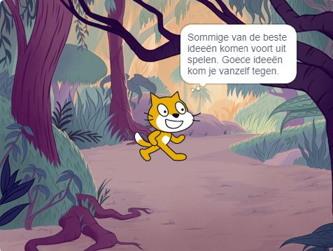

## Plan je boek 📔

Gebruik deze stap om je boek te plannen. Je kunt plannen door gewoon na te denken, achtergronden en sprites toe te voegen in Scratch, of te tekenen of te schrijven - of wat je maar wilt!

Nu is het tijd om na te denken over de pagina's (achtergronden) en de personages en voorwerpen (sprites) in je boek.

--- task ---

Open het [Ik heb een boek voor je gemaakt startproject](https://scratch.mit.edu/projects/582223042/editor){:target="_blank"}. Scratch wordt in een nieuw browsertabblad geopend.

⏱️ Niet veel tijd? Je kunt beginnen met een van de [voorbeelden](https://scratch.mit.edu/studios/29082370){:target="_blank"}.

--- collapse ---
---
title: Working offline
---

Voor informatie over hoe je Scratch instelt voor offline gebruik, ga je naar [onze handleiding 'Aan de slag met Scratch'](https://projects.raspberrypi.org/en/projects/getting-started-scratch){:target="_blank"}.

--- /collapse ---

--- /task ---

--- task ---

Gebruik je nieuwe Scratch-project om je boek te plannen. Je hoeft niet alle pagina's te plannen, je kunt ze er later altijd nog meer toevoegen.

Je kunt ook ✏️ een potlood en [dit planningsblad](resources/i-made-a-book-worksheet.pdf){:target="_blank"} of een stuk papier gebruiken om je ideeën te schetsen.

Denk na over de achtergronden en sprites:
- 🖼️ Welke achtergronden of achtergrondkleuren gebruik je in je boek?
- 🗒️ Hoe gaan gebruikers je boek gebruiken om naar de volgende pagina te gaan?
- 🦁 Welke personages en voorwerpen ga je gebruiken in je boek?
- 🏃‍♀️ Hoe zullen de sprites op elke pagina worden geanimeerd en met elkaar omgaan?

{:width="300px"}

--- /task ---
